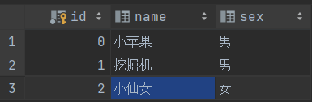

[TOC]

## 一、JDBC认识

​	如果要连接资料库并进行操作，基本上必须了解所使用的资料库所提供的 API 操作介面，然而各个厂商所提供的 API 操作介面并不一致，如果今天要使用 A 厂商的资料库，就必须设计一个专用的程式来操作 A 厂商资料库所提供的 API，将来如果要使用 B 厂商的资料库，即使目的相同，也是要撰写专用于 B 厂商资料库之程式，十分的不方便。

​	使用 JDBC，可由厂商实作操作资料库介面的驱动程式，我们只需要导入jar包作为依赖，就能够使用别人的代码。

```java
// 使用方法
// Google 搜索：download mysql java connector maven
// 下载 mysql-connector-java-xxx.jar 包
// 导入项目 library 或者module

// 过去要手动加载驱动
// Class.forName(com.mysql.jdbc.Driver);
```

​	**注意**：6.0以上版本，不用手动加载驱动，可以直接使用。

```java
// 1、通过DriverManager来获得数据库连接
        try (Connection connection = DriverManager.getConnection(
                "jdbc:mysql://localhost:3306/XX", "用户名", "密码");
             // 2、创建一个用于执行SQL的Statement对象
             Statement statement = connection.createStatement()){
            // 3、执行SQL语句，并得到结果集
            ResultSet set = statement.executeQuery("select * from 表单");
            // 4、查看结果
            while (set.next()){
                System.out.println(set.getString(1));
            }
        } catch (SQLException e) {
            e.printStackTrace();
        }
        // 5、释放资源，但在上面try-catch帮我们做了close
    }
```


## 二、DriverManager

​	首先了解DriverManager，其实就是负责管理驱动。

```java
# com.mysql.cj.jdbc.Driver类中有个静态代码块，指向registerDriver()
    
static {
        try {
            DriverManager.registerDriver(new Driver());
        } catch (SQLException var1) {
            throw new RuntimeException("Can't register driver!");
        }
}
```

...


## 三、Connection和Statement

Connection是数据库的连接对象，可以通过连接对象来创建一个Statement用于执行SQL语句。

除了普通的Statement，还存在PreparedStatement：

```java
PreparedStatement prepareStatement(String sql)
    throws SQLException;
```

可以有效的**预防SQL注入式攻击**。

**了解Statement：**

- 我们使用 executeQuery() 方法来执行 select 语句，此方法返回给我们一个 ResultSet 对象，查询得到的数据，就存在 ResultSet 中！
- 除了执行DQL语句外，还可以使用 executeUpdate() 方法来执行DML、DDL语句。


## 四、执行SQL语句

```java
statement.executeQuery();    // DQL
statement.executeUpdate();    // DML
statement.executeBatch();    // 批量处理
```


## 五、将查询结果映射为对象

**Student表：**



**设置对象：**

```java
# 建立一个Class接收数据
    
public class Student {
    Integer id;
    String name;
    String sex;

    public Student(Integer id, String name, String sex) {
        this.id = id;
        this.name = name;
        this.sex = sex;
    }

    public void say() {
        System.out.println("id:"+id+",name:"+name+",sex:"+sex);
    }
}
```

**映射对象：**

```java
try (Connection connection = DriverManager.getConnection(
    "jdbc:mysql://localhost:3306/community", "root", "y6263309");
             Statement statement = connection.createStatement()){
            // 执行SQL语句，并得到结果集
            ResultSet set = statement.executeQuery("select * from user");
            // 查看结果
            while (set.next()){
                // 映射对象
                Student student = new Student(set.getInt(1),set.getString(2),set.getString(3));
                student.say();
            }
        } catch (SQLException e) {
            e.printStackTrace();
        }
```
注意：列的下标index从1开始

------

**也可以通过反射的机制映射对象，好处是无论什么类型都能通过实体类型映射：**

```java
private static <T> T convert(ResultSet set, Class<T> clazz) {
	try {
            Constructor<T> constructor = clazz.getConstructor(clazz.getConstructors()[0].getParameterTypes());
            Class<?>[] param = constructor.getParameterTypes();
            Object[] object = new Object[param.length];
            for (int i = 0; i < param.length; i++) {
                object[i] = set.getObject(i+1);
                if(object[i].getClass() != param[i])
                    throw new SQLException("错误的类型转换："+object[i].getClass()+" -> "+param[i]);
            }
            return constructor.newInstance(object);
        } catch (ReflectiveOperationException | SQLException e) {
            e.printStackTrace();
            return null;
        }
}
```

现在可以转换为对象

```java
while(set.next()){
    Student student = convert(set, Student.class);
    if(student != null) student.say();
}
```


## 六、SQL注入攻击

假设今天要模拟登入一个账户，我们会这样写：

```java
try(Connection connection = DriverManager.getConnection("URL", "用户", "密码");
        Statement statement = connection.createStatement();
        Scanner scanner = new Scanner(System.in)){
        ResultSet set = statement.executeQuery("select * from user where username='"
                + scanner.nextLine() + "'and password='" + scanner.nextLine()+"';");
        while(set.next()){
            String username = set.getString(1);
            System.out.println("登入成功");
        }
} catch(SQLException e) {
	e.printStackTrace();
}
```

看起来没有问题，但如果输入以下内容：

```java
Test
1111' or 1=1; --
// Test 登入成功！
```

1=1导致系统会强制判断 True 登入，这是以为SQL语句判断错误：

```mysql
// --双短横线表示省略后面的内容
select * from user where username='Test' and pwd='1111' or 1=1; --'
```

为了解决这个问题，我们可以通过限制关键字来防止用户输入特定语句关键字，但是这不是最好的解决办法。

------

**解决方案（可以使用PreparedStatement）：**

```java
// Statement stat = conn.createStatement();
PreparedStatement stat = conn.prepareStatement("Select * From MyGuests Where id = ?");
```

```java
// ...
stat.setString(1, "2");
stat.executeQuery();
stat.clearParameters();
```


## 七、管理事务

​	JDBC默认的事务处理是自动提交，所以前面我们执行一个SQL语句就会自动被直接提交（相当于没有启动事务），所以JDBC需要进行事务管理时，首先要通过 Connection 对象调用 setAutoCommit(false) 方法，将SQL的提交（commit）由驱动程式转交给应用程式负责。

```java
conn.setAutoCommit(false)    // 关闭自动提交
// SQL语句...
// SQL语句...
conn.commit();
```

如果不使用commit()，所有的操作都会丢失，只有提交才能保存。

可以使用 rollback() 来回滚之前的全部操作。


