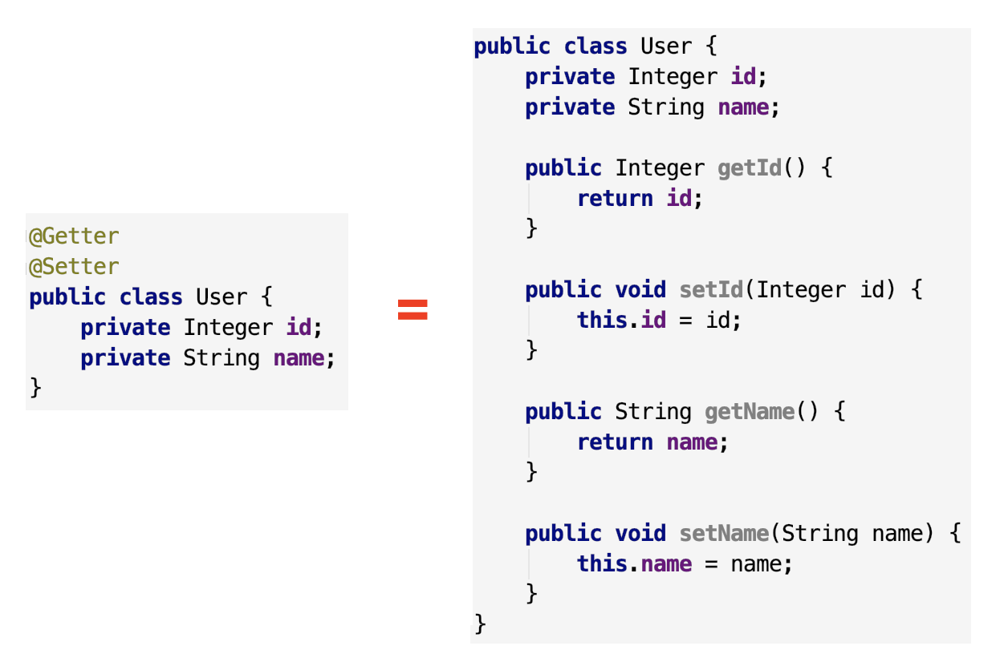
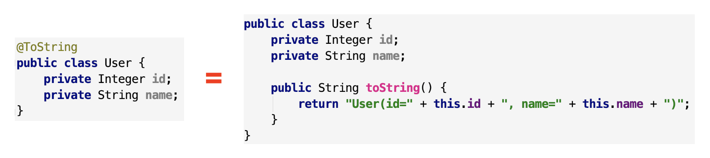
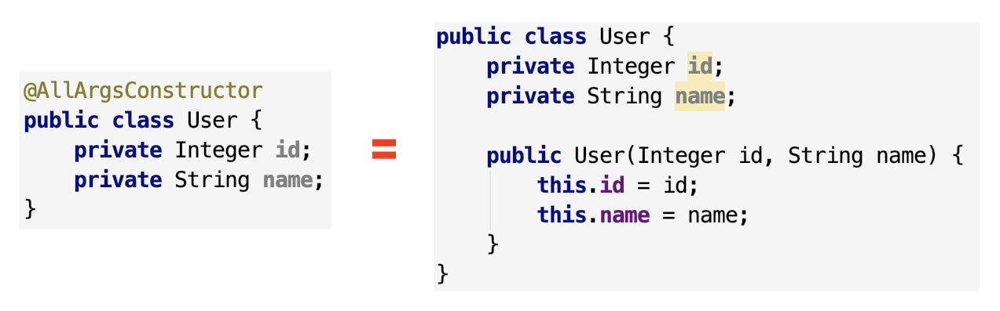
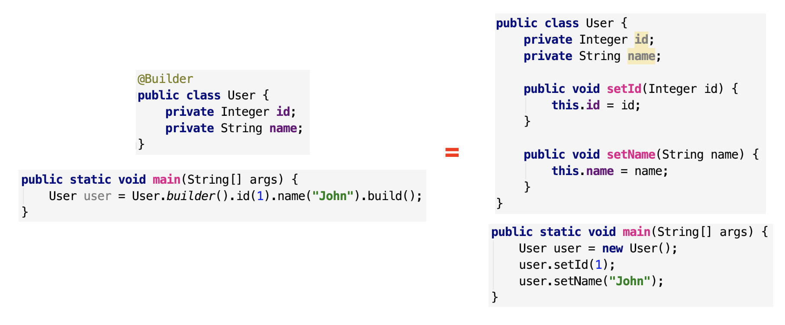

[TOC]

## 一、什么是 Lombok

Lombok 是一款 Java 开发插件，可以通过它定义的注解来精简冗长和繁琐的代码，主要针对简单的 Java 模型对象（POJO）。


## 二、Lombok 安装

- 下载 jar 包，本地安装
- 使用 maven 添加依赖（Maven repository）


## 三、常见用法

过度使用Lombok语法可能会阻碍团队的发展，所以这里我只列出常见用法


### 1、@Getter 和 @Setter

自动产生 getter/setter



### 2、@ToString

自動 override `toString()` 方法，會印出所有變量



### 3、@EqualsAndHashCode

自動生成 `equals(Object other)` 和 `hashcode()` 方法，包括所有非靜態變量和非 transient 的變量


如果某些變量不想要加進判斷，可以透過 `exclude ` 排除，也可以使用 of 指定某些字段


Q：為什麼只有一個整體的 `@EqualsAndHashCode` 注解，而不是分開的兩個 `@Equals` 和 `@HashCode`？

A：在 Java 中有規定，當兩個 object equals 時，他們的 hashcode 一定要相同，反之，當 hashcode 相同時，object 不一定 equals。所以 equals 和 hashcode 要一起 implement，免得發生違反 Java 規定的情形發生。

### 4、Constructor

#### 4.1、@NoArgsConstructor

生成一個沒有參數的constructor


#### 4.2、@AllArgsConstructor

生成一個包含所有參數的 constructor



這裡注意一個 Java 的小坑，當我們沒有指定 constructor 時，Java compiler 會幫我們自動生成一個沒有任何參數的 constructor 給該類，但是如果我們自己寫了 constructor 之後，Java 就不會自動幫我們補上那個無參數的 constructor 了

然而很多地方（像是 Spring Data JPA），會需要每個類都一定要有一個無參數的 constructor，所以你在加上 `@AllArgsConstructor` 時，拜託，一定要補上 `@NoArgsConstrcutor`，不然會有各種坑等著你

```java
@AllArgsConstructor
@NoArgsConstructor
public class User {
    private Integer id;
    private String name;
}
```


#### 4.3、@RequiredArgsConstructor

生成一個包含 “特定參數” 的 constructor，特定參數指的是那些有加上 final 修飾詞的變量們


### 5、@Data

懶人包，只要加了 @Data 這個注解，等於同時加了以下注解

- @Getter/@Setter
- @ToString
- @EqualsAndHashCode
- @RequiredArgsConstructor

**@Data 是使用頻率最高的lombok注解**


### 6、@Value

也是懶人包，但是他會把所有的變量都設成 final 的，其他的就跟 @Data 一樣，等於同時加了以下注解

- @Getter (注意沒有setter)
- @ToString
- @EqualsAndHashCode
- @RequiredArgsConstructor


### 7、@Builder

自動生成流式 set 值寫法（不会静态出现在类中，因此需要搭配setter构造器），從此之後再也不用寫一堆 setter 了



注意，雖然只要加上 @Builder 注解，我們就能夠用流式寫法快速設定 Object 的值，但是 setter 還是必須要寫不能省略的，因為 Spring 或是其他框架有很多地方都會用到 Object 的 getter/setter 對他們取值/賦值

所以通常是 @Data 和 @Builder 會一起用在同個類上，既方便我們流式寫 code，也方便框架做事

```java
@Data
@Builder
public class User {
    private Integer id;
    private String name;
}
```


### 8、@SneakyThrows

从字面理解就是“偷偷摸摸的抛出”。 对的，就是这个意思。 该注解属于Lombok，它的作用为**减少程序的异常捕获**。

