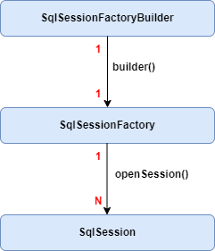
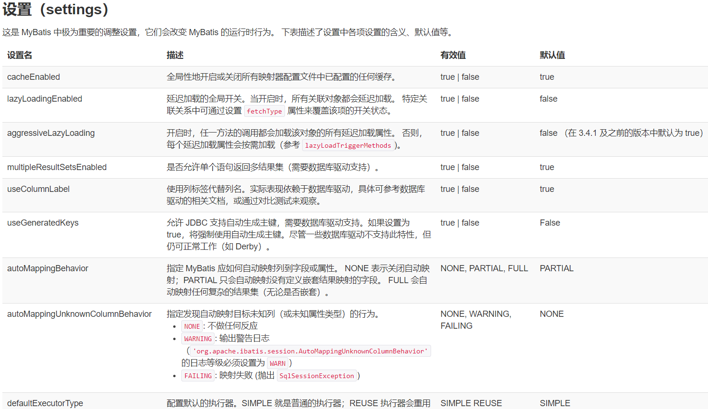
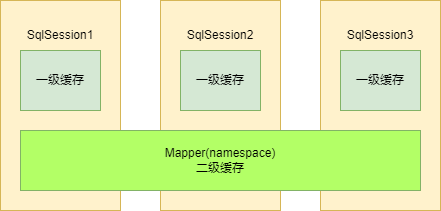
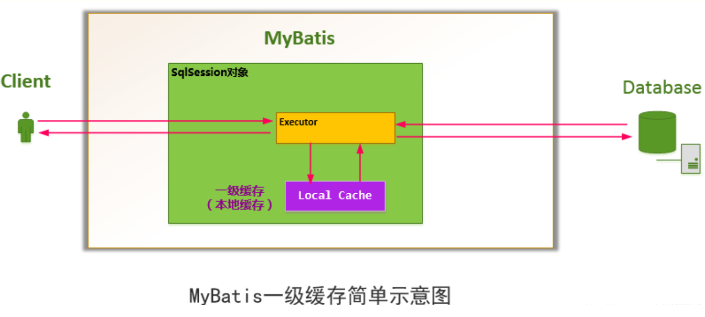
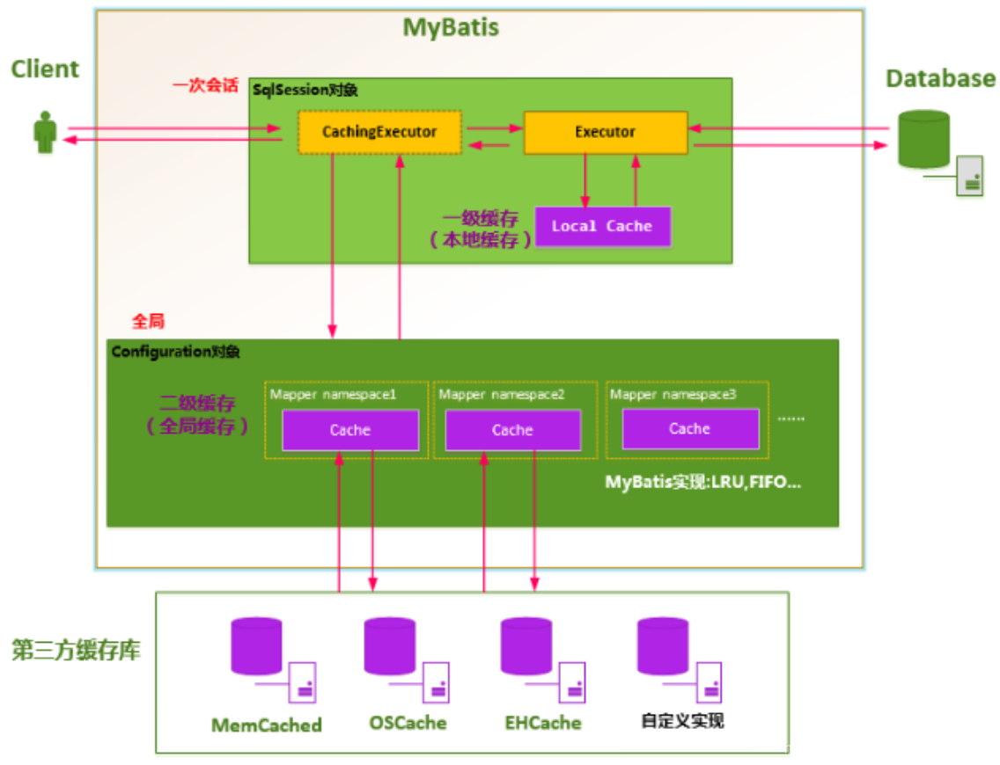
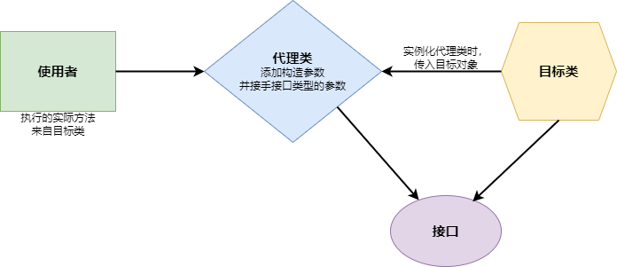

[TOC]

## 一、什么是Mybatis

​	MyBatis 是一款优秀的持久层框架，它支持自定义 SQL、存储过程以及高级映射。MyBatis 免除了几乎所有的 JDBC 代码以及设置参数和获取结果集的工作。MyBatis 可以通过简单的 XML 或注解来配置和映射原始类型、接口和 Java POJO（Plain Old Java Objects，普通老式 Java 对象）为数据库中的记录。

[Mybatis官方文档]: https://mybatis.org/mybatis-3/zh/index.html	"Mybatis官网"



通过 SqlSession 可以完成几乎所有的数据库操作，这个接口定义了大量处理方法，极大简化了流程。


## 二、安装

- 本地 jar 包
- Maven 依赖注入


## 三、XML语言概述

XML主要用于数据的储存和传输，如：

```xml
<?xml version="1.0" encoding="UTF-8" ?>
<outer>
    <name>小明</name>
    <desc>玩游戏</desc>
    <inner type="1">
        <age>10</age>
        <sex>男</sex>
    </inner>
</outer>
```

XML的**格式规范**：

- 必须储存在一个根节点，将所有的子标签全部包含。
- 可以但不必须包含一个头部申明（主要是可以设定编码格式）。
- 所有的标签必须成对出现，可以嵌套但不能交叉嵌套。
- 区分大小写。
- 标签中可以存在属性（例如上面范例中的 type=“1”），单/双引号都可以

**XML常用的转义字符**

| **字符** | **转义字符** | **描述** |
| -------- | ------------ | -------- |
| &        | &amp;        | 和       |
| <        | &lt;         | 小于号   |
| >        | &gt;         | 大于号   |
| "        | &quot;       | 双引号   |
| '        | &apos;       | 单引号   |


## 四、初次使用Mybatis

### 1、构建 SqlSessionFactory

- 使用XML

在上方引入了 DTD（文档类型定义）的东西，它提前帮助我们规定了一些内容，帮助我们提前规定好标签的配置。配置文件完成后，我们就可以读取配置文件并且得到一个 SqlSessionFactory 对象。

```xml
<?xml version="1.0" encoding="UTF-8" ?>
<!DOCTYPE configuration
        PUBLIC "-//mybatis.org//DTD Config 3.0//EN"
        "https://mybatis.org/dtd/mybatis-3-config.dtd">
<configuration>
    <environments default="development">
        <environment id="development">
            <transactionManager type="JDBC"/>
            <dataSource type="POOLED">
                <property name="driver" value="com.mysql.cj.jdbc.Driver"/>
                <property name="url" value="jdbc:mysql://localhost:3306/community"/>
                <property name="username" value="root"/>
                <property name="password" value="y6263309"/>
            </dataSource>
        </environment>
    </environments>
    <mappers>
        <mapper resource="org/mybatis/example/BlogMapper.xml"/>
    </mappers>
</configuration>
```

mapper配置的几种方式：resource、url、class、package：

```xml
// 举例 url
<mappers>
	<mapper url="file:///var/mappers/BlogMapper.xml"/> 
</mappers>
```


[遇到 mybatis 找不到映射器xml文件的问题]: https://cloud.tencent.com/developer/article/1484017


根据配置文件mybatis-config.xml创建Factory

```java
SqlSessionFactory sqlSessionFactory = 
    new SqlSessionFactoryBuilder().build(new FileInputStream("mybatis-config.xml"));
```

- 不使用XML

`最新内容参考官网`


### 2、构建 SqlSession 对象

先配置一个映射类

```java
@Data
public class Student {
    Integer id;
    String name;
    String sex;

    public Student(Integer id, String name, String sex) {
        this.id = id;
        this.name = name;
        this.sex = sex;
    }
}
```

然后创建一个 TestMapper.xml，并配置好 id 和 resultType（映射类）

```xml
<?xml version="1.0" encoding="UTF-8" ?>
<!DOCTYPE mapper
        PUBLIC "-//mybatis.org//DTD Config 3.0//EN"
        "https://mybatis.org/dtd/mybatis-3-mapper.dtd">
<mapper namespace="com.test.mapper.TestMapper">
    <select id="selectStudent" resultType="Student">
        select * from user
    </select>
</mapper>
```

在 mybatis-config.xml 中配置好 TestMapper

```xml
<mappers>
	<mapper resource="test/mapper/TestMapper.xml"/>
</mappers>
```

最后在 Main 中操作 SqlSession 对象

```java
try (SqlSession session = sqlSessionFactory.openSession(true)) {
	List<Student> list = session.selectList("selectStudent");
	list.forEach(System.out::println);
}
```

### 3、Mapper 代理开发

一般 xml 文件放在 resources 下面，mapper 接口放在 src 中

namespace 改为接口位置


## 五、配置 Mybatis

### 1、创建工具类

由于SqlSessionFactory一般只需要创建一次，因此可以创建一个工具类来集中创建SqlSession：

```java
public class MybatisUtil {

    // 在类加载时就创建
    private static SqlSessionFactory sqlSessionFactory;

    static {
        try {
            sqlSessionFactory = new SqlSessionFactoryBuilder()
                    .build(new FileInputStream("mybatis-config.xml"));
        } catch (FileNotFoundException e) {
            e.printStackTrace();
        }
    }

    /**
     * 获取一个新的对话
     * @param autoCommit 是否自动开启提交，否则为事务操作
     * @return SqlSession对象
     */
    public static SqlSession getSession(boolean autoCommit) {
        return sqlSessionFactory.openSession(autoCommit);
    }
}
```

Main中使用：

```java
try (SqlSession session = MybatisUtil.getSession(true)) {

	List<Student> list = session.selectList("selectStudent");
    list.forEach(System.out::println);

}
```


### 2、Mapper代理开发（定义接口）

1. 定义与SQL映射文件同名的Mapper接口，并且将Mapper接口和SQL映射文件放在同一目录下。（但是实际开发中，一般会把xml和java代码文件分开存放，往往直接在resource文件夹中创建mapper文件夹）
2. 设置SQL映射文件的namespace属性为Mapper接口全限定名
3. 在Mapper接口中定义方法，方法名就是 SQL映射文件中sql语句的id，并保持参数类型与返回类型一致


创建一个新的接口Mapper：

```java
public interface TestMapper1 {
    List<Student> selectStudent();
}
```

修改xml中的`namespace`：

```xml
<?xml version="1.0" encoding="UTF-8" ?>
<!DOCTYPE mapper
        PUBLIC "-//mybatis.org//DTD Config 3.0//EN"
        "https://mybatis.org/dtd/mybatis-3-mapper.dtd">
<mapper namespace="test.mapper.TestMapper1">
    <select id="selectStudent" resultType="entity.Student">
        select * from user;
    </select>
</mapper>
```

在Main函数中使用 `getMapper()` 方法：

```java
TestMapper1 mapper = session.getMapper(TestMapper1.class);
mapper.selectStudent().forEach(System.out::println);
```

**注意**： `getMapper()` 方法会自动帮我们生成完成接口中的类，由`com.sun.proxy.$Proxy4`实现，动态代理。


## 六、配置文件

### 1、环境配置（environments）

MyBatis 可以配置成适应多种环境（例如在家办公和在公司办公用不同的数据库），这种机制有助于将 SQL 映射应用于多种数据库之中， 现实情况下有多种理由需要这么做。例如，开发、测试和生产环境需要有不同的配置；或者想在具有相同 Schema 的多个生产数据库中使用相同的 SQL 映射。还有许多类似的使用场景。

**不过要记住：尽管可以配置多个环境，但每个 SqlSessionFactory 实例只能选择一种环境。**

所以，如果你想连接两个数据库，就需要创建两个 SqlSessionFactory 实例，每个数据库对应一个。而如果是三个数据库，就需要三个实例，依此类推。

为了指定创建哪种环境，只要将它作为可选的参数传递给 SqlSessionFactoryBuilder 即可。可以接受环境配置的两个方法签名是：

```java
SqlSessionFactory factory = new SqlSessionFactoryBuilder().build(reader, environment);
SqlSessionFactory factory = new SqlSessionFactoryBuilder().build(reader, environment, properties);
```

### 2、dataSource...

### 3、typeAlias 别名

### 4、使用Map类型以键值对的关系储存结果

记得xml中的resultType也要改

```java
public interface TestMapper {
	List<Map> selectStudent();
}
```

### 5、定义resultType来映射实体类

这样实体类中的变量名就不用和数据库一致

**TestMapper.xml：**

```xml
...
<resultMap id="Test" type="entity.Student">
    <result column="id" property="实体类中的命名1">
    <result column="sid" property="实体类中的命名2">
    <result column="sex" property="实体类中的命名3">
</resultMap>

<select id="selectStudent" resultType="Test">
	select * from user;
</select>
...
```

### 6、类中有多种构造方法

在回传对象时，会使用到构造方法（因为要创建对象）

这时候就会遇到选择构造方法的问题

会优先寻找所有变量齐全的情况，否则（条件不足时候）会报错，需要手动选定

**Student类：**

```java
public Student(int id, String name) {
	System.out.println("构造方法2");
}
```

**TestMapper.xml：**

```xml
...
<resultMap id="Test" type="entity.Student">
    <constructor>
        <arg column="sid" javaType="Integer"/>
        <arg column="name" javaType="String"/> 
    </constructor>
</resultMap>
...
```

需要注意的是，指定构造方法后，如果字段被填入构造方法作为参数，将不会反射给字段单独赋值，而如果构造方法中没有传入的字段，依然会被反射赋值。

### 7、Setting



具体请参考官方文档

 

## 七、增删改查

### 1、查询

假设通过sid学号查询某个特定学生信息

```java
Student getStudentBySid(int sid);
```

```xml
<select id="getStudentBySid" parameterType="int" resultType="entity.Student">
	select * from user where id = #{sid}
</select>
```

针对SQL注入问题，使用#{}还是${}请参考官网有更详细的说明。 

推荐不用parameterType，让mybatis自动处理。

### 2、插入

int表达操作资料的笔数

```java
int addStudent(Student student);
```

```xml
<insert id="addStudent" parameterType="entity.Student">
	insert into user(name, sex) values(#{name}, #{sex})
</insert>
```

### 3、更新

```java
int updateStudent(Student student);
```

```xml
<update id="updateStudent">
	update user
	set id = #{id}, name = #{name}, sex=#{sex}
	where id = #{id}
</update>
```

### 4、删除

```java
int deleteStudent(int sid);
```

```xml
<delete id="deleteStudent">
	delete from user where id = #{sid}
</delete>
```

### 5、复杂查询（多表联查）

#### 一对多

有三个表: Teacher、teach(老师和学生关系)、Student

假设有一个Teacher类下面有多个学生，采用映射方式把学生全部映射给此老师：

```java
@Data
public class Teacher {
	int tid;
    String name;
    List<Student> studentList;
}
```

一对多的查询，需要进行复杂查询，要使用resultMap来自定义映射规则：

```xml
<select id="getTeacherByid" resultMap="asTeacher">
	select *, teacher.name as tname from student inner join teach on student.sid = tach.sid
						inner join teacher on teach.tid = teacher.tid where teach.tid = #{tid}
</select>

<resultMap id="asTeacher" type="Teaher">
	<id column="tid" property="tid"/>
    <result column="tname" property="name"/>
    <collection property="studentList" ofType="Student">
        <id column="id" property="id"/>
    	<result column="name" property="name"/>
        <result column="sex" property="sex"/>
    </collection>
</resultMap>
```

`id`：用于辨识是否为一个对象，在上述例子中用于区分老师。

`collection`：将所有结果映射成一个集合。

#### 多对一

`association`：只会关联一个对象。

```xml
<association>
    ...
</association>
```


## 八、动态SQL

可以避免根据不同条件拼接 SQL 语句，例如拼接时不能忘记添加必要的空格，同时还要注意去掉列表最后一个列名的逗号。但利用动态SQL，可以拜托这种问题。

使用动态 SQL 最常见情景是根据条件包含 where 子句的一部分。**比如** if：

```xml
<select id="findActiveBlogWithTitleLike" resultType="Blog">
	SELECT * FROM BLOG
  	WHERE state = ‘ACTIVE’
  	<if test="title != null">
    	AND title like #{title}
  	</if>
</select>
```

更多例子查看官网：

- choose (when, otherwise)
- trim (where, set)
- foreach


## 九、缓存机制

MyBatis 内置了一个强大的事务性查询缓存机制，它可以非常方便地配置和定制。 

默认情况下，只启用了本地的一级会话缓存，它仅仅对**一个会话**中的数据进行缓存。 当数据库内容修改，第一级缓存就会失效。但是注意，一个会话的资料库操作只会重置当前会话的缓存，不会重置其他会话的缓存。



要启用全局的二级缓存，只需要在你的 SQL 映射文件中添加一行：

```xml
<cache/>
```

读取顺序：二级缓存 >= 一级缓存 = > 数据库

一级缓存是SqlSession级别的缓存。在操作数据库时需要构造 sqlSession对象，在对象中有一个(内存区域)数据结构（HashMap）用于存储缓存数据。不同的sqlSession之间的缓存数据区域（HashMap）是互相不影响的。



二级缓存是mapper级别的缓存，多个SqlSession去操作同一个Mapper的sql语句，多个SqlSession去操作数据库得到数据会存在二级缓存区域，多个SqlSession可以共用二级缓存，二级缓存是跨SqlSession的。

二级缓存是多个SqlSession共享的，其作用域是mapper的同一个namespace，不同的sqlSession两次执行相同namespace下的sql语句且向sql中传递参数也相同即最终执行相同的sql语句，第一次执行完毕会将数据库中查询的数据写到缓存（内存），第二次会从缓存中获取数据将不再从数据库查询，从而提高查询效率。Mybatis默认没有开启二级缓存需要在setting全局参数中配置开启二级缓存。




具体参考官网，还有多种方法...


## 十、注解开发

使用映射器类来执行映射语句是更常见的做法。

一个映射器类就是一个仅需声明与 SqlSession 方法相匹配方法的接口。

首先要在 `mybatis-config.xml` 中注册接口：

```xml
<!-- 使用映射器接口实现类的完全限定类名 -->
<mappers>
  <mapper class="org.mybatis.builder.AuthorMapper"/>
  <mapper class="org.mybatis.builder.BlogMapper"/>
  <mapper class="org.mybatis.builder.PostMapper"/>
</mappers>
```
或
```xml
<!-- 将包内的映射器接口全部注册为映射器 -->
<mappers>
  <package name="org.mybatis.builder"/>
</mappers>
```

现在，我们可以直接使用注解来实现大部分操作：

```java
@Insert("insert into student(name, sex) values(#{name}, #{sex})")
int addStudent(Student student);
```

这些例子展示了如何通过指定 @Result 的 id 属性来命名结果集：

```java
@Results(id = "userResult", value = {
  @Result(property = "id", column = "uid", id = true),
  @Result(property = "firstName", column = "first_name"),
  @Result(property = "lastName", column = "last_name")
})
@Select("select * from users where id = #{id}")
User getUserById(Integer id);

@Results(id = "companyResults")
@ConstructorArgs({
  @Arg(column = "cid", javaType = Integer.class, id = true),
  @Arg(column = "name", javaType = String.class)
})
@Select("select * from company where id = #{id}")
Company getCompanyById(Integer id);
```

更多请参考官方文档...

```java
// 输入多个参数的构造方法
@SelectProvider(type = UserSqlBuilder.class, method = "buildGetUsersByName")
List<User> getUsersByName(
    @Param("name") String name, @Param("orderByColumn") String orderByColumn);

class UserSqlBuilder {

  // 如果不使用 @Param，就应该定义与 mapper 方法相同的参数
  public static String buildGetUsersByName(
      final String name, final String orderByColumn) {
    return new SQL(){{
      SELECT("*");
      FROM("users");
      WHERE("name like #{name} || '%'");
      ORDER_BY(orderByColumn);
    }}.toString();
  }

  // 如果使用 @Param，就可以只定义需要使用的参数
  public static String buildGetUsersByName(@Param("orderByColumn") final String orderByColumn) {
    return new SQL(){{
      SELECT("*");
      FROM("users");
      WHERE("name like #{name} || '%'");
      ORDER_BY(orderByColumn);
    }}.toString();
  }
}
```

获取类中的值：

```java
@Insert("insert into student(sid, name, sex) values(#{sid}, #{student.name}, #{student.sex})")
int addStudentAndSid(@Param(sid) int sid, @Param(student) Student student);
```


## 十一、动态代理机制

Mybatis会自动帮我们实现类，实现类的名称为`com.sun.proxy.$Proxy4`，原理如下：




