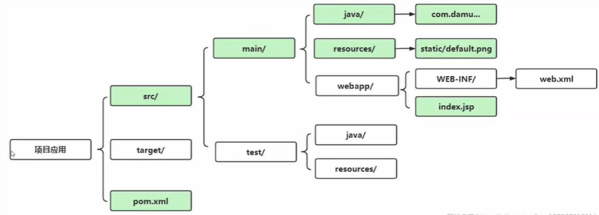
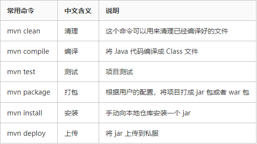
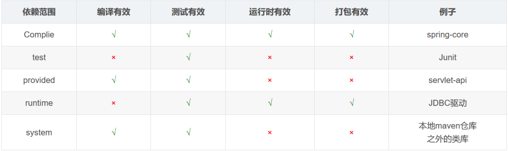

[TOC]

# 一、Maven 介绍

由于 Java 的生态非常丰富，无论你想实现什么功能，都能找到对应的工具类，这些工具类都是以 jar 包的形式出现的，例如 Spring，SpringMVC、MyBatis、数据库驱动，等等，都是以 jar 包的形式出现的，jar 包之间会有关联，在使用一个依赖之前，还需要确定这个依赖所依赖的其他依赖，所以，当项目比较大的时候，依赖管理会变得非常麻烦臃肿，这是 Maven 解决的第一个问题。

Maven 还可以处理多模块项目。简单的项目，单模块分包处理即可，如果项目比较复杂，要做成多模块项目，例如一个电商项目有订单模块、会员模块、商品模块、支付模块...，一般来说，多模块项目，每一个模块无法独立运行，要多个模块合在一起，项目才可以运行，这个时候，借助 Maven 工具，可以实现项目的一键打包。

Maven 中的有两大核心：

- 依赖管理：对 jar 的统一管理(Maven 提供了一个 Maven 的中央仓库，https://mvnrepository.com/，当我们在项目中添加完依赖之后，Maven 会自动去中央仓库下载相关的依赖，并且解决依赖的依赖问题)
- 项目构建：对项目进行编译、测试、打包、部署、上传到私服等


e.g.

IDEA 2022 兼容maven 3.8.1及之前的所用版本
IDEA 2021 兼容maven 3.8.1及之前的所用版本
IDEA 2020 兼容Maven 3.6.3及之前所有版本
IDEA 2018 兼容Maven3.6.1及之前所有版本

[IntelliJ IDEA配置Tomcat]: https://blog.csdn.net/zcs2632008/article/details/123484037


# 二、Maven 项目架构




# 三、依赖导入

```xml
<dependencies>
    <dependency>
        <groupId>org.projectlombok</groupId>
        <artifactId>lombok</artifactId>
        <version>RELEASE</version>
        <scope>compile</scope>
    </dependency>
</dependencies>
```


# 四、Maven 常用命令



`install`包含了`package`的所有步骤，并在此基础上将构建结果安装到本地仓库。


# 五、依赖管理

## Maven 坐标

- dependencies

在 dependencies 标签中，添加项目需要的 jar 所对应的 maven 坐标。

- dependency

一个 dependency 标签表示一个坐标

- groupId

团体、公司、组织机构等等的唯一标识。团体标识的约定是它以创建这个项目的组织名称的逆向域名（例如 org.javaboy）开头。一个 Maven 坐标必须要包含 groupId。一些典型的 groupId 如 apache 的 groupId 是 org.apache.

- artifactId

artifactId 相当于在一个组织中项目的唯一标识符。

- version

一个项目的版本。一个项目的话，可能会有多个版本。如果是正在开发的项目，我们可以给版本号加上一个 SNAPSHOT，表示这是一个快照版（新建项目的默认版本号就是快照版）

- scope

表示依赖范围。



## 可选依赖

当项目中的某些依赖不希望被所依赖的项目使用时候，可以添加<optional>标签，默认在导入依赖时，不会导入：

```xml
<optional>true</optional>
```

## 排除依赖

如果存在那种不是可选依赖，但是我们不希望使用此依赖，就可以通过排除依赖防止添加不必要的依赖：

```xml
<exclusion>...</exclusion>
```


# 六、继承关系

子项目会继承父项目的所有依赖，除非在父项目中使用<dependencyManagement>

```xml
<dependencyManagement>...</dependencyManagement>
```

在子项目中可以自由选择


