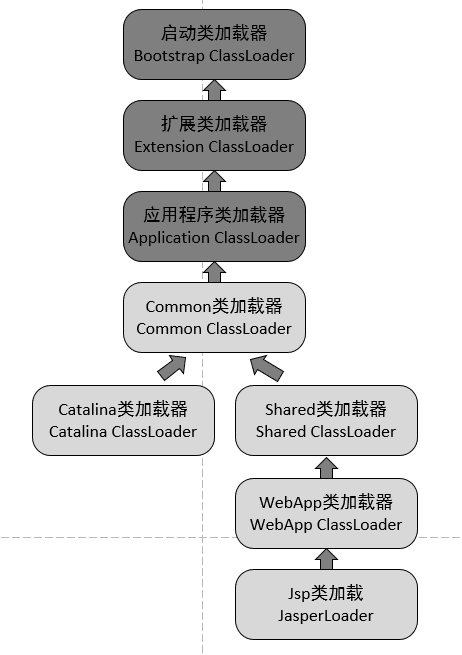

[IntelliJ IDEA配置Tomcat]: https://blog.csdn.net/zcs2632008/article/details/123484037
[Tomcat GUI 图形管理page：localhost/8080/manager/html]: https://blog.csdn.net/cyan20115/article/details/106555106	"要先添加admin账号"

# Tomcat 介绍

Tomcat 是 Java 官方推出一款免费开源的 Web 容器，它占用资源少，扩展性好，运行稳定，支持负载均衡，并且易于学习和使用，所以成为最受欢迎的 Tomcat 容器。

**Tomcat 运行 war 包：**

- maven 打包 Java Web 项目成 war 包
- 把 war 包放入 apache-tomcat-xxx\webapps 中，点击 bin 中的 startup.bat 文件，自动解压成文件夹在当前目录（webapps）中，并部署在网址中

# Tomat 类加载机制

Java默认的类加载机制是通过双亲委派模型来实现的，而Tomcat实现的方式又和双亲委派模型有所区别。

**原因在于一个Tomcat容器允许同时运行多个Web程序，每个Web程序依赖的类又必须是相互隔离的**。因此，如果Tomcat使用双亲委派模式来加载类的话，将导致Web程序依赖的类变为共享的。

举个例子，假如我们有两个Web程序，一个依赖A库的1.0版本，另一个依赖A库的2.0版本，他们都使用了类xxx.xx.Clazz，其实现的逻辑因类库版本的不同而结构完全不同。那么这两个Web程序的其中一个必然因为加载的Clazz不是所使用的Clazz而出现问题！而这对于开发来说是非常致命的！

**Common类加载器**，负责加载Tomcat和Web应用都复用的类 

- **Catalina类加载器**，负责加载Tomcat专用的类，而这些被加载的类在Web应用中将不可见

- Shared类加载器

  ，负责加载Tomcat下所有的Web应用程序都复用的类，而这些被加载的类在Tomcat中将不可见 

  - **WebApp类加载器**，负责加载具体的某个Web应用程序所使用到的类，而这些被加载的类在Tomcat和其他的Web应用程序都将不可见
  - **Jsp类加载器**，每个jsp页面一个类加载器，不同的jsp页面有不同的类加载器，方便实现jsp页面的热插拔。

