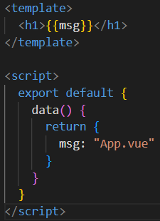
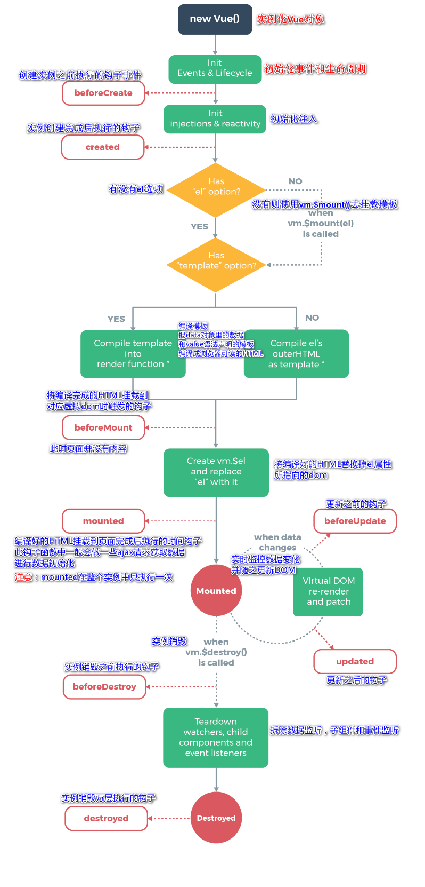

# 一、模板语法

## 1. 模板



```vue
<script></script>

<template></template>

<style></style>
```

上下顺序不限

## 2. 插值

数据绑定最常见的形式就是使用 `{{...}}`（双大括号）的文本插值

`v-once`：如果不想改变标签的内容，可以通过使用 **v-once** 指令执行一次性地插值，当数据改变时，插值处的内容不会更新。

`v-html`：插入 HTML。

## 3. 表达式

Vue.js 都提供了完全的 JavaScript 表达式支持，例如

```vue
{{5+5}}
{{ ok ? 'YES' : 'NO' }}
{{ message.split('').reverse().join('') }}
```

注意：有个限制就是，每个绑定都只能包含单个表达式，以下内容不会生效：

```vue
<!--  这是语句，不是表达式：-->
{{ var a = 1 }}

<!-- 流控制也不会生效，请使用三元表达式 -->
{{ if (ok) { return message } }}
```

## 4. 指令

指令是带有 `v-` 前缀的特殊 attribute。Vue 提供了许多[内置指令](https://cn.vuejs.org/api/built-in-directives.html)，包括上面我们所介绍的 `v-bind` 和 `v-html`。

`v-if`：v-if 指令可以根据表达式的值( true 或 false )来决定是否插入元素。

`v-for`：v-for 指令可以绑定数组的数据来渲染一个项目列表。

`v-bind`：插入属性。

`v-on` ：它用于监听 DOM 事件。

`v-model`：指令用来在 input、select、textarea、checkbox、radio 等表单控件元素上创建双向数据绑定，自动更新绑定的元素的值。

## 5. 动态参数

你还可以将一个函数绑定到动态的事件名称上：

template

```vue
<a v-on:[eventName]="doSomething"> ... </a>

<!-- 简写 -->
<a @[eventName]="doSomething">
```

在此示例中，当 `eventName` 的值是 `"focus"` 时，`v-on:[eventName]` 就等价于 `v-on:focus`。

## 6. 修饰符

修饰符是以半角句号 **.** 指明的特殊后缀，用于指出一个指令应该以特殊方式绑定。例如，**.prevent** 修饰符告诉 **v-on** 指令对于触发的事件调用 **event.preventDefault()**：

```vue
<form v-on:submit.prevent="onSubmit"></form>
```

## 7. 缩写

- `v-bind 缩写`

Vue.js 为两个最为常用的指令提供了特别的缩写：

```vue
<!-- 完整语法 -->
<a v-bind:href="url"></a>
<!-- 缩写 -->
<a :href="url"></a>
```

- `v-on 缩写`

```vue
<!-- 完整语法 -->
<a v-on:click="doSomething"></a>
<!-- 缩写 -->
<a @click="doSomething"></a>
```


# 二、条件渲染

`v-if`：条件判断使用 v-if 指令，指令的表达式返回 true 时才会显示

因为 v-if 是一个指令，所以必须将它添加到一个元素上。如果是多个元素，可以包裹在 <template> 元素上，并在上面使用 v-if。

最终的渲染结果将不包含 ` <template> ` 元素。

`v-else`：可以用 v-else 指令给 v-if 添加一个 "else" 块。

`v-else-if`：可以链式的使用多次。

`v-show`：可以使用 v-show 指令来根据条件展示元素。


**Q：v-if 和 v-show 选哪个？**

[v-if vs. v-show]: https://cn.vuejs.org/guide/essentials/conditional.html#v-if-vs-v-show

总的来说，v-if 有更高的切换开销，而 v-show 有更高的初始渲染开销。

因此，如果需要频繁切换，则使用 v-show 较好；如果在运行时绑定条件很少改变，则 v-if 会更合适。


# 三、列表渲染

## 1. v-for

`v-for` 指令需要以 **site in sites** 形式的特殊语法， sites 是源数据数组并且 site 是数组元素迭代的别名。

v-for 还支持一个可选的第二个参数，参数值为当前项的索引。

##  2. v-for 迭代对象

可以通过一个对象的属性来迭代数值 `value`。

可以提供第二个的参数为键名 `key`。

第三个参数为索引 `index`。

## 3. v-for 和 v-if 

注意：同时使用 `v-if` 和 `v-for` 是**不推荐的**，因为这样二者的优先级不明显。请转阅[风格指南](https://cn.vuejs.org/style-guide/rules-essential.html#avoid-v-if-with-v-for)查看更多细节。

在外新包装一层 `<template>` 再在其上使用 `v-for` 可以解决这个问题 (这也更加明显易读)。

## 4. 通过 key 管理状态

为了给 Vue 一个提示，以便它可以跟踪每个节点的标识，从而重用和重新排序现有的元素，你需要为每个元素对应的块提供一个唯一的 `key` attribute：

```vue
<div v-for="item in items" :key="item.id">
  <!-- 内容 -->
</div>
```

[推荐](https://cn.vuejs.org/style-guide/rules-essential.html#use-keyed-v-for)在任何可行的时候为 `v-for` 提供一个 `key` attribute。

`key` 绑定的值期望是一个基础类型的值，例如字符串或 number 类型。不要用对象作为 `v-for` 的 key。关于 `key` attribute 的更多用途细节，请参阅 [`key` API 文档](https://cn.vuejs.org/api/built-in-special-attributes.html#key)。

## 5. 组件上使用 v-for

我们可以直接在组件上使用 `v-for`，和在一般的元素上使用没有区别 (别忘记提供一个 `key`)：

```vue
<MyComponent v-for="item in items" :key="item.id" />
```

但是，这不会自动将任何数据传递给组件，因为组件有自己独立的作用域。为了将迭代后的数据传递到组件中，我们还需要传递 props：

```vue
<MyComponent
  v-for="(item, index) in items"
  :item="item"
  :index="index"
  :key="item.id"
/>
```

## 6. 数组变化侦测

Vue 能够侦听响应式数组的变更方法，并在它们被调用时触发相关的更新。这些变更方法包括：

- `push()`
- `pop()`
- `shift()`
- `unshift()`
- `splice()`
- `sort()`
- `reverse()`

## 7. 展示过滤或排序后的结果

有时，我们希望显示数组经过过滤或排序后的内容，而不实际变更或重置原始数据。

在这种情况下，你可以创建返回已过滤或已排序数组的计算属性。

在计算属性不可行的情况下 (例如在多层嵌套的 `v-for` 循环中)，你也可以使用方法。


# 五、计算属性

## 1. 基础

推荐使用**计算属性**来描述依赖响应式状态的复杂逻辑。这是重构后的示例：

```javascript
export default {
  data() {
    return {
      author: {
        name: 'John Doe',
        books: [
          'Vue 2 - Advanced Guide',
          'Vue 3 - Basic Guide',
          'Vue 4 - The Mystery'
        ]
      }
    }
  },
  computed: {
    // 一个计算属性的 getter
    publishedBooksMessage() {
      // `this` 指向当前组件实例
      return this.author.books.length > 0 ? 'Yes' : 'No'
    }
  }
}
```

```vue
<p>Has published books:</p>
<span>{{ publishedBooksMessage }}</span>
```

更改此应用的 `data` 中 `books` 数组的值后，可以看到 `publishedBooksMessage` 也会随之改变。

在模板中使用计算属性的方式和一般的属性并无二致。Vue 会检测到 `this.publishedBooksMessage` 依赖于 `this.author.books`，所以当 `this.author.books` 改变时，任何依赖于 `this.publishedBooksMessage` 的绑定都将同时更新。

## 2. 计算属性缓存 vs 方法

如果使用 method() 可以达到相同的效果，不同之处在于**计算属性值会基于其响应式依赖被缓存**。一个计算属性仅会在其响应式依赖更新时才重新计算。这意味着只要 `author.books` 不改变，无论多少次访问 `publishedBooksMessage` 都会立即返回先前的计算结果，而不用重复执行 getter 函数。

## 3. 可写计算属性

计算属性默认是只读的。当你尝试修改一个计算属性时，你会收到一个运行时警告。只在某些特殊场景中你可能才需要用到“可写”的属性，你可以通过同时提供 getter 和 setter 来创建。

## 4. 最佳实践

Getter 不应有副作用。

避免直接修改计算属性值。


# 六、Class 与 Style 绑定（类与样式）

## 1. 绑定 HTML class

### 绑定对象

- 可以给 `:class` (`v-bind:class` 的缩写) 传递一个对象来动态切换 class：

```html
<div :class="{ active: isActive }"></div>
```

- 此外，`:class` 指令也可以和一般的 `class` attribute 共存。举例来说，下面这样的状态：

```javascript
data() {
  return {
    isActive: true,
    hasError: false
  }
}
```

配合以下模板：

```html
<div
  class="static"
  :class="{ active: isActive, 'text-danger': hasError }"
></div>
```

渲染的结果会是：

```html
<div class="static active"></div>
```

- 也可以直接绑定一个对象：

```javascript
data() {
  return {
    classObject: {
      active: true,
      'text-danger': false
    }
  }
}
```

```html
<div :class="classObject"></div>
```

- 也可以绑定一个返回对象的计算属性：

```javascript
data() {
  return {
    isActive: true,
    error: null
  }
},
computed: {
  classObject() {
    return {
      active: this.isActive && !this.error,
      'text-danger': this.error && this.error.type === 'fatal'
    }
  }
}
```

```html
<div :class="classObject"></div>
```

### 绑定数组

- 可以给 `:class` 绑定一个数组来渲染多个 CSS class：

```javascript
data() {
  return {
    activeClass: 'active',
    errorClass: 'text-danger'
  }
}
```

```html
<div :class="[activeClass, errorClass]"></div>
```

渲染的结果是：

```html
<div class="active text-danger"></div>
```

- 可以使用三元表达式：

```html
<div :class="[isActive ? activeClass : '', errorClass]"></div>
```

`errorClass` 会一直存在，但 `activeClass` 只会在 `isActive` 为真时才存在。

- 也可以在数组中嵌套对象：

```html
<div :class="[{ active: isActive }, errorClass]"></div>
```

### 绑定组件

- 上述方法皆可适用于组件
- 如果你的组件有多个根元素，你将需要指定哪个根元素来接收这个 class。你可以通过组件的 `$attrs` 属性来实现指定：

```html
<!-- MyComponent 模板使用 $attrs 时 -->
<p :class="$attrs.class">Hi!</p>
```

## 2. 绑定内联样式 Style

基本与绑定class方式相同


# 七、事件处理

## 1. 监听事件

我们可以使用 `v-on` 指令 (简写为 `@`) 来监听 DOM 事件，并在事件触发时执行对应的 JavaScript。

事件处理器 (handler) 的值可以是：

1. **内联事件处理器**：事件被触发时执行的内联 JavaScript 语句 (与 `onclick` 类似)。
2. **方法事件处理器**：一个指向组件上定义的方法的属性名或是路径。

也可以有多个方法，这些方法由逗号运算符分隔：

```html
<!-- 这两个 one() 和 two() 将执行按钮点击事件 -->
<button @click="one($event), two($event)">
```

## 2. 在内联事件处理器中访问事件参数

有时我们需要在内联事件处理器中访问原生 DOM 事件。你可以向该处理器方法传入一个特殊的 `$event` 变量，或者使用内联箭头函数：

```html
<!-- 使用特殊的 $event 变量 -->
<button @click="warn('Form cannot be submitted yet.', $event)">
  Submit
</button>

<!-- 使用内联箭头函数 -->
<button @click="(event) => warn('Form cannot be submitted yet.', event)">
  Submit
</button>
```

```javascript
methods: {
  warn(message, event) {
    // 这里可以访问 DOM 原生事件
    if (event) {
      event.preventDefault()
    }
    alert(message)
  }
}
```

## 3. 事件修饰符

Vue.js 为 v-on 提供了事件修饰符来处理 DOM 事件细节，如：event.preventDefault() 或 event.stopPropagation()。

Vue.js 通过由点 **.** 表示的指令后缀来调用修饰符。

- `.stop` - 阻止冒泡
- `.prevent` - 阻止默认事件
- `.capture` - 阻止捕获
- `.self` - 只监听触发该元素的事件
- `.once` - 只触发一次
- `.left` - 左键事件
- `.right` - 右键事件
- `.middle` - 中间滚轮事件

## 4. 按键修饰符

全部的按键别名：

- `.enter`
- `.tab`
- `.delete` (捕获 "删除" 和 "退格" 键)
- `.esc`
- `.space`
- `.up`
- `.down`
- `.left`
- `.right`

系统修饰键：

- `.ctrl`
- `.alt`
- `.shift`
- `.meta`

鼠标按钮修饰符:

- `.left`
- `.right`
- `.middle`

.exact 修饰符：

- `.exact`

修饰符允许你控制由精确的系统修饰符组合触发的事件。


# 八、表单输入绑定

手动连接值绑定和更改事件监听器可能会很麻烦：

```html
<input
  :value="text"
  @input="event => text = event.target.value">
```

`v-model` 指令帮我们简化了这一步骤：

```html
<input v-model="text">
```

## 1. 基本用法

- 文本 <input 
- 多行文本 <textarea
- 单选框 <radio
- 复选框 <checkbox
- 选择器 <select <option

## 2. 值绑定

有时我们可能希望将该值绑定到当前组件实例上的动态数据。这可以通过使用 `v-bind` 来实现。此外，使用 `v-bind` 还使我们可以将选项值绑定为非字符串的数据类型。

## 3. 修饰符

### .lazy

在默认情况下， v-model 在 input 事件中同步输入框的值与数据，但你可以添加一个修饰符 lazy ，从而转变为在 change 事件中同步：

```html
<!-- 在 "change" 而不是 "input" 事件中更新 -->
<input v-model.lazy="msg" >
```

### .number

如果想自动将用户的输入值转为 Number 类型（如果原值的转换结果为 NaN 则返回原值），可以添加一个修饰符 number 给 v-model 来处理输入值：

```html
<input v-model.number="age" type="number">
```

这通常很有用，因为在 type="number" 时 HTML 中输入的值也总是会返回字符串类型。

### .trim

如果要自动过滤用户输入的首尾空格，可以添加 trim 修饰符到 v-model 上过滤输入：

```html
<input v-model.trim="msg">
```


# 九、监听器

## 1. 基础

在选项式 API 中，我们可以使用 [`watch` 选项](https://cn.vuejs.org/api/options-state.html#watch)在每次响应式属性发生变化时触发一个函数。

```javascript
export default {
  data() {
    return {
      question: '',
      answer: 'Questions usually contain a question mark. ;-)'
    }
  },
  watch: {
    // 每当 question 改变时，这个函数就会执行
    question(newQuestion, oldQuestion) {
      if (newQuestion.includes('?')) {
        this.getAnswer()
      }
    }
  },
  methods: {
	...
  }
}
```

`watch` 选项也支持把键设置成用 `.` 分隔的路径：

```javascript
export default {
  watch: {
    // 注意：只能是简单的路径，不支持表达式。
    'some.nested.key'(newValue) {
      // ...
    }
  }
}
```


# 十、生命周期

`mounted` 钩子可以用来在组件完成初始渲染并创建 DOM 节点后运行代码：

```javascript
export default {
  mounted() {
    console.log(`the component is now mounted.`)
  }
}
```

还有其他一些钩子，会在实例生命周期的不同阶段被调用，最常用的是 [`mounted`](https://cn.vuejs.org/api/options-lifecycle.html#mounted)、[`updated`](https://cn.vuejs.org/api/options-lifecycle.html#updated) 和 [`unmounted`](https://cn.vuejs.org/api/options-lifecycle.html#unmounted)。

所有生命周期钩子函数的 `this` 上下文都会自动指向当前调用它的组件实例。注意：避免用箭头函数来定义生命周期钩子，因为如果这样的话你将无法在函数中通过 `this` 获取组件实例。

在Vue的生命周期中，mounted函数是非常关键的一步，它表示Vue组件已经被挂载到DOM上了。在使用Vue的时候，有时候需要在Vue组件挂载到DOM上的时候执行一些代码，这时候就需要使用mounted函数。可以把mounted看作是Vue实例生命周期的一个钩子函数，它会在Vue组件挂载到DOM上之后被调用。在mounted函数中，可以获取到DOM元素对象，这意味着我们可以在这里进行DOM操作。

需要注意的是，mounted函数只会执行一次，就是Vue组件首次挂载到DOM上的时候。如果Vue组件被销毁并重新创建，mounted函数也会再次执行。所以，如果需要在每次Vue组件重新渲染后执行一些操作，可以使用updated函数。




# 十一、模板引用

虽然 Vue 的声明性渲染模型为你抽象了大部分对 DOM 的直接操作，但在某些情况下，我们仍然需要直接访问底层 DOM 元素。要实现这一点，我们可以使用特殊的 `ref` attribute：

```html
<input ref="input">
```

`ref` 是一个特殊的 attribute，和 `v-for` 章节中提到的 `key` 类似。它允许我们在一个特定的 DOM 元素或子组件实例被挂载后，获得对它的直接引用。这可能很有用，比如说在组件挂载时将焦点设置到一个 input 元素上，或在一个元素上初始化一个第三方库。


# 十二、组件基础

## 1. 定义组件

- 当使用构建步骤时，我们一般会将 Vue 组件定义在一个单独的 `.vue` 文件中，这被叫做[单文件组件](https://cn.vuejs.org/guide/scaling-up/sfc.html)：

```vue
<script>
export default {
  data() {
    return {
      count: 0
    }
  }
}
</script>

<template>
  <button @click="count++">You clicked me {{ count }} times.</button>
</template>
```

当不使用构建步骤时，一个 Vue 组件以一个包含 Vue 特定选项的 JavaScript 对象来定义：

```javascript
export default {
  data() {
    return {
      count: 0
    }
  },
  template: `
    <button @click="count++">
      You clicked me {{ count }} times.
    </button>`
}
```

- 也可以使用原生的方法构建

```javascript
const Site = {
  data() {
    return {
      sites: [
        { id: 1, title: 'Google' },
        { id: 2, title: 'Runoob' },
        { id: 3, title: 'Taobao' }
      ]
    }
  }
}
 
const app = Vue.createApp(Site)
 
app.component('site-info', {
  props: ['id','title'],
  template: `<h4>{{ id }} - {{ title }}</h4>`
})
 
app.mount('#app')
```

## 2. 使用组件

要使用一个子组件，我们需要在父组件中导入它。假设我们把计数器组件放在了一个叫做 `ButtonCounter.vue` 的文件中，这个组件将会以默认导出的形式被暴露给外部。

```vue
<script>
import ButtonCounter from './ButtonCounter.vue'

export default {
  components: {
    ButtonCounter
  }
}
</script>

<template>
  <h1>Here is a child component!</h1>
  <ButtonCounter />
</template>
```

如果你是直接在 DOM 中书写模板 (例如原生 `<template>` 元素的内容)，模板的编译需要遵从浏览器中 HTML 的解析行为。在这种情况下，你应该需要使用 `kebab-case` 形式并显式地关闭这些组件的标签。

```html
<!-- 如果是在 DOM 中书写该模板 -->
<button-counter></button-counter>
```

## 3. 传递props

Props 是一种特别的 attributes，你可以在组件上声明注册。要传递给博客文章组件一个标题，我们必须在组件的 props 列表上声明它。这里要用到 [`props`](https://cn.vuejs.org/api/options-state.html#props) 选项：

```vue
<!-- BlogPost.vue -->
<script>
export default {
  props: ['title']
}
</script>

<template>
  <h4>{{ title }}</h4>
</template>
```

## 4. 通过插槽来分配内容

一些情况下我们会希望能和 HTML 元素一样向组件中传递内容：

```vue
<AlertBox>
  Something bad happened.
</AlertBox>
```

这可以通过 Vue 的自定义 `<slot>` 元素来实现：

```vue
<template>
  <div class="alert-box">
    <strong>This is an Error for Demo Purposes</strong>
    <slot />
  </div>
</template>
```

如上所示，我们使用 `<slot>` 作为一个占位符，父组件传递进来的内容就会渲染在这里。

## 5. 动态组件

```html
<!-- currentTab 改变时组件也改变 -->
<component :is="currentTab"></component>
```

在上面的例子中，被传给 `:is` 的值可以是以下几种：

- 被注册的组件名
- 导入的组件对象

当使用 `<component :is="...">` 来在多个组件间作切换时，被切换掉的组件会被卸载。我们可以通过 [`` 组件](https://cn.vuejs.org/guide/built-ins/keep-alive.html)强制被切换掉的组件仍然保持“存活”的状态。

## 6. DOM 模板解析注意事项

- 大小写区分

```javascript
// JavaScript 中的 camelCase
const BlogPost = {
	...
}
```

```vue
<!-- HTML 中的 kebab-case -->
<blog-post>...</blog-post>
```

- 闭合标签

我们在上面的例子中已经使用过了闭合标签 (self-closing tag)：

```vue
<MyComponent />
```

这是因为 Vue 的模板解析器支持任意标签使用 `/>` 作为标签关闭的标志。

然而在 HTML DOM 模板中，我们必须显式地写出关闭标签：

```html
<my-component></my-component>
```

- 元素位置限制

某些 HTML 元素对于放在其中的元素类型有限制，例如 `<ul>`，`<ol>`，`<table>` 和 `<select>`，相应的，某些元素仅在放置于特定元素中时才会显示，例如 `<li>`，`<tr>` 和 `<option>`。

我们可以使用特殊的 [`is` attribute](https://cn.vuejs.org/api/built-in-special-attributes.html#is) 作为一种解决方案。

