# 一、性能指标

通常是以 4 个指标来衡量网络的性能，分别是带宽、延时、吞吐率、PPS（Packet Per Second），它们表示的意义如下：

- *带宽*，表示链路的最大传输速率，单位是 b/s （比特 / 秒），带宽越大，其传输能力就越强。
- *延时*，表示请求数据包发送后，收到对端响应，所需要的时间延迟。不同的场景有着不同的含义，比如可以表示建立 TCP 连接所需的时间延迟，或一个数据包往返所需的时间延迟。
- *吞吐率*，表示单位时间内成功传输的数据量，单位是 b/s（比特 / 秒）或者 B/s（字节 / 秒），吞吐受带宽限制，带宽越大，吞吐率的上限才可能越高。
- *PPS*，全称是 Packet Per Second（包 / 秒），表示以网络包为单位的传输速率，一般用来评估系统对于网络的转发能力。

当然，除了以上这四种基本的指标，还有一些其他常用的性能指标，比如：

- *网络的可用性*，表示网络能否正常通信；
- *并发连接数*，表示 TCP 连接数量；
- *丢包率*，表示所丢失数据包数量占所发送数据组的比率；
- *重传率*，表示重传网络包的比例；

# 二、网络配置查看

要想知道网络的配置和状态，我们可以使用 `ifconfig` 或者 `ip` 命令来查看。

这两个命令功能都差不多，不过它们属于不同的软件包，`ifconfig` 属于 `net-tools` 软件包，`ip` 属于 `iproute2` 软件包，我的印象中 `net-tools` 软件包没有人继续维护了，而 `iproute2` 软件包是有开发者依然在维护，所以更推荐你使用 `ip` 工具。

学以致用，那就来使用这两个命令，来查看网口 `eth0` 的配置等信息：

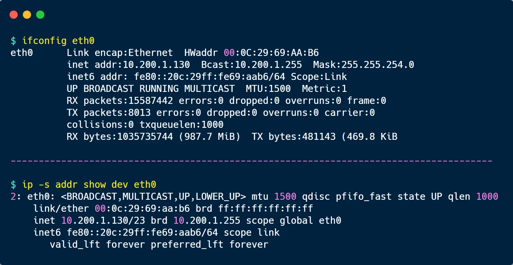

虽然这两个命令输出的格式不尽相同，但是输出的内容基本相同，比如都包含了 IP 地址、子网掩码、MAC 地址、网关地址、MTU 大小、网口的状态以及网络包收发的统计信息，下面就来说说这些信息，它们都与网络性能有一定的关系。

第一，网口的连接状态标志。其实也就是表示对应的网口是否连接到交换机或路由器等设备，如果 `ifconfig` 输出中看到有 `RUNNING`，或者 `ip` 输出中有 `LOWER_UP`，则说明物理网络是连通的，如果看不到，则表示网口没有接网线。

第二，MTU 大小。默认值是 `1500` 字节，其作用主要是限制网络包的大小，如果 IP 层有一个数据报要传，而且网络包的长度比链路层的 MTU 还大，那么 IP 层就需要进行分片，即把数据报分成若干片，这样每一片就都小于 MTU。事实上，每个网络的链路层 MTU 可能会不一样，所以你可能需要调大或者调小 MTU 的数值。

第三，网口的 IP 地址、子网掩码、MAC 地址、网关地址。这些信息必须要配置正确，网络功能才能正常工作。

第四，网络包收发的统计信息。通常有网络收发的字节数、包数、错误数以及丢包情况的信息，如果 `TX`（发送） 和 `RX`（接收） 部分中 errors、dropped、overruns、carrier 以及 collisions 等指标不为 0 时，则说明网络发送或者接收出问题了，这些出错统计信息的指标意义如下：

- *errors* 表示发生错误的数据包数，比如校验错误、帧同步错误等；
- *dropped* 表示丢弃的数据包数，即数据包已经收到了 Ring Buffer（这个缓冲区是在内核内存中，更具体一点是在网卡驱动程序里），但因为系统内存不足等原因而发生的丢包；
- *overruns* 表示超限数据包数，即网络接收/发送速度过快，导致 Ring Buffer 中的数据包来不及处理，而导致的丢包，因为过多的数据包挤压在 Ring Buffer，这样 Ring Buffer 很容易就溢出了；
- *carrier* 表示发生 carrirer 错误的数据包数，比如双工模式不匹配、物理电缆出现问题等；
- *collisions* 表示冲突、碰撞数据包数；

`ifconfig` 和 `ip` 命令只显示的是网口的配置以及收发数据包的统计信息，而看不到协议栈里的信息，那接下来就来看看如何查看协议栈里的信息。

# 三、Socket 信息查看

我们可以使用 `netstat` 或者 `ss`，这两个命令查看 socket、网络协议栈、网口以及路由表的信息。

虽然 `netstat` 与 `ss` 命令查看的信息都差不多，但是如果在生产环境中要查看这类信息的时候，尽量不要使用 `netstat` 命令，因为它的性能不好，在系统比较繁忙的情况下，如果频繁使用 `netstat` 命令则会对性能的开销雪上加霜，所以更推荐你使用性能更好的 `ss` 命令。

从下面这张图，你可以看到这两个命令的输出内容：

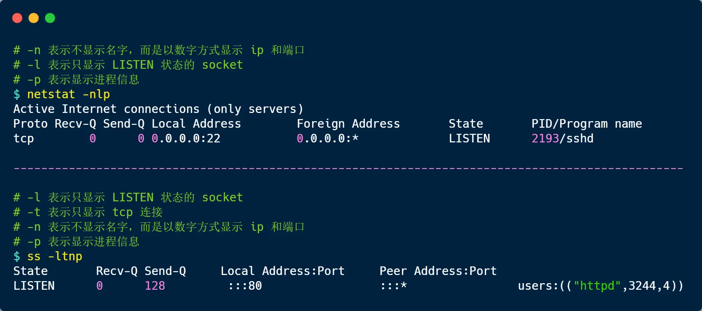

可以发现，输出的内容都差不多， 比如都包含了 socket 的状态（*State*）、接收队列（*Recv-Q*）、发送队列（*Send-Q*）、本地地址（*Local Address*）、远端地址（*Foreign Address*）、进程 PID 和进程名称（*PID/Program name*）等。

接收队列（*Recv-Q*）和发送队列（*Send-Q*）比较特殊，在不同的 socket 状态。它们表示的含义是不同的。

当 socket 状态处于 `Established`时：

- *Recv-Q* 表示 socket 缓冲区中还没有被应用程序读取的字节数；
- *Send-Q* 表示 socket 缓冲区中还没有被远端主机确认的字节数；

而当 socket 状态处于 `Listen` 时：

- *Recv-Q* 表示全连接队列的长度；
- *Send-Q* 表示全连接队列的最大长度；

服务端收到第三次握手的 ACK 后，内核会把连接从半连接队列移除，然后创建新的完全的连接，并将其增加到全连接队列 ，等待进程调用 `accept()` 函数时把连接取出来。也就说，全连接队列指的是服务器与客户端完了 TCP 三次握手后，还没有被 `accept()` 系统调用取走连接的队列。

那对于协议栈的统计信息，依然还是使用 `netstat` 或 `ss`，它们查看统计信息的命令如下：

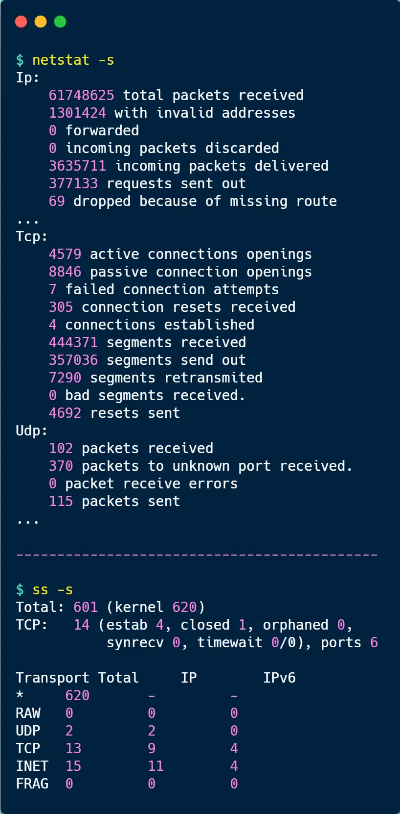

`ss` 命令输出的统计信息相比 `netsat` 比较少，`ss` 只显示已经连接（*estab*）、关闭（*closed*）、孤儿（*orphaned*） socket 等简要统计。

而 `netstat` 则有更详细的网络协议栈信息，比如上面显示了 TCP 协议的主动连接（*active connections openings*）、被动连接（*passive connection openings*）、失败重试（*failed connection attempts*）、发送（*segments send out*）和接收（*segments received*）的分段数量等各种信息。

# 四、网络吞吐率和 PPS 查看

可以使用 `sar` 命令当前网络的吞吐率和 PPS，用法是给 `sar` 增加 `-n` 参数就可以查看网络的统计信息，比如

- sar -n DEV，显示网口的统计数据；
- sar -n EDEV，显示关于网络错误的统计数据；
- sar -n TCP，显示 TCP 的统计数据

比如，我通过 `sar` 命令获取了网口的统计信息：

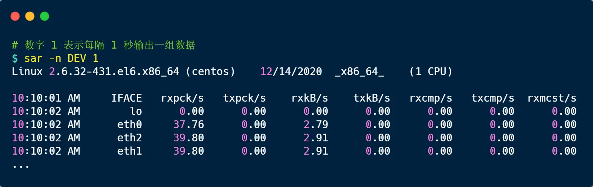

- `rxpck/s` 和 `txpck/s` 分别是接收和发送的 PPS，单位为包 / 秒。
- `rxkB/s` 和 `txkB/s` 分别是接收和发送的吞吐率，单位是 KB/ 秒。
- `rxcmp/s` 和 `txcmp/s` 分别是接收和发送的压缩数据包数，单位是包 / 秒。

# 五、连通性和延时如何查看

要测试本机与远程主机的连通性和延时，通常是使用 `ping` 命令，它是基于 ICMP 协议的，工作在网络层。

比如，如果要测试本机到 `192.168.12.20` IP 地址的连通性和延时：

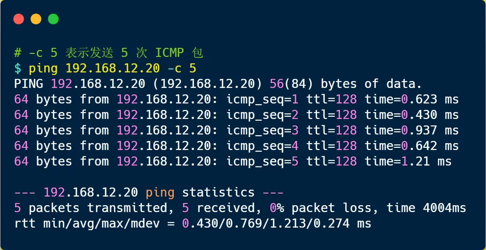

显示的内容主要包含 `icmp_seq`（ICMP 序列号）、`TTL`（生存时间，或者跳数）以及 `time` （往返延时），而且最后会汇总本次测试的情况，如果网络没有丢包，`packet loss` 的百分比就是 0。

不过，需要注意的是，`ping` 不通服务器并不代表 HTTP 请求也不通，因为有的服务器的防火墙是会禁用 ICMP 协议的。

# 六、日志分析

观察程序是否如期运行，或者是否有错误，最直接的方式就是看运行**日志**，当然要想从日志快速查到我们想要的信息，前提是程序打印的日志要精炼、精准。

但日志涵盖的信息远不止于此，比如对于 nginx 的 access.log 日志，我们可以根据日志信息**分析用户行为**。

什么用户行为呢？比如分析出哪个页面访问次数（*PV*）最多，访问人数（*UV*）最多，以及哪天访问量最多，哪个请求访问最多等等。

以一个大概几万条记录的 nginx 日志文件作为案例：

## 前置准备

当我们要分析日志的时候，先用 `ls -lh` 命令查看日志文件的大小，如果日志文件大小非常大，最好不要在线上环境做。

比如下面这个日志就 6.5M，不算大，在线上环境分析问题不大。

如果日志文件数据量太大，你直接一个 `cat` 命令一执行，是会影响线上环境，加重服务器的负载，严重的话，可能导致服务器无响应。

当发现日志很大的时候，我们可以使用 `scp` 命令将文件传输到闲置的服务器再分析，scp 命令使用方式如下图：

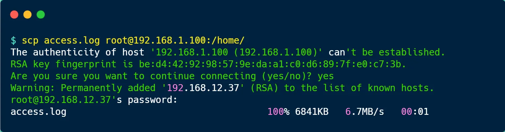

## 慎用 cat

大家都知道 `cat` 命令是用来查看文件内容的，但是日志文件数据量有多少，它就读多少，很显然不适用大文件。

对于大文件，我们应该养成好习惯，用 `less` 命令去读文件里的内容，因为 less 并不会加载整个文件，而是按需加载，先是输出一小页的内容，当你要往下看的时候，才会继续加载。

可以使用 `tail` 命令，比如当你想查看倒数 5 行的内容，你可以使用这样的命令：

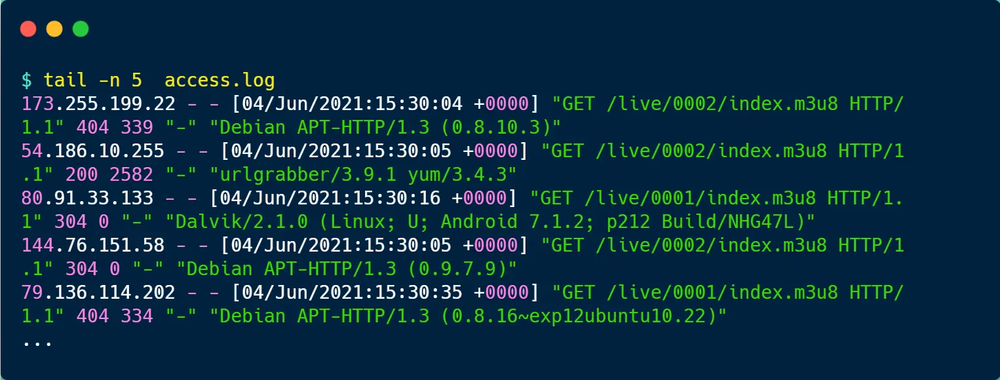

如果你想实时看日志打印的内容，你可以使用 `tail -f` 命令，这样你看日志的时候，就会是阻塞状态，有新日志输出的时候，就会实时显示出来。

## PV 分析

PV 的全称叫 *Page View*，用户访问一个页面就是一次 PV，比如大多数博客平台，点击一次页面，阅读量就加 1，所以说 PV 的数量并不代表真实的用户数量，只是个点击量。

对于 nginx 的 `acess.log` 日志文件来说，分析 PV 还是比较容易的，既然日志里的内容是访问记录，那有多少条日志记录就有多少 PV。

我们直接使用 `wc -l` 命令，就可以查看整体的 PV 了，如下图一共有 49903 条 PV。

## PV 分组

nginx 的 `acess.log` 日志文件有访问时间的信息，因此我们可以根据访问时间进行分组，比如按天分组，查看每天的总 PV，这样可以得到更加直观的数据。

要按时间分组，首先我们先「访问时间」过滤出来，这里可以使用 awk 命令来处理，awk 是一个处理文本的利器。

awk 命令默认是以「空格」为分隔符，由于访问时间在日志里的第 4 列，因此可以使用 `awk '{print $4}' access.log` 命令把访问时间的信息过滤出来，结果如下：

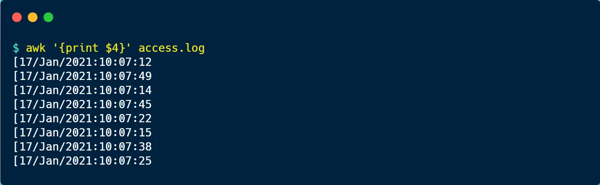

上面的信息还包含了时分秒，如果只想显示年月日的信息，可以使用 `awk` 的 `substr` 函数，从第 2 个字符开始，截取 11 个字符。

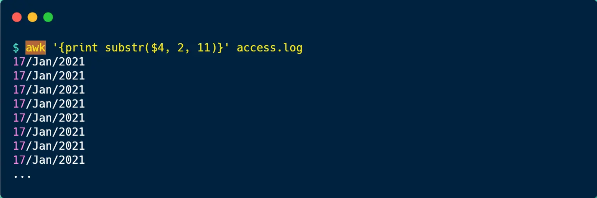

接着，我们可以使用 `sort` 对日期进行排序，然后使用 `uniq -c` 进行统计，于是按天分组的 PV 就出来了。

可以看到，每天的 PV 量大概在 2000-2800：

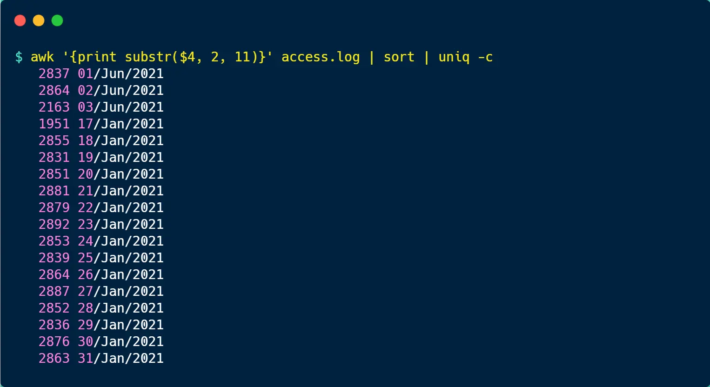

注意，**使用 `uniq -c` 命令前，先要进行 `sort` 排序**，因为 uniq 去重的原理是比较相邻的行，然后除去第二行和该行的后续副本，因此在使用 uniq 命令之前，请使用 sort 命令使所有重复行相邻。

## UV 分析

UV 的全称是 *Uniq Visitor*，它代表访问人数，比如公众号的阅读量就是以 UV 统计的，不管单个用户点击了多少次，最终只算 1 次阅读量。

access.log 日志里虽然没有用户的身份信息，但是我们可以用「客户端 IP 地址」来**近似统计** UV。

该命令的输出结果是 2589，也就说明 UV 的量为 2589。上图中，从左到右的命令意思如下：

- `awk '{print $1}' access.log`，取日志的第 1 列内容，客户端的 IP 地址正是第 1 列；
- `sort`，对信息排序；
- `uniq`，去除重复的记录；
- `wc -l`，查看记录条数；

## UV 分组

假设我们按天来分组分析每天的 UV 数量，这种情况就稍微比较复杂，需要比较多的命令来实现。

既然要按天统计 UV，那就得把「日期 + IP地址」过滤出来，并去重，命令如下：

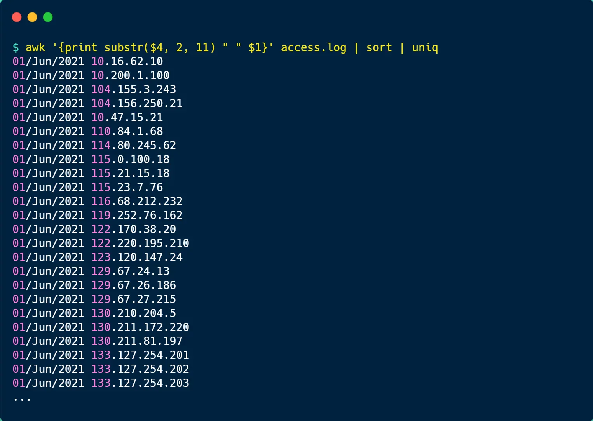

具体分析如下：

- 第一次 `ack` 是将第 4 列的日期和第 1 列的客户端 IP 地址过滤出来，并用空格拼接起来；
- 然后 `sort` 对第一次 ack 输出的内容进行排序；
- 接着用 `uniq` 去除重复的记录，也就说日期 +IP 相同的行就只保留一个；

上面只是把 UV 的数据列了出来，但是并没有统计出次数。

...

## 终端分析

nginx 的 access.log 日志最末尾关于 User Agent 的信息，主要是客户端访问服务器使用的工具，可能是手机、浏览器等。

因此，我们可以利用这一信息来分析有哪些终端访问了服务器。

User Agent 的信息在日志里的第 12 列，因此我们先使用 `awk` 过滤出第 12 列的内容后，进行 `sort` 排序，再用 `uniq -c` 去重并统计，最后再使用 `sort -rn`（*r 表示逆向排序， n 表示按数值排序*） 对统计的结果排序，结果如下图：

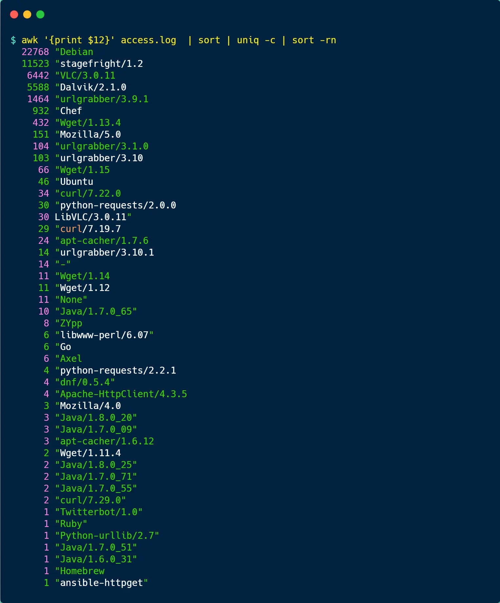

## 分析 TOP3 的请求

access.log 日志中，第 7 列是客户端请求的路径，先使用 `awk` 过滤出第 7 列的内容后，进行 `sort` 排序，再用 `uniq -c` 去重并统计，然后再使用 `sort -rn` 对统计的结果排序，最后使用 `head -n 3` 分析 TOP3 的请求，结果如下图：

## 性能分析

`top`命令：*Linux*下常用的性能分析工具，能够实时显示系统中各个进程的资源占用状况，类似于Windows的任务管理器。

