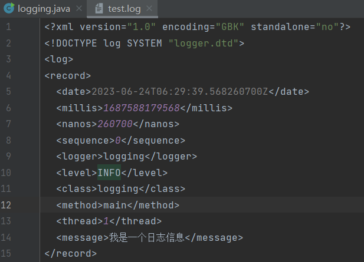
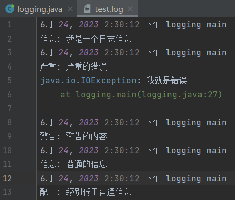
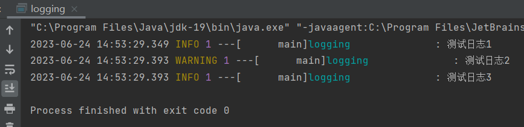
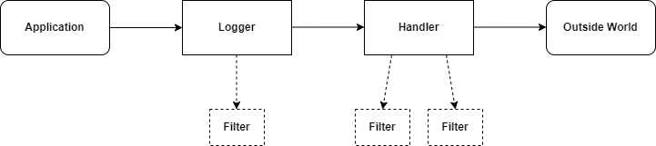

[TOC]

## 一、日志系统介绍

​	我们之前一直都使用 `System.out.println` 来打印信息，但是如果项目中存在大量的控制语句，就会显得很凌乱，而且日志的粒度是不够细的。假如我们就希望，项目只在debug的情况下打印某些日志。而实际运行时不打印日志，因此我们需要日志框架来规范日志化输出。

​	JDK为我们提供了一个自带的日志框架，位于 `java.util.logging` 包下，我们可以用此框架来规范化打印，使用如下:

```java
public static void main(String[] args) {
	Logger logger = Logger.getLogger(logging.class.getName());
	logger.info("我是一个日志信息");
}

// sout:
// 6月 07, 2023 3:58:23 下午 logging main
// 信息: 我是一个日志信息
```

### JUL 日志讲解

日志分为 7 个级别，可以在 level 类中查看：

- SEVERE (最高级) - 一般用于代表严重错误
- WARNING - 一般用于表示某些警告，但是不足以判断为错误
- INFO (默认级别) - 常规消息
- CONFIG
- FINE
- FINER
- FINEST (最低级)

### Log方法输出不同级别

```java
Logger logger = Logger.getLogger(logging.class.getName());
logger.info("我是一个日志信息");
logger.log(Level.SEVERE, "严重的错误", new IOException("我就是错误"));
logger.log(Level.WARNING, "警告的内容");
logger.log(Level.INFO, "普通的信息");
logger.log(Level.CONFIG, "级别低于普通信息");
```

发现级别低于默认级别的日志信息，无法输出到控制台。

这是因为每一个Logger都有一个父类日志打印器`ConsoleHandler`，使用默认的日志级别INFO。

**为了解决这个问题，要更改默认日志系统和控制台处理器，禁用父类日志打印器：**

```java
// 修改日志级别
logger.setLevel(Level.ALL);

// 禁用父类控制器
logger.setUseParentHandlers(false);

// 使用自定义日志处理器
ConsoleHandler handler = new ConsoleHandler();
handler.setLevel(Level.ALL);
logger.addHandler(handler);
```

### 设置过滤条件

```java
Logger logger = Logger.getLogger(logging.class.getName());

// 自定义过滤规则
logger.setFilter(record -> !record.getMessage().contains("普通"));

// Test
logger.log(Level.WARNING, "警告");
logger.log(Level.INFO, "普通的消息");
```

### 文件处理器

使用文件处理器来处理日志信息，需要添加一个处理器：

```java
// 添加输出到本地文件
FileHandler fileHandler = new FileHandler("test.log", true);    // true代表append自动追加文件内容
fileHandler.setLevel(Level.WARNING);
logger.addHandler(fileHandler);
```



默认使用的是xml文件输出，可以使用`SimpleFormatter`自定义，为格式化LogRecords提供支持：

```java
SimpleFormatter formatter = new SimpleFormatter();

...
fileHandler.setFormatter(formatter);
...
```




### 自定义一个控制器

```java
public class logging {

    public static void main(String[] args) throws IOException {

        Logger logger = Logger.getLogger(logging.class.getName());
        logger.setUseParentHandlers(false);

        // 为了让颜色变回普通的颜色，通过代码块在初始化时将输出流设定为System.out
        ConsoleHandler handler = new ConsoleHandler(){{
            setOutputStream(System.out);
        }};

        // 创建匿名内部类实现自定义的格式
        handler.setFormatter(new Formatter() {
            @Override
            public String format(LogRecord record) {
                SimpleDateFormat format = new SimpleDateFormat("yyyy-MM-dd HH:mm:ss.SSS");
                String time = format.format(new Date(record.getMillis()));
                String level = record.getLevel().getName();    // 获取日志级别名称
                // String level = record.getLevel().getLoacalizedName();    // 获取本地化名称
                String thread = String.format("%10s", Thread.currentThread().getName());    // 线程名称(做格式化处理)
                long threadID = record.getLongThreadID();    // 线程ID
                String className = String.format("%-20s", record.getSourceClassName());    // 发送日志的类名
                String msg = record.getMessage();    // 日志消息

                // 输出格式
                return "\033[38m" + time + " \033[33m" + level + " \033[35m" + threadID
                        + "\033[38m ---[" + thread + "]\033[36m" + className + "\033[38m : " + msg + "\n";
            }
        });

        logger.addHandler(handler);

        // test
        logger.info("测试日志1");
        logger.log(Level.WARNING, "测试日志2");
        logger.log(Level.INFO, "测试日志3");

    }
}
```



### 设置一个过滤器

```java
Logger logger = Logger.getLogger(Main.class.getName());
logger.setFilter(record -> false);    // 任意条件都不得在控制台输出

logger.info("1");    // 无法输出
logger.info("2");    // 无法输出
```

### 总结




## 二、Properties配置文件

XML 配置文件的读取太过于繁琐，我们可以使用 Properties 文件：

```properties
name=Test
desc=Description
```

我们可以通过 Properties 类将其读取为一个类似于 Map 一样的对象：

```java
public static void main(String[] args) throws IOException {
    Properties properties = new Properties();
    properties.load(new FileInputStream("test.properties"));
    System.out.println(properties);
}
```

Properties 类继承自 Hashtable，而 Hashtable 是实现的 Map 接口，也就是说 Properties 本质上是一个 Map 一样的结构，可以配置映射，来方便快速读取对应配置的值。

也可以将已经保存的 Properties 对象放入输出流进行保存，就不保存文件，直接在控制台输出。


## 三、使用配置文件 properties 修改 Logger

可以通过进行配置文件来规定日志打印器的一些默认值：

```properties
# RootLogger 的默认处理器为
handlers = java.util.logging.ConsoleHandler

# RootLogger 的默认日志级别为
.level = CONFIG
```

可以尝试使用配置文件来进行配置：

```java
// 获取日志管理器
LogManager manager = LogManager.getLogManager();

// 读取配置文件 properties
manager.readConfiguration(new FileInputStream("logging.properties"));

// 再获取日志打印器
Logger logger = Logger.getLogger(Main.class.getName());
logger.log(Level.CONFIG, "我是一条日志信息");    // 发现默认级别不再是 INFO 了
```


## 四、使用 Lombok 快速开启日志

Logger 可以使用 Lombok 快速生成：

```java
@Log
public class Main {
    public static void main(String[] args) {
        System.out.println("自动生成的 Logger 名称:"+log.getName());
        log.info("我是日志信息");
    }
}
```

手动指定名称：

```java
@Log(topic = "测试")
public class Main {
    public static void main(String[] args) {
        System.out.println("自动生成的 Logger 名称:"+log.getName());
        log.info("我是日志信息");
    }
}
```


## 五、Mybatis 日志系统

开启日志系统，需要进行配置：

```xml
<setting name="logImpl" value="xxx">
```

logImpl 包括很多种配置项，包括 SLF4J、LOG4J、LOG4J2、JDK_LOGGING、COMMONS_LOGGING、STDOUT_LOGGING、NO_LOGGING，而默认情况下为没有配置。

使用日志系统输出 Mybatis 的日志信息：

```xml
<setting name="logImpl" value="JDK_LOGGING">
```

Mybatis  的日志级别都比较低，需要配置一个 logging.properties 默认的日志级别：

```properties
handlers = java.util.logging.ConsoleHandler
.level = ALL
java.util.logging.ConsoleHandler.level = ALL
```

编写一个测试类：

```java
@Log
public class MainTest {
    
    private SqlSessionFactory sqlSessionFactory;
    
    @Before
    public void before() {
        try {
            sqlSessionFactory = new SqlSessionFactoryBuilder()
                	.build(new FileInputStream("mybatis-config.xml"));
            LogManager manager = LogManager.getLogManager();
            manager.readConfiguration(new FileInputStream("logging.properties"));
        } catch (IOException e) {
            e.printStackTrace();
        }
    }
    
    @Test
    public void test() {
        try() {
            TestMapper mapper = sqlSession.getMapper(TestMapper.class);
            log.info(mapper.getStudentBySidAndSex(1, "男").toString());
            log.info(mapper.getStudentBySidAndSex(1, "男").toString());
        }
    }
    
}
```

但是这样结果出来的日志信息不好看，我们可以自己创建一个格式化类：

```java
public class TestFormatter extends Formatter {
    @Override
    public String format(LogRecord record) {
        SimpleDateFormat format = new SimpleDateFormat("yyyy-MM-dd HH:mm:ss.SSS");
        String time = format.format(new Date(record.getMillis()));    // 格式化日志时间
        return time + " : " + record.getMessage() + "\n";
    }
}
```

修改 logging.properties，添加：

```properties
java.util.logging.ConsoleHandler.formatter = com.test.TestFormatter
```


