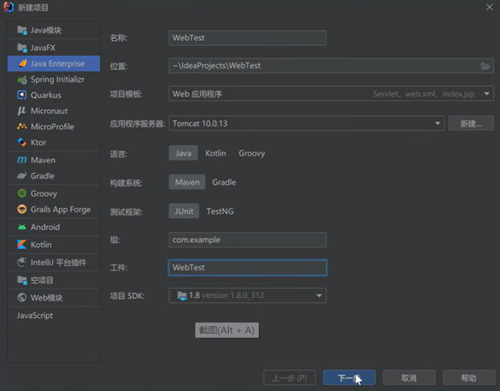
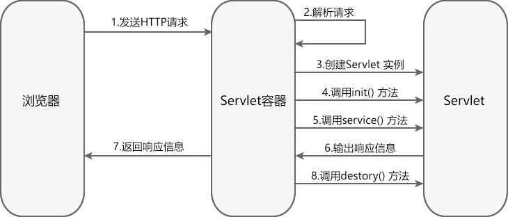
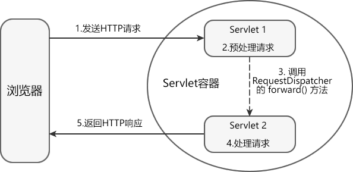
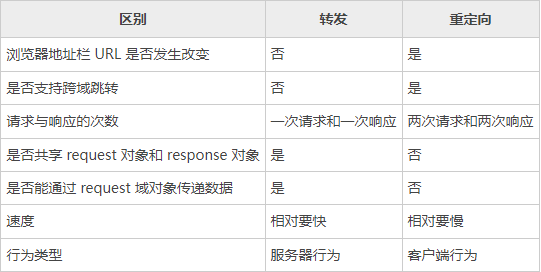
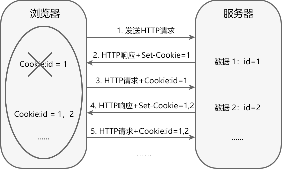
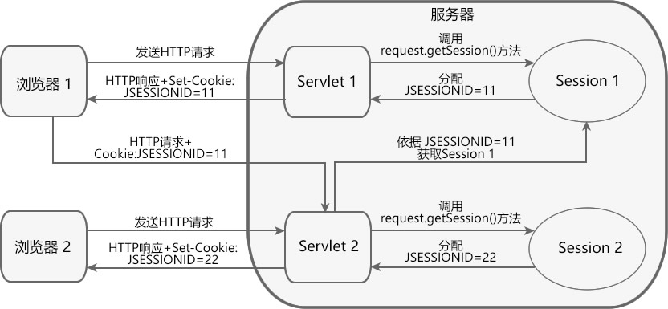
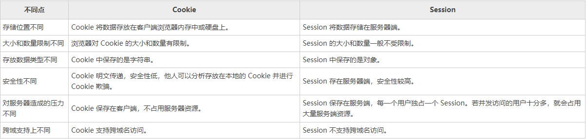
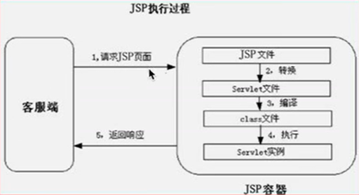
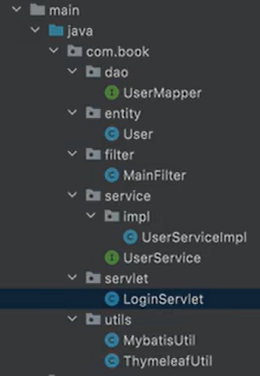

[TOC]

[Servlet教程 - C语言中文网]: https://c.biancheng.net/servlet2/

# 一、IDEA 创建 Web 项目

三层业务架构：

表示层 -> 数据业务逻辑层 -> Dao层

# 二、生命周期

Servlet 的生命周期就是 Servlet 从创建到销毁的过程。Servlet 的生命周期由 Servlet 容器管理，主要分为以下 3 个阶段。

1. 初始化阶段
2. 运行时阶段
3. 销毁阶段

在 javax.servlet.Servlet 接口中定义了 3 个方法：init()、service()、destory()，它们分别在 Servlet 生命周期的不同阶段被 Servlet 容器调用。

## 初始化阶段

只有完成了初始化，Servlet 才能处理来自客户端的请求。

Servlet 初始化阶段分为 2 步：

1. 加载和实例化 Servlet；
2. 调用 init() 方法进行初始化。

#### 1. 加载和实例化 Servlet

Servlet 容器负责加载和实例化 Servlet。当容器启动或首次请求某个 Servlet 时，容器会读取 web.xml 或 @WebServlet 中的配置信息，对指定的 Servlet 进行加载。加载成功后，容器会通过反射对 Servlet 进行实例化。

#### 2. 调用 init() 方法进行初始化

加载和实例化完成后，Servlet 容器调用 init() 方法初始化 Servlet 实例。

初始化的目的：让 Servlet 实例在处理请求之前完成一些初始化工作，例如建立数据库连接，获取配置信息等。

在 Servlet 的整个生命周期内，init() 方法只能被调用一次。

## 运行时阶段

运行时阶段是 Servlet 生命周期中最重要的阶段。Servlet 容器接收到来自客户端请求时，容器会针对该请求分别创建一个 ServletRequst 对象和 ServletResponse 对象，将它们以参数的形式传入 service() 方法内，并调用该方法对请求进行处理。

在 service() 方法中，Servlet 通过 ServletRequst 对象获取客户端的相关信息和请求信息。在请求处理完成后，通过 ServletResponse 对象将响应信息进行包装，返回给客户端。当 Servlet 容器将响应信息返回给客户端后，ServletRequst 对象与 ServletResponse 对象就会被销毁。

在 Servlet 的整个生命周期内，对于 Servlet 的每一次请求，Servlet 容器都会调用一次 service() 方法，并创建新的 ServletRequest 和 ServletResponse 对象。即 service() 方法在 Servlet 的整个生命周期中会被调用多次。

## 销毁阶段

当 Servlet 容器关闭、重启或移除 Servlet 实例时，容器就会调用 destory() 方法，释放该实例使用的资源，例如：关闭数据库连接，关闭文件的输入流和输出流等，随后该实例被 Java 的垃圾收集器所回收。

对于每个 Servlet 实例来说，destory() 方法只能被调用一次。

在 Java Servlet 中，有三个域对象用于在不同的作用域中存储数据。这些域对象是： 

1. 请求域（Request Scope）：请求域是指在一次 HTTP 请求的处理过程中，存储和共享数据的范围。请求域中的数据只对同一次请求中的不同 Servlet 和 JSP 页面可见。可以使用 `HttpServletRequest` 对象的 `setAttribute()` 方法将数据存储在请求域中，然后使用 `getAttribute()` 方法来获取这些数据。 
2. 会话域（Session Scope）：会话域是指在用户会话期间存储和共享数据的范围。会话域中的数据对同一用户的所有请求都可见。可以使用 `HttpSession` 对象的 `setAttribute()` 方法将数据存储在会话域中，然后使用 `getAttribute()` 方法来获取这些数据。会话域可以通过在请求中包含会话标识符来跟踪用户的会话。 
3. 上下文域（Application Scope）：上下文域是指在整个 Web 应用程序的生命周期中存储和共享数据的范围。上下文域中的数据对所有用户的所有请求都可见。可以使用 `ServletContext` 对象的 `setAttribute()` 方法将数据存储在上下文域中，然后使用 `getAttribute()` 方法来获取这些数据。 这些域对象提供了在不同作用域中共享数据的机制，可以根据数据的生命周期和共享的需求选择适当的域对象。

# 三、@WebServlet注解

使用 web.xml 或 @WebServlet 注解都可以配置 Servlet， 两者各有优缺点。

## @WebServlet 注解配置 Servlet

优点：@WebServlet 直接在 Servlet 类中使用，代码量少，配置简单。每个类只关注自身业务逻辑，与其他 Servlet 类互不干扰，适合多人同时开发。

## web.xml 配置文件配置 Servlet

优点：集中管理 Servlet 的配置，便于查找和修改。

缺点：代码较繁琐，可读性不强，不易于理解。

# 四、ServletContext 接口

Servlet 容器启动时，会为每个 Web 应用（webapps 下的每个目录都是一个 Web 应用）创建一个唯一的 ServletContext 对象，该对象一般被称为“Servlet 上下文”。

ServletContext 对象的生命周期从 Servlet 容器启动时开始，到容器关闭或应用被卸载时结束。

Web 应用中的所有 Servlet 共享同一个 ServletContext 对象，不同 Servlet 之间可以通过 ServletContext 对象实现数据通讯，因此 ServletContext 对象也被称为 Context 域对象。

> 域对象是服务器在内存上创建的存储空间，该空间用于不同动态资源（例如 Servlet、JSP）之间传递与共享数据。

## 设置上下文初始化参数

通过 web.xml 中的 <context-param> 元素可以为 Web 应用设置一些全局的初始化参数，这些参数被称为上下文初始化参数。在 Servlet 中调用接口中方法可以获取初始化参数

## 数据通信

在 Servlet 中，调用 ServletContext 接口的 setAttribute() 方法可以创建一些属性，这些属性被存放在 ServletContext 对象中。应用中所有 Servlet 都可以对这些属性进行访问和操作，通过它们可以实现应用内不同 Servlet 之间的数据通讯。 

## 读取 Web 应用下的资源文件

ServletContext 接口定义了一些读取 Web 资源的方法

# 五、HttpServletRequest接口

# 六、Servlet请求转发

请求转发具有以下特点：

1. 请求转发不支持跨域访问，只能跳转到当前应用中的资源。
2. 请求转发之后，浏览器地址栏中的 URL 不会发生变化，因此浏览器不知道在服务器内部发生了转发行为，更无法得知转发的次数。
3. 参与请求转发的 Web 资源之间共享同一 request 对象和 response 对象。
4. 由于 forward() 方法会先清空 response 缓冲区，因此只有转发到最后一个 Web 资源时，生成的响应才会被发送到客户端。

# 七、HttpServletResponse接口

在 Servlet API 中，定义了一个 HttpServletResponse 接口，它继承自 ServletResponse 接口。HttpServletResponse 对象专门用来封装 HTTP 响应消息，简称 response 对象。

Servlet 容器会针对每次请求创建一个 response 对象，并把它作为参数传递给 Servlet 的 service 方法。Servlet 处理请求后，会将响应信息封装到 response 对象中，并由容器解析后返回给客户端。

由于 HTTP 响应消息由响应行、响应头、消息体三部分组成，所以 HttpServletResponse 接口中定义了向客户端发送响应状态码、响应头、响应体的方法。

# 八、Servlet重定向

重定向属于客户端行为。服务器在收到客户端请求后，会通知客户端浏览器重新向另外一个 URL 发送请求，这称为请求重定向。它本质上是两次 HTTP 请求，对应两个 request 对象和两个 response 对象。

## 转发和重定向的区别

 

# 九、Servlet Cookie

HTTP（超文本传输协议）是一个基于请求与响应模式的无状态协议。

无状态主要指 2 点：

1. 协议对于事务处理没有记忆能力，服务器不能自动维护用户的上下文信息，无法保存用户状态；
2. 每次请求都是独立的，不会受到前面请求的影响，也不会影响后面的请求。

## 会话技术

从打开浏览器访问某个网站，到关闭浏览器的过程，称为一次会话。会话技术是指在会话中，帮助服务器记录用户状态和数据的技术。

常用的会话技术分为两种：

1. Cookie ：客户端会话技术
2. Session ：服务端会话技术

## Cookie

Cookie 属于客户端会话技术，它是服务器发送给浏览器的小段文本信息，存储在客户端浏览器的内存中或硬盘上。当浏览器保存了 Cookie 后，每次访问服务器，都会在 HTTP 请求头中将这个 Cookie 回传给服务器。

#### Cookie 的分类

Cookie分为两种：

1. 会话级别 Cookie（默认）：Cookie 保存到浏览器的内存中，浏览器关闭则 Cookie 失效。
2. 持久的 Cookie：Cookie 以文本文件的形式保存到硬盘上。

#### Cookie 的缺点

Cookie 虽然可以解决服务器跟踪用户状态的问题，但是它具有以下缺点：

- 在 HTTP 请求中，Cookie 是明文传递的，容易泄露用户信息，安全性不高。
- 浏览器可以禁用 Cookie，一旦被禁用，Cookie 将无法正常工作。
- Cookie 对象中只能设置文本（字符串）信息。
- 客户端浏览器保存 Cookie 的数量和长度是有限制的。

# 十、Servlet Session

Session 是服务器端会话技术。当浏览器访问 Web 服务器的资源时，服务器可以为每个用户浏览器创建一个 Session 对象，每个浏览器独占一个 Session 对象。

由于每个浏览器独占一个 Session，所以用户在访问服务器的资源时，可以把数据保存在各自的 Session 中。当用户再次访问该服务器中的其它资源时，其它资源可以从 Session 中取出数据，为用户服务。

## Session 与 Cookie 对比

## Session 的生命周期

#### Session 对象创建

Session 对象在容器第一次调用 request.getSession() 方法时创建。

> 值得注意的是，当客户端访问的 Web 资源是 HTML，CSS，图片等静态资源时，服务器不会创建 Session 对象。

#### Session 对象销毁

Session 对象在如下 3 种情况下会被销毁：

- Session 过期；
- 调用 session.invalidate() 方法，手动销毁 Session；
- 服务器关闭或者应用被卸载。

## Session 域对象

Session 对象也是一种域对象，它可以对属性进行操作，进而实现会话中请求之间的数据通讯和数据共享。

# 十一、Servlet Filter

Filter 不是 Servlet，不能直接访问，它本身也不能生成 request 对象和 response 对象，它只能为 Web 资源提供以下过滤功能：

- 在 Web 资源被访问前，检查 request 对象，修改请求头和请求正文，或对请求进行预处理操作。
- 将请求传递到下一个过滤器或目标资源。
- 在 Web 资源被访问后，检查 response 对象，修改响应头和响应正文。

> 注意：过滤器并不是必须要将请求传递到下一个过滤器或目标资源，它可以自行对请求进行处理，并发送响应给客户端，也可以将请求转发或重定向到其他的 Web 资源。

Filter 是 Servlet 规范中最实用的技术，通过它可以对服务器管理的所有 Web 资源（例如 JSP、Servlet、静态 HTML 文件、静态图片等）进行拦截，从而实现一些特殊的功能，例如用户的权限控制、过滤敏感词、设置统一编码格式等。

## Filter 的生命周期

Filter 的生命周期分为 3 个阶段：

1. 初始化阶段
2. 拦截和过滤阶段
3. 销毁阶段

### 1. 初始化阶段

Servlet 容器负责加载和实例化 Filter。容器启动时，读取 web.xml 或 @WebFilter 的配置信息对所有的过滤器进行加载和实例化。

加载和实例化完成后，Servlet 容器调用 init() 方法初始化 Filter 实例。在 Filter 的生命周期内， init() 方法只执行一次。

### 2. 拦截和过滤阶段

该阶段是 Filter 生命周期中最重要的阶段。当客户端请求访问 Web 资源时，Servlet 容器会根据 web.xml 或 @WebFilter 的过滤规则进行检查。当客户端请求的 URL 与过滤器映射匹配时，容器将该请求的 request 对象、response 对象以及 FilterChain 对象以参数的形式传递给 Filter 的 doFilter() 方法，并调用该方法对请求/响应进行拦截和过滤。

### 3. 销毁阶段

Filter 对象创建后会驻留在内存中，直到容器关闭或应用被移除时销毁。销毁 Filter 对象之前，容器会先调用 destory() 方法，释放过滤器占用的资源。在 Filter 的生命周期内，destory() 只执行一次。

## FilterChain过滤器链

## FilterConfig接口

avax.Servet 包中提供了一个 FilterCofig 接口，它与 ServletConfig 接口相似，用于在过滤器初始化期间向其传递信息。

FilterConfig 接口由容器实现，容器将它作为参数传入过滤器的 init() 方法中。通过 filterConfig 对象就可以获得 Filter 的初始化参数。

# 十二、Servlet Listener

监听器 Listener 是一个实现特定接口的 Java 程序，这个程序专门用于监听另一个 Java 对象的方法调用或属性改变，当被监听对象发生上述事件后，监听器某个方法将立即自动执行。

监听器 Listener 按照监听的事件划分，可以分为 3 类：

1. 监听对象创建和销毁的监听器
2. 监听对象中属性变更的监听器
3. 监听 HttpSession 中的对象状态改变的监听器

# 十三、JSP

## JSP 加载原理

JSP 本质上依然是一个 Servlet。Tomcat 在加载 JSP 页面时，会将其动态转换成一个 java 类并编译为 class 进行加载，而生成的 Java 类，正是一个 Servlet 的子类，而页面的内容全部被编译为输出字符串。

## 项目架构

**dao层： 持久层。主要与数据库进行交互**

dao层主要是做数据持久层的工作，主要与数据库进行交互。

dao层首先会创建dao接口，然后会在配置文件中定义该接口的实现类，接着就可以在模块中就可以调用dao的接口进行数据业务的而处理，并且不用关注此接口的具体实现类是哪一个类。

dao层的数据源和数据库连接的参数数都是在配置文件中进行配置的。

**entity层（domain层） 实体层，数据库在项目中的类**

**service：业务层，控制业务**

service层主要负责业务模块的逻辑应用设计。

和DAO层一样都是先设计接口，再创建要实现的类，然后在配置文件中进行配置其实现的关联。接下来就可以在service层调用接口进行业务逻辑应用的处理。

封装service层的业务逻辑有利于业务逻辑的独立性和重复利用性。

**controller层（action层）：控制层，控制业务逻辑**

controller层负责具体的业务模块流程的控制，controller层主要调用Service层里面的接口控制具体的业务流程，控制的配置也需要在配置文件中进行。

**view层：视图层**

此层与控制层结合比较紧密，需要二者结合起来协同工发。View层主要负责前台jsp页面的表示。
