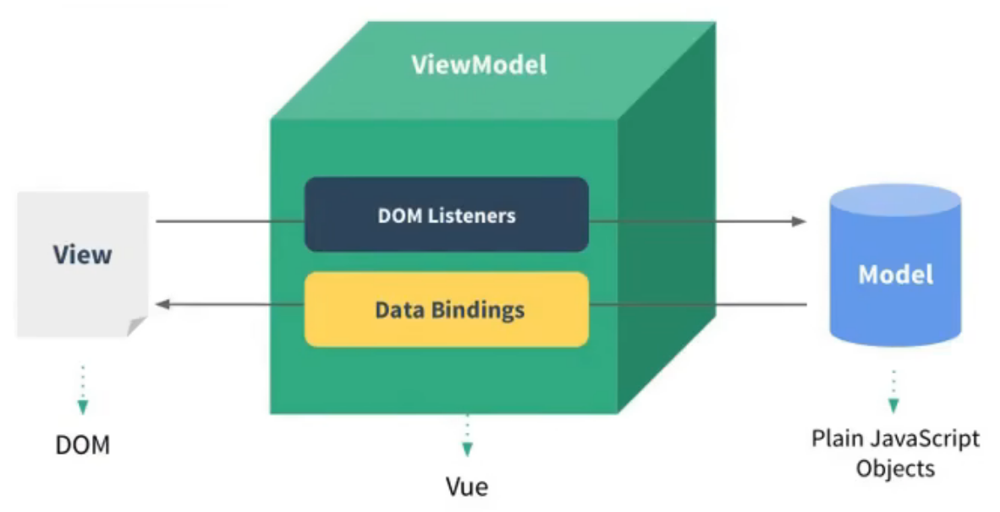
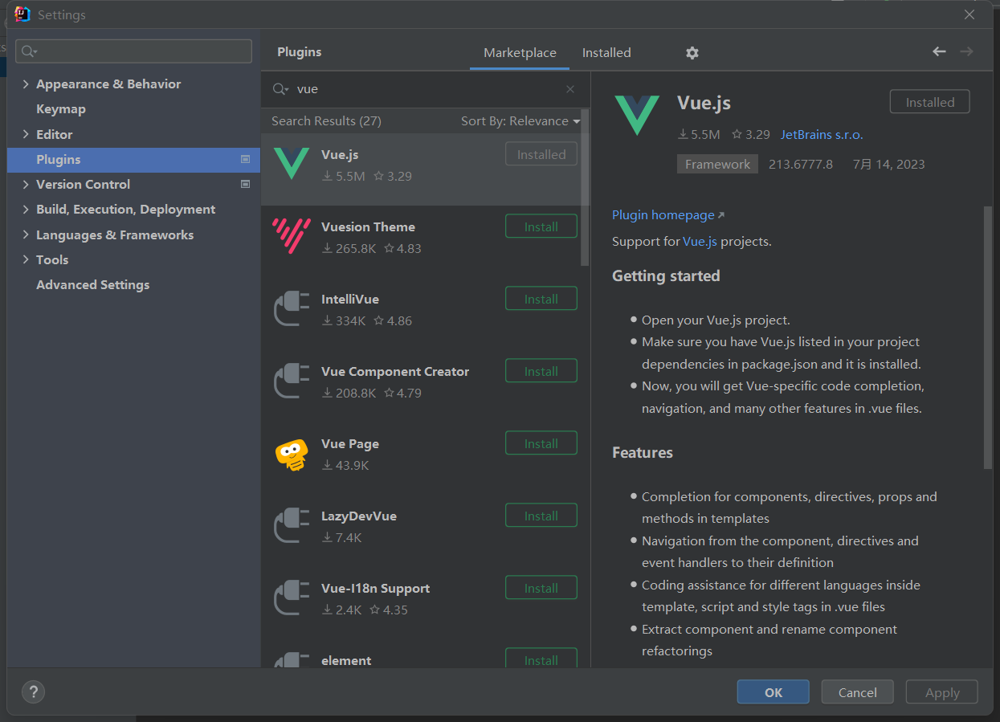

# 一、学习官网

[官网]: https://cn.vuejs.org/
[B站优质视频]: https://www.bilibili.com/video/BV1Rs4y127j8/?share_source=copy_web&amp;vd_source=d3666c2043c363d538f217512a5c5be0

[菜鸟教程]: https://www.runoob.com/vue3/vue3-tutorial.html

[API文档]: https://cn.vuejs.org/api/


# 二、MVVM架构



## 介绍

在Vue框架中，MVVM是指“模型-视图-视图模型”，是一种用于构建用户界面的架构模式。MVVM将用户界面分为三个主要部分：

1. 模型（Model）：表示应用程序中的数据和业务逻辑。

2. 视图（View）：表示用户界面，即用户可以看到和与之交互的部分。

3. 视图模型（ViewModel）：连接模型和视图，充当桥梁。

在MVVM架构中，模型表示应用程序中的数据和业务逻辑。在Vue中，模型通常是由组件的状态(state)和方法(methods)来表示的。状态是组件的数据，可以是原始数据类型、对象或数组，这些状态可以通过Vue实例的数据对象来管理。方法是组件中定义的行为，用于实现模型中的业务逻辑。

视图是用户界面的呈现，通常是由HTML和CSS组成。在Vue中，视图可以通过模板(template)来描述，模板可以包含指令和表达式，用于实现视图的动态渲染和事件处理。指令是一种特殊的HTML属性，用于描述视图和模型之间的绑定关系。表达式是一段JavaScript代码，用于计算视图中的值。

视图模型是Vue中最重要的概念之一，它是连接模型和视图的桥梁。在Vue中，视图模型是由Vue实例来扮演的，Vue实例通过响应式的数据绑定，将视图和模型进行连接。当视图中的状态发生变化时，Vue实例会自动更新模型中的数据，反之亦然。视图模型还负责处理用户与视图之间的交互，例如监听用户输入、处理点击事件等。视图模型可以使用Vue提供的指令和生命周期钩子函数来实现这些功能。

这种架构模式的好处在于它可以将代码分离成不同的层次，使得开发更容易维护和扩展。视图和模型之间的通信是通过视图模型来实现的，这消除了视图和模型之间的直接耦合，使得应用程序更加灵活和可测试。


## 优点

- 数据绑定：Vue实现了响应式的数据绑定，将视图和数据状态进行绑定，当数据状态发生变化时，视图会自动更新。这样，开发人员可以更容易地管理和更新视图状态，而无需手动操作DOM元素。

- 模板系统：Vue提供了一种基于HTML的模板系统，使开发人员可以轻松地创建动态、可重用的UI组件。这种模板系统使得编写复杂的UI界面变得更加简单和直观。

- 事件处理：Vue提供了一个基于指令的事件处理系统，使开发人员可以通过声明式语法绑定事件处理程序。这种方式让事件处理更加简单和清晰。
  


# 三、工具

1、VSCODE...

2、使用IDEA中的插件




# 四、快速上手

首先初始化项目

```
> npm init vue@latest
```

然后

```
cd "package_name"
npm install
npm run dev
```

然后就可以进入架设好的前端网站


# 五、项目架构

src 文件夹：存放源码的地方

assets文件夹：存放公共资源，如图片、公共css或者字体图标

# 六、Vue的使用方法

## 1、全局构建版本

你可以借助 script 标签直接通过 CDN 来使用 Vue：

```html
<script src="https://unpkg.com/vue@3/dist/vue.global.js"></script>
```

这里我们使用了 [unpkg](https://unpkg.com/)，但你也可以使用任何提供 npm 包服务的 CDN，例如 [jsdelivr](https://www.jsdelivr.com/package/npm/vue) 或 [cdnjs](https://cdnjs.com/libraries/vue)。当然，你也可以下载此文件并自行提供服务。

**例子：**

```html
<script src="https://unpkg.com/vue@3/dist/vue.global.js"></script>

<div id="app">{{ message }}</div>

<script>
  const { createApp } = Vue
  
  createApp({
    data() {
      return {
        message: 'Hello Vue!'
      }
    }
  }).mount('#app')
</script>
```

**export default例子：**

```html
<script>
    export default {
        data() {
            return {
                msg: "hello vue"
            }
        }
    }
</script>
```

## 2、使用 ES 模块构建版本

```html
<div id="app">{{ message }}</div>

<script type="module">
  import { createApp } from 'https://unpkg.com/vue@3/dist/vue.esm-browser.js'
  
  createApp({
    data() {
      return {
        message: 'Hello Vue!'
      }
    }
  }).mount('#app')
</script>
```

## 3、启用 Import maps 版本

在上面的示例中，我们使用了完整的 CDN URL 来导入，但在文档的其余部分中，你将看到如下代码：

js

```html
import { createApp } from 'vue'
```

我们可以使用[导入映射表 (Import Maps)](https://caniuse.com/import-maps) 来告诉浏览器如何定位到导入的 `vue`：

```html
<script type="importmap">
  {
    "imports": {
      "vue": "https://unpkg.com/vue@3/dist/vue.esm-browser.js"
    }
  }
</script>

<div id="app">{{ message }}</div>

<script type="module">
  import { createApp } from 'vue'

  createApp({
    data() {
      return {
        message: 'Hello Vue!'
      }
    }
  }).mount('#app')
</script>
```

## 4、拆分模块版本

随着对这份指南的逐步深入，我们可能需要将代码分割成单独的 JavaScript 文件，以便更容易管理。例如：

```html
<!-- index.html -->
<div id="app"></div>

<script type="module">
  import { createApp } from 'vue'
  import MyComponent from './my-component.js'

  createApp(MyComponent).mount('#app')
</script>
```

```javascript
// my-component.js
export default {
  data() {
    return { count: 0 }
  },
  template: `<div>count is {{ count }}</div>`
}
```

如果直接在浏览器中打开了上面的 `index.html`，你会发现它抛出了一个错误，因为 ES 模块不能通过 `file://` 协议工作，也即是当你打开一个本地文件时浏览器使用的协议。

由于安全原因，ES 模块只能通过 `http://` 协议工作，也即是浏览器在打开网页时使用的协议。为了使 ES 模块在我们的本地机器上工作，我们需要使用本地的 HTTP 服务器，通过 `http://` 协议来提供 `index.html`。

要启动一个本地的 HTTP 服务器，请先安装 [Node.js](https://nodejs.org/zh/)，然后通过命令行在 HTML 文件所在文件夹下运行 `npx serve`。你也可以使用其他任何可以基于正确的 MIME 类型服务静态文件的 HTTP 服务器。


# 七、应用

## 1、挂载应用

应用实例必须在调用了 `.mount()` 方法后才会渲染出来。该方法接收一个“容器”参数，可以是一个实际的 DOM 元素或是一个 CSS 选择器字符串：

```html
<div id="app"></div>
```

```javascript
app.mount('#app')
```

## 2、多个应用实例

应用实例并不只限于一个。`createApp` API 允许你在同一个页面中创建多个共存的 Vue 应用，而且每个应用都拥有自己的用于配置和全局资源的作用域。

```javascript
const app1 = createApp({
  /* ... */
})
app1.mount('#container-1')

const app2 = createApp({
  /* ... */
})
app2.mount('#container-2')
```

# 八、单文件组件

Vue 的单文件组件 (即 `*.vue` 文件，英文 Single-File Component，简称 **SFC**) 是一种特殊的文件格式，使我们能够将一个 Vue 组件的模板、逻辑与样式封装在单个文件中。下面是一个单文件组件的示例：

```vue
<script>
export default {
  data() {
    return {
      greeting: 'Hello World!'
    }
  }
}
</script>

<template>
  <p class="greeting">{{ greeting }}</p>
</template>

<style>
.greeting {
  color: red;
  font-weight: bold;
}
</style>
```

如你所见，Vue 的单文件组件是网页开发中 HTML、CSS 和 JavaScript 三种语言经典组合的自然延伸。`<template>`、`<script>` 和 `<style>` 三个块在同一个文件中封装、组合了组件的视图、逻辑和样式。完整的语法定义可以查阅 [SFC 语法说明](https://cn.vuejs.org/api/sfc-spec.html)。

## 使用方法

### 1、从一个Vue文件中引入

App.vue：

```vue
<template>
  <test />
</template>

<script setup>
  import test from './components/test.vue'
</script>
```

Test.vue：

```vue
<template>
  <p>{{ message }}</p>
</template>

<script>
  export default {
    data() {
        return {
            message: 'TEST.vue'
      }
    }
  }
</script>
```

或者：

```vue
<script>
import ButtonCounter from './ButtonCounter.vue'

export default {
  components: {
    ButtonCounter
  }
}
</script>

<template>
  <h1>Here is a child component!</h1>
  <ButtonCounter />
</template>
```

### 2、组件


