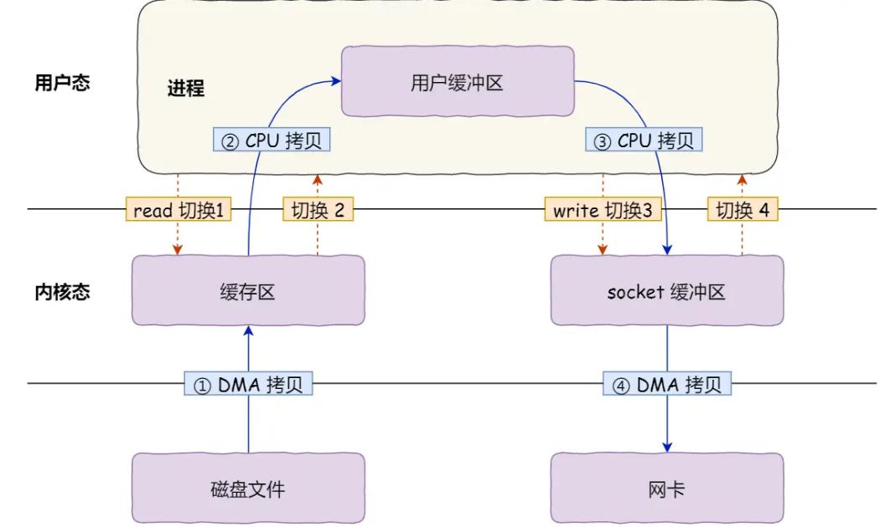
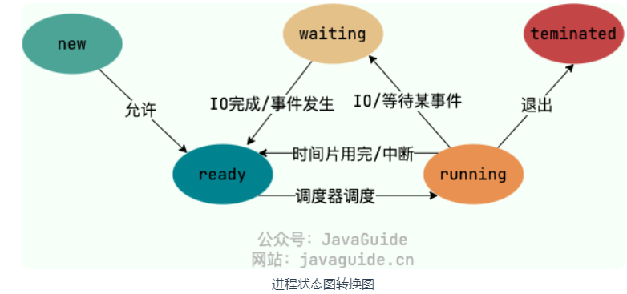
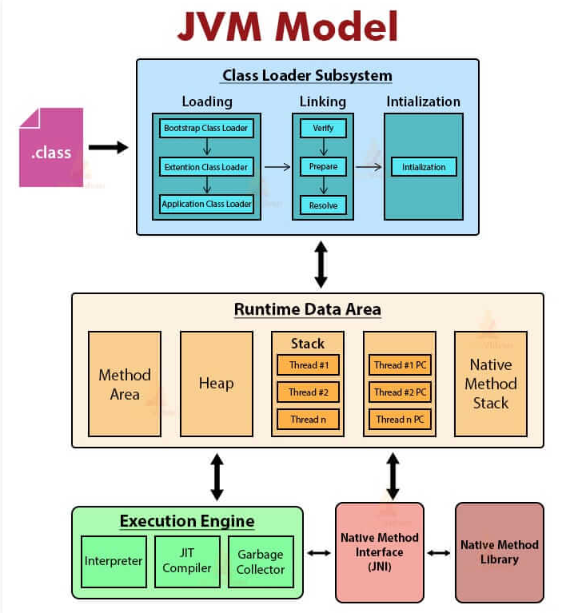

# 自我介绍

面试官您好，我是叶晋荣，目前是香港大学计算机系的在读学生，预计今年十一月份毕业。我本科读的是台湾东海大学的信息管理。在我大四的时候，有拿到过产学合作的机会。帮台湾最大的车辆测试中心，做全栈的中台管理的项目，这是一个从0到1的项目，后端用的是Node.js。到了研究生以后，我觉得应该朝向具体某一个领域发展，我就选择了Java技术栈，因为他的技术面非常成熟。我觉得自己是一个学习能力、驱动性特别强的人，我这几个月自己买了很多的书，自学了Java基础、JVM、并发编程，还深入了解 MySQL、Redis、RabbitMQ，还补充了很多计算机网络、操作系统的知识。我看了很多的项目，积累了很多经验。现在主要做了两个项目，一个是跟电商相关的项目，另一个是目前正在学习的一个微服务项目。


# 问面试官的问题


# 计算机网络✔

**TCP/IP 四层网络架构 vs OSI 七层网络架构**


[从输入一个网址到回应发生了什么]: https://xiaolincoding.com/network/1_base/what_happen_url.html#%E4%BA%92%E7%9B%B8%E6%89%92%E7%9A%AE-%E6%9C%8D%E5%8A%A1%E5%99%A8-%E4%B8%8E-%E5%AE%A2%E6%88%B7%E7%AB%AF



[Linux 接收/发送网络包的流程 - 软中断]: https://xiaolincoding.com/network/1_base/how_os_deal_network_package.html#linux-%E6%8E%A5%E6%94%B6%E7%BD%91%E7%BB%9C%E5%8C%85%E7%9A%84%E6%B5%81%E7%A8%8B
[HTTP 常见的状态码]: https://xiaolincoding.com/network/2_http/http_interview.html#http-%E5%B8%B8%E8%A7%81%E7%9A%84%E7%8A%B6%E6%80%81%E7%A0%81%E6%9C%89%E5%93%AA%E4%BA%9B
[HTTP 和 HTTPS的区别 / TLS 协议]: https://xiaolincoding.com/network/2_http/http_interview.html#http-%E4%B8%8E-https
[HTTP/1.1、HTTP/2、HTTP/3 演变]: https://xiaolincoding.com/network/2_http/http_interview.html#http-1-1%E3%80%81http-2%E3%80%81http-3-%E6%BC%94%E5%8F%98
[WebSocket]: https://xiaolincoding.com/network/2_http/http_websocket.html
[TCP 和 UDP]: https://javaguide.cn/cs-basics/network/other-network-questions2.html#tcp-%E4%B8%8E-udp
[如何理解TCP是面向字节流的协议,UDP是面向报文的协议]: https://blog.csdn.net/qq_48626761/article/details/131854239
[TCP 三次握手]: https://xiaolincoding.com/network/3_tcp/tcp_interview.html#tcp-%E8%BF%9E%E6%8E%A5%E5%BB%BA%E7%AB%8B
[TCP 四次挥手]: https://xiaolincoding.com/network/3_tcp/tcp_interview.html#tcp-%E8%BF%9E%E6%8E%A5%E6%96%AD%E5%BC%80
[TCP 重传、滑动窗口、流量控制、拥塞控制]: https://xiaolincoding.com/network/3_tcp/tcp_feature.html#%E9%87%8D%E4%BC%A0%E6%9C%BA%E5%88%B6
[TCP 半连接队列和全连接队列]: https://xiaolincoding.com/network/3_tcp/tcp_queue.html#%E4%BB%80%E4%B9%88%E6%98%AF-tcp-%E5%8D%8A%E8%BF%9E%E6%8E%A5%E9%98%9F%E5%88%97%E5%92%8C%E5%85%A8%E8%BF%9E%E6%8E%A5%E9%98%9F%E5%88%97
[IP 基础知识]: https://xiaolincoding.com/network/4_ip/ip_base.html#%E5%89%8D%E8%8F%9C-ip-%E5%9F%BA%E6%9C%AC%E8%AE%A4%E8%AF%86


# 操作系统✔

**用户态和内核态**


[冯诺依曼模型]: https://xiaolincoding.com/os/1_hardware/how_cpu_run.html#%E5%86%AF%E8%AF%BA%E4%BE%9D%E6%9B%BC%E6%A8%A1%E5%9E%8B
[操作系统结构]: https://www.xiaolincoding.com/os/2_os_structure/linux_vs_windows.html#%E5%86%85%E6%A0%B8
[Linux 内核 vs Windows 内核]: https://xiaolincoding.com/os/2_os_structure/linux_vs_windows.html



[进程和线程]: https://javaguide.cn/cs-basics/operating-system/operating-system-basic-questions-01.html#%E8%BF%9B%E7%A8%8B%E5%92%8C%E7%BA%BF%E7%A8%8B
[进程间的通信方式]: https://javaguide.cn/cs-basics/operating-system/operating-system-basic-questions-01.html#%E8%BF%9B%E7%A8%8B%E9%97%B4%E7%9A%84%E9%80%9A%E4%BF%A1%E6%96%B9%E5%BC%8F%E6%9C%89%E5%93%AA%E4%BA%9B
[进程的调度算法]: https://javaguide.cn/cs-basics/operating-system/operating-system-basic-questions-01.html#%E8%BF%9B%E7%A8%8B%E7%9A%84%E8%B0%83%E5%BA%A6%E7%AE%97%E6%B3%95%E6%9C%89%E5%93%AA%E4%BA%9B
[僵尸进程和孤儿进程]: https://javaguide.cn/cs-basics/operating-system/operating-system-basic-questions-01.html#%E4%BB%80%E4%B9%88%E6%98%AF%E5%83%B5%E5%B0%B8%E8%BF%9B%E7%A8%8B%E5%92%8C%E5%AD%A4%E5%84%BF%E8%BF%9B%E7%A8%8B
[死锁产生的条件]: https://xiaolincoding.com/os/4_process/deadlock.html#%E6%AD%BB%E9%94%81%E7%9A%84%E6%A6%82%E5%BF%B5
[内存管理]: https://javaguide.cn/cs-basics/operating-system/operating-system-basic-questions-02.html#%E5%86%85%E5%AD%98%E7%AE%A1%E7%90%86
[文件系统]: https://javaguide.cn/cs-basics/operating-system/operating-system-basic-questions-02.html#%E6%96%87%E4%BB%B6%E7%B3%BB%E7%BB%9F

[一致性哈希]: https://www.xiaolincoding.com/os/8_network_system/hash.html


# 网络安全✔

**CSRF 跨站请求伪造攻击**：利用用户自己的权限在未知的情况下攻击自己，例如用钓鱼网站伪造请求

**SFA 会话固定攻击**：利用Cookie中相同的JSESSIONID进行的攻击，简单来说就是黑客把他的JSESSIONID直接给你，让你来登入

**XSS 跨站脚本攻击**：在网页注入恶意脚本代码来攻击用户


# Java 基础✔

[深拷贝和浅拷贝]: https://javaguide.cn/java/basis/java-basic-questions-02.html#%E6%B7%B1%E6%8B%B7%E8%B4%9D%E5%92%8C%E6%B5%85%E6%8B%B7%E8%B4%9D%E5%8C%BA%E5%88%AB%E4%BA%86%E8%A7%A3%E5%90%97-%E4%BB%80%E4%B9%88%E6%98%AF%E5%BC%95%E7%94%A8%E6%8B%B7%E8%B4%9D
[浮点数计算精度丢失]: https://www.cnblogs.com/fuzongle/p/14986543.html
[编译型和解释型语言]: https://www.freecodecamp.org/chinese/news/compiled-versus-interpreted-languages/
[泛型和通配符]: 面试指北	"123 - 128"

**泛型擦除**

Java 的泛型是伪泛型，这是因为 Java 在编译期间，所有的泛型信息都会被擦掉，这也就是通常所说类型擦除 。编译器会在编译期间会动态地将泛型 T 擦除为 Object 或将 T extends xxx 擦除为其限定类型 xxx 。**泛型本质上其实还是编译器的行为**，为了保证引入泛型机制但不创建新的类型，减少虚拟机的运行开销，编译器通过擦除将泛型类转化为一般类。  

```java
// 举例1
List<Integer> list = new ArrayList<>();
list.add(12);
// 1.编译期间直接添加会报错
list.add("a");
Class<? extends List> clazz = list.getClass();
Method add = clazz.getDeclaredMethod("add", Object.class);
// 2.运行期间通过反射添加，是可以的
add.invoke(list, "kl");
System.out.println(list)
    
// 举例2: 由于泛型擦除的问题，下面的方法重载会报错
public void print(List<String> list) { }
public void print(List<Integer> list) { }
```

[反射机制]: https://javaguide.cn/java/basis/reflection.html
[代理机制]: https://javaguide.cn/java/basis/proxy.html


# 集合✔

| 集合总结                                                     |                                                              |
| ------------------------------------------------------------ | ------------------------------------------------------------ |
| [List](https://javaguide.cn/java/collection/java-collection-questions-01.html#list-1) | ArrayList 和 Array（数组）的区别<br />ArrayList 和 Vector 的区别<br />Vector 和 Stack 的区别<br />ArrayList 与 LinkedList 区别 |
| [Set](https://javaguide.cn/java/collection/java-collection-questions-01.html#set-1) | Comparable 和 Comparator 的区别<br />无序性和不可重复性的含义是什么<br />HashSet、LinkedHashSet 和 TreeSet 三者的异同 |
| [Queue](https://javaguide.cn/java/collection/java-collection-questions-01.html#queue-1) | Queue 与 Deque<br />ArrayDeque 与 LinkedList 的区别<br />PriorityQueue<br />BlockingQueue |
| [Map](https://javaguide.cn/java/collection/java-collection-questions-02.html#map-%E9%87%8D%E8%A6%81) | HashTable 和 HashMap的区别<br />HashMap<br />**1.7版本**<br />**1.8版本之后**<br />HashMap 和 HashSet 区别<br />ConcurrentHashMap<br />**1.7版本**<br />**1.8版本** |

| 安全性     |                                                              |
| ---------- | ------------------------------------------------------------ |
| 线程安全   | Vector、Stack、HashTable、ConcurrentHashMap、并发容器(ConcurrentHashMap、CopyOnWriteArrayList、BlockingQueue) |
| 线程不安全 | *                                                            |


# 并发编程✔

[基础知识]: https://javaguide.cn/java/concurrent/java-concurrent-questions-01.html
[JMM(Java Memory Model) 以及 happens-before原则]: https://javaguide.cn/java/concurrent/jmm.html
[CAS]: https://javaguide.cn/java/concurrent/java-concurrent-questions-02.html#%E5%A6%82%E4%BD%95%E5%AE%9E%E7%8E%B0%E4%B9%90%E8%A7%82%E9%94%81
[volatile关键字]: https://javaguide.cn/java/concurrent/java-concurrent-questions-02.html#volatile-%E5%85%B3%E9%94%AE%E5%AD%97
[synchronized关键字]: https://javaguide.cn/java/concurrent/java-concurrent-questions-02.html#synchronized-%E5%85%B3%E9%94%AE%E5%AD%97
[synchronized锁升级机制]: https://juejin.cn/post/7097910013636640776
[Reentrantlock]: https://javaguide.cn/java/concurrent/java-concurrent-questions-02.html#reentrantlock
[ReentrantReadWriteLock]: https://javaguide.cn/java/concurrent/java-concurrent-questions-02.html#reentrantreadwritelock
[AQS详解]: https://javaguide.cn/java/concurrent/aqs.html
[常用同步工具类]: https://javaguide.cn/java/concurrent/aqs.html#%E5%B8%B8%E8%A7%81%E5%90%8C%E6%AD%A5%E5%B7%A5%E5%85%B7%E7%B1%BB
[ThreadLocal]: https://javaguide.cn/java/concurrent/java-concurrent-questions-03.html#threadlocal
[线程池]: https://javaguide.cn/java/concurrent/java-concurrent-questions-03.html#%E7%BA%BF%E7%A8%8B%E6%B1%A0
[线程池常用的阻塞队列]: https://javaguide.cn/java/concurrent/java-concurrent-questions-03.html#%E7%BA%BF%E7%A8%8B%E6%B1%A0%E5%B8%B8%E7%94%A8%E7%9A%84%E9%98%BB%E5%A1%9E%E9%98%9F%E5%88%97%E6%9C%89%E5%93%AA%E4%BA%9B
[常见并发容器]: https://javaguide.cn/java/concurrent/java-concurrent-collections.html
[带着BAT大厂的面试问题去理解Fork/Join框架]: https://pdai.tech/md/java/thread/java-thread-x-juc-executor-ForkJoinPool.html#%E5%B8%A6%E7%9D%80bat%E5%A4%A7%E5%8E%82%E7%9A%84%E9%9D%A2%E8%AF%95%E9%97%AE%E9%A2%98%E5%8E%BB%E7%90%86%E8%A7%A3fork-join%E6%A1%86%E6%9E%B6


# JVM✔



[JDK各版本的特性（8~20）]: https://blog.csdn.net/qq_44150902/article/details/129062849
[Java运行时内存区域]: https://javaguide.cn/java/jvm/memory-area.html
[对象引用]: https://javabetter.cn/jvm/zongjie.html#_3-%E5%AF%B9%E8%B1%A1%E5%BC%95%E7%94%A8
[JVM垃圾回收详解]: https://javaguide.cn/java/jvm/jvm-garbage-collection.html
[类加载过程]: https://javaguide.cn/java/jvm/class-loading-process.html
[类加载器]: https://javaguide.cn/java/jvm/classloader.html
[JVM参数总结]: https://javaguide.cn/java/jvm/jvm-parameters-intro.html

[JVM 方法区和元空间]: https://juejin.cn/post/7081620160914096159


# IO✔

[创建网络模型: BIO/NIO/AIO]: https://javaguide.cn/java/io/io-model.html#java-%E4%B8%AD-3-%E7%A7%8D%E5%B8%B8%E8%A7%81-io-%E6%A8%A1%E5%9E%8B
[零拷贝]: https://www.xiaolincoding.com/os/8_network_system/zero_copy.html
[select/poll/epoll]: https://www.xiaolincoding.com/os/8_network_system/selete_poll_epoll.html


# Spring

## 基础


[IOC]: https://javaguide.cn/system-design/framework/spring/spring-knowledge-and-questions-summary.html#%E8%B0%88%E8%B0%88%E8%87%AA%E5%B7%B1%E5%AF%B9%E4%BA%8E-spring-ioc-%E7%9A%84%E4%BA%86%E8%A7%A3
[AOP]: https://javaguide.cn/system-design/framework/spring/spring-knowledge-and-questions-summary.html#spring-aop
[AOP实现原理]: https://www.cnblogs.com/tuyang1129/p/12878549.html#21-spring-aop%E7%9A%84%E5%AE%9E%E7%8E%B0%E5%8E%9F%E7%90%86
[Spring事务]: https://javaguide.cn/system-design/framework/spring/spring-transaction.html


## SpringMVC

[MVC 工作原理]: https://javaguide.cn/system-design/framework/spring/spring-knowledge-and-questions-summary.html#springmvc-%E5%B7%A5%E4%BD%9C%E5%8E%9F%E7%90%86%E4%BA%86%E8%A7%A3%E5%90%97


## SpringBoot

[面试指北]: 200-214	"page"
[SpringBoot 启动流程]: https://juejin.cn/post/7035910505810100255
[SpringBoot 启动过程（生命周期及事件）概述]: https://www.cnblogs.com/z-sm/p/15120013.html
[自定义 starter]: https://juejin.cn/post/6844904032708870151


## SpringSecurity

[SpringSecurity]: https://javaguide.cn/system-design/framework/spring/spring-knowledge-and-questions-summary.html#spring-security
[Spring Security到底在哪里进行密码方式认证]: https://blog.csdn.net/chengqiuming/article/details/103282586
[浅析Spring Security实现认证、授权原理]: https://zhuanlan.zhihu.com/p/601973405
[Spring Security 原理了解]: https://10wjfang.github.io/blog/2019/02/13/spring-security/
[一文带你搞定Spring Security + JWT]: https://www.cnblogs.com/RudeCrab/p/14265273.html#%E5%89%8D%E8%A8%80
[过滤器（filter）与拦截器（Interceptor）的区别]: https://blog.csdn.net/weixin_44341110/article/details/127446625
[性能优化 - 缓存 JWT token]: https://blog.51cto.com/u_16213386/9280055


## SpringCloud

[Nacos 问题1]: https://juejin.cn/post/7114108694908010533
[Nacos 问题2]: https://www.cnblogs.com/xgss/articles/17097246.html
[Gateway 常见问题]: https://javaguide.cn/distributed-system/spring-cloud-gateway-questions.html
[Sentinel 常见问题]: https://blog.csdn.net/weixin_44582492/article/details/134938082

[SpringCloudAlibaba常用组件]: https://blog.csdn.net/zsx1314lovezyf/article/details/132618524


# Mybatis


# 源码解析

[Arraylist 源码分析/扩容机制]: https://javaguide.cn/java/collection/arraylist-source-code.html

维护了一个Object[]，默认容量为10，支持传入容量参数进行初始化。

扩容机制：通过位运算（速度远远快于整除运算）将新容量更新为旧容量的1.5倍，将旧数组中的所有元素复制到新数组中，保持相同的顺序，并释放旧数组，以便垃圾收集器可以回收它占用的内存。如果还是小于所需容量，就把最小需要容量当作数组的新容量，并检查新容量是否超出了ArrayList所定义的最大容量，若超出了则新容量则为Integer.MAX_VALUE。


[LinkedList 源码分析]: https://javaguide.cn/java/collection/linkedlist-source-code.html

实现了Deque和Queue接口的双向链表，LinkedList 中的元素是通过 Node 定义的。


[HashMap 源码分析]: https://javaguide.cn/java/collection/hashmap-source-code.html

`HashMap` 默认的初始化大小为 16。之后每次扩充，容量变为原来的 2 倍。创建时如果给定了容量初始值，那么 `Hashtable` 会直接使用你给定的大小，而 `HashMap` 会将其扩充为 2 的幂次方大小。JDK1.8 以后的 `HashMap` 在解决哈希冲突时有了较大的变化，当链表长度大于阈值（默认为 8）时，将链表转化为红黑树（将链表转换成红黑树前会判断，如果当前数组的长度小于 64，那么会选择先进行数组扩容，而不是转换为红黑树），以减少搜索时间。

> HashMap 的长度为什么是 2 的幂次方?
> 使用2的幂次方作为散列桶数组的长度，可以通过位运算（与操作）(length-1)&hash 来替代取模运算，使计算索引的过程更高效。
>
> HashMap 多线程操作导致死循环问题？
> JDK1.7 及之前版本的 `HashMap`使用头插法，在多线程环境下扩容操作可能形成一个环形链表，存在死循环。为了解决这个问题，JDK1.8 版本的 HashMap 采用了尾插法而不是头插法来避免链表倒置。但还是会存在数据覆盖（丢失）的问题，因此推荐使用ConcurrentHashMap。


[ConcurrentHashMap 源码分析]: https://javaguide.cn/java/collection/concurrent-hash-map-source-code.html

实现线程安全的方式（重要）：

- 在 JDK1.7 的时候，`ConcurrentHashMap` 对整个桶数组进行了分割分段(`Segment`，分段锁)，每个段都是一个独立的哈希表，拥有自己的锁，每一把锁只锁容器其中一部分数据，多线程访问容器里不同数据段的数据，就不会存在锁竞争，提高并发访问率。
- 到了 JDK1.8 的时候，`ConcurrentHashMap` 已经摒弃了 `Segment` 的概念，而是直接用 `Node` 数组+链表+红黑树的数据结构来实现，并发控制使用 `synchronized` 和 CAS 来保证并发安全。（JDK1.6 以后 `synchronized` 锁做了很多优化） 整个看起来就像是优化过且线程安全的 `HashMap`，虽然在 JDK1.8 中还能看到 `Segment` 的数据结构，但是已经简化了属性，只是为了兼容旧版本；

> **JDK 1.7 和 JDK 1.8 的 ConcurrentHashMap 实现有什么不同？**
> **1. 线程安全实现方式**：JDK 1.7 采用 `Segment` 分段锁来保证安全， `Segment` 是继承自 `ReentrantLock`。JDK1.8 放弃了 `Segment` 分段锁的设计，采用 `Node + CAS + synchronized` 保证线程安全，锁粒度更细，`synchronized` 只锁定当前链表或红黑二叉树的首节点。
> **2. Hash 碰撞解决方法** : JDK 1.7 采用拉链法，JDK1.8 采用拉链法结合红黑树（链表长度超过一定阈值时，将链表转换为红黑树）。
> **3. 并发度**：JDK 1.7 最大并发度是 Segment 的个数，默认是 16，一旦定义不可以改变。JDK 1.8 最大并发度是 Node 数组的大小，并发度更大。
>
> **ConcurrentHashMap 为什么 key 和 value 不能为 null？**
> 避免二义性。null 是一个特殊的值，表示没有对象或没有引用。如果你用 null 作为键，那么你就无法区分这个键是否存在于 `ConcurrentHashMap` 中，还是根本没有这个键。同样，如果你用 null 作为值，那么你就无法区分这个值是否是真正存储在 `ConcurrentHashMap` 中的，还是因为找不到对应的键而返回的。
>
> **ConcurrentHashMap 能保证复合操作的原子性吗？**
> `ConcurrentHashMap` 是线程安全的，但不可以保证所有的复合操作都是原子性。ConcurrentHashMap 提供了一些原子性的复合操作，如 putIfAbsent、compute、computeIfAbsent 、computeIfPresent、merge等。


[精通Synchronized底层的实现原理]: https://blog.csdn.net/zhenghuishengq/article/details/132740980
[通过源码分析AQS和ReentrantLock的底层原理]: https://blog.csdn.net/zhenghuishengq/article/details/132857564


# 数据库

[数据库设计的步骤]: https://javaguide.cn/database/basis.html#%E6%95%B0%E6%8D%AE%E5%BA%93%E8%AE%BE%E8%AE%A1%E9%80%9A%E5%B8%B8%E5%88%86%E4%B8%BA%E5%93%AA%E5%87%A0%E6%AD%A5
[数据库三大范式]: https://javaguide.cn/database/basis.html#%E6%95%B0%E6%8D%AE%E5%BA%93%E8%8C%83%E5%BC%8F%E4%BA%86%E8%A7%A3%E5%90%97


# MySQL

基础架构：


[索引引擎-MyISAM 和 InnoDB 有什么区别]: https://javaguide.cn/database/mysql/mysql-questions-01.html#myisam-%E5%92%8C-innodb-%E6%9C%89%E4%BB%80%E4%B9%88%E5%8C%BA%E5%88%AB
[MySQL索引详解]: https://javaguide.cn/database/mysql/mysql-index.html
[MySQL 日志]: 面试指北143-146	"page"
[MySQL事务]: https://javaguide.cn/database/mysql/mysql-questions-01.html#mysql-%E4%BA%8B%E5%8A%A1
[Innodb MVCC实现原理]: https://zhuanlan.zhihu.com/p/52977862
[MySQL 锁]: https://javaguide.cn/database/mysql/mysql-questions-01.html#mysql-%E9%94%81
[使用 Sharding-JDBC 实现读写分离]: https://www.cnblogs.com/studyjobs/p/17367516.html
[精通MySQL之索引篇，这篇注重练习]: https://www.cnblogs.com/bigdatalaoliu/p/14351053.html

分库分表 水平 垂直


**数据库优化:** 

包含多个层面:

- 索引优化

[mysql中走与不走索引的情况汇集]: https://cloud.tencent.com/developer/article/1666887
[MySQL索引最左匹配原则是什么]: https://worktile.com/kb/p/24047
[Mysql索引下推]: https://zhuanlan.zhihu.com/p/121084592
[使用索引的原则]: https://javaguide.cn/database/mysql/mysql-index.html#%E6%AD%A3%E7%A1%AE%E4%BD%BF%E7%94%A8%E7%B4%A2%E5%BC%95%E7%9A%84%E4%B8%80%E4%BA%9B%E5%BB%BA%E8%AE%AE
[MySQL如何选择索引及索引优化实战]: https://juejin.cn/post/6994728070447890463#heading-14
[Mysql之索引选择及优化]: https://blog.51cto.com/u_9177933/2981568

- SQL优化

[常见SQL优化手段 ]: 《面试指北》高并发-高性能-常见的SQL优化手段

- 架构优化：读写分离、分库分表、冷热分离

[读写分离和分库分表]: https://javaguide.cn/high-performance/read-and-write-separation-and-library-subtable.html
[数据冷热分离详解]: https://javaguide.cn/high-performance/data-cold-hot-separation.html

- 慢查询优化

[常见mysql的慢查询优化方式]: https://cloud.tencent.com/developer/article/1545163

- 分页优化

[深度分页优化建议]: https://javaguide.cn/high-performance/deep-pagination-optimization.html#%E6%B7%B1%E5%BA%A6%E5%88%86%E9%A1%B5%E4%BB%8B%E7%BB%8D

- 硬件/服务器配置优化

[MySQL高性能优化规范建议]: https://javaguide.cn/database/mysql/mysql-high-performance-optimization-specification-recommendations.html


# Redis

[Redis 基础]: https://javaguide.cn/database/redis/redis-questions-01.html#redis-%E5%9F%BA%E7%A1%80
[分布式缓存]: 152	"page"
[Redis 应用]: https://javaguide.cn/database/redis/redis-questions-01.html#redis-%E5%BA%94%E7%94%A8
[3 种常用的缓存读写策略]: https://javaguide.cn/database/redis/3-commonly-used-cache-read-and-write-strategies.html
[5 种基本数据类型详解]: https://javaguide.cn/database/redis/redis-data-structures-01.html
[数据类型应用]: https://javaguide.cn/database/redis/redis-questions-01.html#redis-%E6%95%B0%E6%8D%AE%E7%B1%BB%E5%9E%8B
[Redis 持久化机制]: https://javaguide.cn/database/redis/redis-persistence.html
[Redis 线程模型]: https://javaguide.cn/database/redis/redis-questions-01.html#redis-%E7%BA%BF%E7%A8%8B%E6%A8%A1%E5%9E%8B-%E9%87%8D%E8%A6%81
[Redis 内存管理]: https://javaguide.cn/database/redis/redis-questions-01.html#redis-%E5%86%85%E5%AD%98%E7%AE%A1%E7%90%86
[Redis 事务]: https://javaguide.cn/database/redis/redis-questions-02.html#redis-%E4%BA%8B%E5%8A%A1
[Redis 性能优化]: https://javaguide.cn/database/redis/redis-questions-02.html#redis-%E6%80%A7%E8%83%BD%E4%BC%98%E5%8C%96-%E9%87%8D%E8%A6%81
[Redis 生产问题]: https://javaguide.cn/database/redis/redis-questions-02.html#redis-%E7%94%9F%E4%BA%A7%E9%97%AE%E9%A2%98-%E9%87%8D%E8%A6%81
[Redis 哨兵/集群]: 158-176	"page"
[Redis SDS数据结构]: https://juejin.cn/post/7095718147864887304#heading-12
[Redis为什么用跳表实现有序集合]: https://javaguide.cn/database/redis/redis-skiplist.html
[Redis内存碎片详解]: https://javaguide.cn/database/redis/redis-memory-fragmentation.html
[Redis常见阻塞原因总结]: https://javaguide.cn/database/redis/redis-common-blocking-problems-summary.html

[最强分布式锁工具：Redisson]: https://blog.csdn.net/qq_37284798/article/details/129416160


# RabbitMQ

[Kafka 与 RabbitMQ 的差异]: https://aws.amazon.com/cn/compare/the-difference-between-rabbitmq-and-kafka/
[消息队列基础知识]: https://javaguide.cn/high-performance/message-queue/message-queue.html
[Kafka、RabbitMQ有哪些区别？适用于什么场景？]: https://blog.51cto.com/u_15490273/4915605
[RabbitMQ常见问题]: https://javaguide.cn/high-performance/message-queue/rabbitmq-questions.html

[如何用 RabbitMQ 解决分布式事务]: https://cloud.tencent.com/developer/article/2022241
[解决消息丢失问题]: https://blog.csdn.net/sunao1106/article/details/126986389

[RabbitMQ 怎么保证可靠性、幂等性、消费顺序]: https://cloud.tencent.com/developer/article/2143164


# ElasticSearch

[面试指北]: 176-199
[ElasticSearch7.6入门学习笔记]: https://www.kuangstudy.com/bbs/1354069127022583809
[Elasticsearch 21道面试题]: https://blog.csdn.net/Y_hanxiong/article/details/131632139
[10道不得不会的ElasticSearch面试题]: https://blog.51cto.com/wangshiyu/6253207

重点内容：倒排索引、数据同步、性能优化


# XXL-JOB


# Docker


# Nginx


# 设计模式

[7个原则和24大设计模式]: https://pdai.tech/md/dev-spec/pattern/1_overview.html
[IO中的设计模式]: https://javaguide.cn/java/io/io-design-patterns.html
[Spring中的设计模式]: https://javaguide.cn/system-design/framework/spring/spring-design-patterns-summary.html

项目中用到的设计模式


# Linux

[常用命令]: https://www.runoob.com/w3cnote/linux-common-command-2.html

[查看和设置环境变量]: https://juejin.cn/post/7176214315400167485


# 分布式

[CAP & BASE理论]: https://javaguide.cn/distributed-system/protocol/cap-and-base-theorem.html

[7种分布式事务方案]: https://mp.weixin.qq.com/s?__biz=MzU3MDAzNDg1MA==&amp;mid=2247499421&amp;idx=1&amp;sn=a55797652284bafd9216ea981f4125e0&amp;chksm=fcf72150cb80a846e62beecc2a9f1e251bcd0e23136175504a7e28f1cce2ff5f5a26da1960a2&amp;token=1838352427&amp;lang=zh_CN#rd


# 高性能


# 高可用


# 系统设计

[面试指北]: 55-109	"page"


# 项目

项目包装

- 突出项目的重点、难点、优化点，要自己虚构场景来生成亮点，比如常见的高并发，高可用, 线程池等；
- 突出你如何解决问题，比如死锁排查, 内存溢出(Full GC)如何解决，cpu飙升, 并发集合问题, 消息堆积如何解决；
- 服务崩溃、异常怎么办
- 结合实际适当修改项目的应用场景；
- 上线了的项目一定要了解 QPS、TPS 等参数，发现哪些组件出现性能瓶颈，限流优化之后性能提少多少倍数；
- 服务器配置等信息，数据库最大存储，数据表怎么设计的
- 项目测试覆盖率


项目1 - 在线课程学习系统

模块：内容管理、视频管理、课程搜索、订单支付、选课管理、认证授权  

亮点功能：

- 高可用和高性能：Nginx、SpringCloud Gateway、Nacos、Sentinal 负载均衡和服务降级等策略
- 视频上传：视频分片上传、断点续传
- 视频格式转换：Xxl-Job 分布式调度任务搭配线程池、CountDownLatch与 FFmpeg 工具对视频格式进行异步处理，丢弃策略，如何保证幂等性
- 保证分布式事务：RabbitMQ 搭配消息表方案，保证 MySQL、Redis、Elasticsearch 的数据一致性
- 幂等性：基于 Redisson 实现分布式锁，避免产生任务重复的问题


项目2 - 印尼电商独立站

模块：用户管理、商品管理、订单管理、库存管理  

亮点功能：

- 从 0 到 1 设计业务数据库表，数据库三大范式，RBAC 模型
- SpringSecurity 原理，手动整合 Jwt 方案
- 接口限流
- 邮箱注册码
- 热度排行榜单
- 一人一单、库存超卖、订单幂等性
- 基于过滤器实现日志记录

[JWT 优化]: https://blog.csdn.net/whos2016/article/details/108782490?utm_source=miniapp_weixin


# 数据结构与算法

**树**

[Java数据结构系列 - 树详解]: https://blog.csdn.net/wxfighting/article/details/125711574
[Java高阶数据结构 - AVL树和红黑树]: https://blog.csdn.net/leijie1123/article/details/127649234

**堆**

[Java数据结构系列 - 堆详解]: https://blog.csdn.net/wxfighting/article/details/125798597

**图**

[Java数据结构 - 图详解]: https://blog.csdn.net/wcc178399/article/details/127541764

**八大排序**

[各类排序算法比较和应用场景]: https://blog.csdn.net/MBuger/article/details/67643185
[排序算法的稳定性以及时间空间复杂度]: https://www.cnblogs.com/remixnameless/p/13334131.html

**三大查找**

[三大查找算法 - Java实现]: https://www.cnblogs.com/songjilong/p/12236627.html

**经典算法**

KMP


# 线上问题排查

[Java应用生产故障排查（内存CPU飙升、线程死锁）]: https://juejin.cn/post/7312431790713929763#heading-12
[死锁问题怎么排查]: https://javabetter.cn/sidebar/sanfene/javathread.html#_38-%E9%82%A3%E6%AD%BB%E9%94%81%E9%97%AE%E9%A2%98%E6%80%8E%E4%B9%88%E6%8E%92%E6%9F%A5%E5%91%A2

JVM 在线上环境往往会出现以下几个问题：

① JVM 内存泄漏 (无法释放已申请的内存)

② JVM 内存溢出 (申请不到足够的内存)

③ 业务线程死锁

④ 应用程序异常宕机

⑤ 线程阻塞 / 响应速度变慢

⑥ CPU 利用率飙升或 100%
