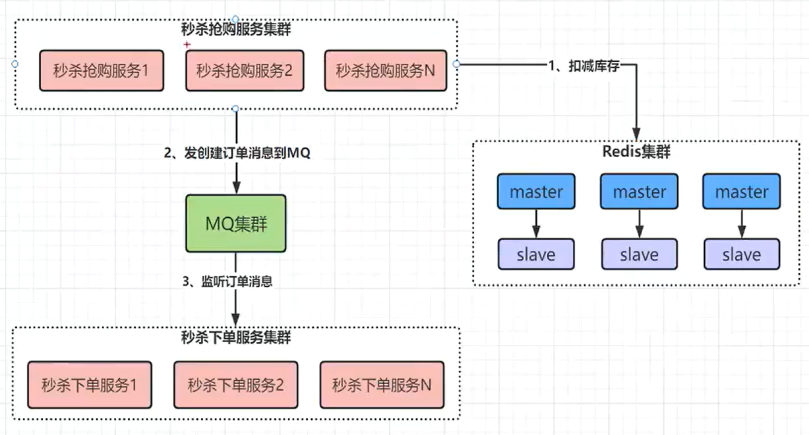
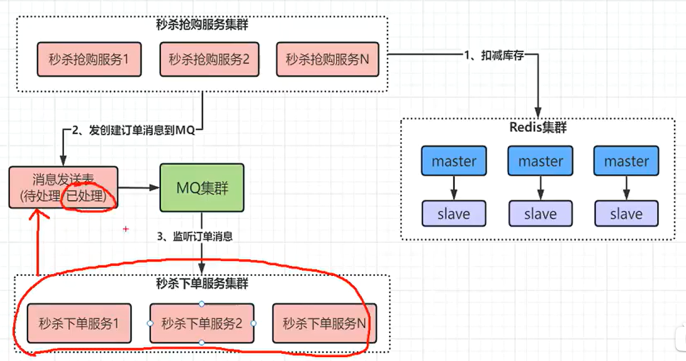

# 秒杀系统面试题

[高并发下的订单与库存的处理]: https://blog.csdn.net/u010811263/article/details/81084886
[单体项目对于超卖现象的问题分析和解决方案]: https://juejin.cn/post/7047681777036427271
[高并发大流量秒杀系统如何正确的解决库存超卖问题]: https://blog.51cto.com/binghe001/4221679
[单体和分布式项目超卖问题解决方案区别]: https://juejin.cn/post/7270046196641955897
[java微信支付v3系列]: https://blog.csdn.net/qq_45740561/article/details/128402504

[实现10万并发秒杀系统，横扫一切关于高并发系统面试问题]: https://www.bilibili.com/video/BV16N411P7wQ/?share_source=copy_web&amp;vd_source=d3666c2043c363d538f217512a5c5be0

传统秒杀系统解决方案是给方法块或者数据库行的加锁，虽然能够保证并发安全避免超卖，但是没法支撑大量秒杀并发场景(利用数据库操作，能够达到每秒上千并发就很了不起，除非像阿里那样有能力对数据库底层源码做优化，否则大多用缓存来做系统)

可以利用Redis集群来提高系统并发量，但是会因为热点商品导致数据倾斜的问题

## 基于Redis与MQ实现秒杀下单架构

## Redis数据倾斜

**redis 集群架构的数据倾斜**：数据存在出在一个节点上，大量请求达到一个节点，这个节点压力非常大。

**解决方案**：预热及时发现数据倾斜，通过命令挪到其他节点上，数据迁移。如：hashTag前面{}里的值去hash，这样就可以控制hash结果了。某一个商品特别热卖，导致大量访问访问一个商品，一个商品只在一个节点上，这就导致该节点访问压力暴增，我们可以提前规划，在缓存预热时，就将其库存分在多个节点上，不同的分片。

## MQ如何保证消息的可靠性

消息到 MQ 的过程中搞丢，MQ 自己搞丢，MQ 到消费过程中搞丢。

- 生产者到 RabbitMQ：事务机制和 Confirm 机制(消息发送表)。

  注意：事务机制和 Confirm 机制是互斥的，两者不能共存，会导致 RabbitMQ 报错。

- RabbitMQ 自身：持久化、集群、普通模式、镜像模式。
- RabbitMQ 到消费者：basicAck 机制、死信队列、消息补偿机制。

## MQ保证幂等机制，避免下单重复消费

- 消费数据为了单纯的写入数据库，可以先根据主键查询数据是否已经存在，如果已经存在了就没必要插入了。或者直接插入也没问题，因为可以利用主键的唯一性来保证数据不会重复插入，重复插入只会报错，但不会出现脏数据。
- 消费数据只是为了缓存到redis当中，这种情况就是直接往redis中set value了，天然的幂等性。
- 针对复杂的业务情况，可以在生产消息的时候给每个消息加一个全局唯一ID，消费者消费消息时根据这个ID去redis当中查询之前是否消费过。如果没有消费过，就进行消费并将这个消息的ID写入到redis当中。如果已经消费过了，就无需再次消费了。

## 线上MQ百万秒杀订单发生积压问题

MQ集群可以储存百亿消息，但是后端如果来不及消费，会导致MQ中堆积大量消息，针对这个问题有多种解决方案。

[MQ 消息积压问题与解决方案]: https://blog.csdn.net/rlnLo2pNEfx9c/article/details/122916585

## Redis主从切换导致同步异常以及超卖

[巧解Redis主从切换引发的库存同步地狱]: https://cloud.tencent.com/developer/article/2323356

## Redis集群崩溃时如何保证系统高可用

[构建高可用的秒杀系统：应对Redis集群崩溃的终极指南]: https://cloud.tencent.com/developer/article/2323353

## MQ集群崩溃时保证秒杀系统高可用

[RabbitMQ在崩溃时丢失数据]: https://www.volcengine.com/theme/8032526-R-7-1

更多可以参考Redis集群崩溃时的处理...

## 秒杀链路中保证Redis与MQ事务一致性

[Redis与MQ如何保证秒杀链路中的事务一致性]: https://cloud.tencent.com/developer/article/2323357

## 秒杀系统限流防刷攻击静态页面方案

[防刷方案分析]: https://blog.csdn.net/weixin_33669968/article/details/106033970
[限流算法]: https://www.nowcoder.com/discuss/364825391666659328?sourceSSR=search