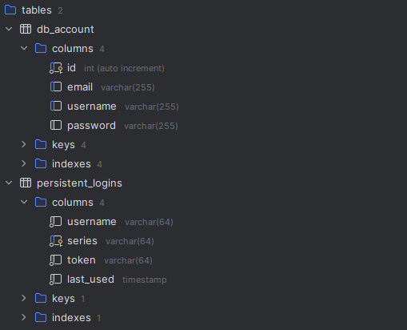

# Spring Boot 前后端分离登录项目

[项目视频教学地址]: https://www.bilibili.com/video/BV1rT411W7QM/?p=6&amp;share_source=copy_web&amp;vd_source=d3666c2043c363d538f217512a5c5be0

## 项目介绍

前后端分离项目，包含基本的登录、邮箱注册、密码重置等等功能，可以二次开发编写具体场景下的应用程序。

* 登录功能（支持用户名、邮箱登录）
* 注册用户（通过邮箱注册）
* 重置密码（通过邮箱重置密码）

登录功能：

- 用户登录成功之后，才能访问index路径下的资源页面
- 用户如果没有登录，那么会自动跳转到登录界面；如果登入并勾选 remember-me，自动跳出登录界面
- 如果用户请求的是一个压根就不存在的页面，强制回到登录界面

## 项目技术栈

Spring Boot项目，基于 session-cookie、Spring Security 验证登录

前端：Html + Css + Javascript + Vue + Element Plus

后端：Spring Boot + Mybatis + Redis

## 技术亮点

**前端：**

- Element UI 组件
- axios 请求
- 表单验证规则
- pinia 储存库
- ref() API
- 配置 Router 路由器
- 路由守卫

**后端：**

- Restful API
- SpringSecurity 配置
  - 请求验证
  - 登录自定义本地资料库验证登录
  - 登出验证
  - 异常情况验证
  - 记住我选项
  - CORS 配置
  - _csrf 配置
- 接口参数 validation 验证
- Redis 邮箱验证码验证
- Interceptor 拦截器前置验证

## MySQL 数据库

详细建库建表请参考当前目录下的 database.txt 文档

## 注意事项

- 下载 npm、node.js
- 提前在 Mysql 建库建表
- 本地或者云端要记得开启 Redis，不然会报错
