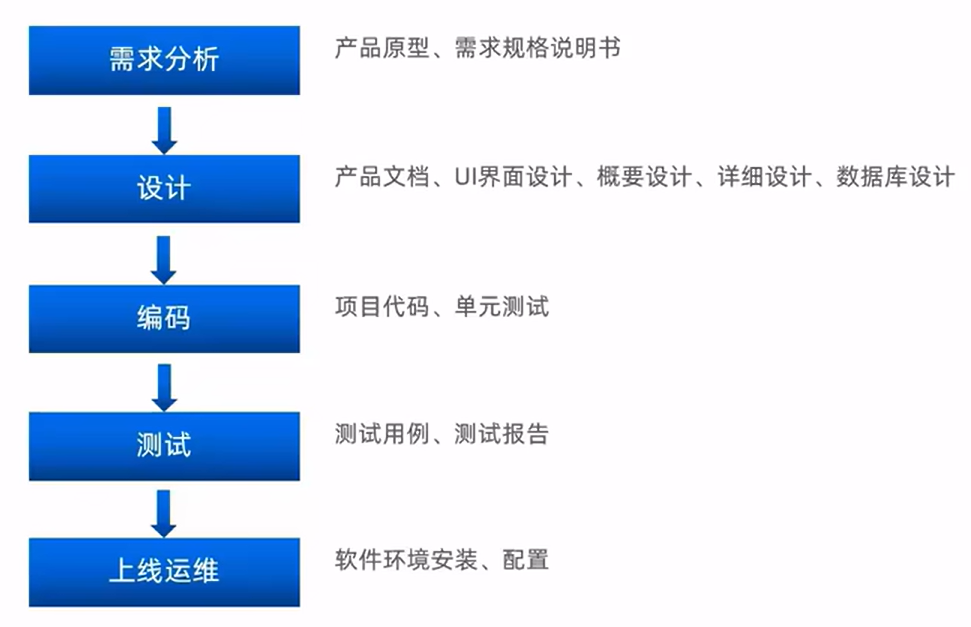
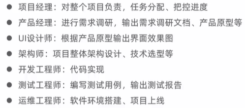
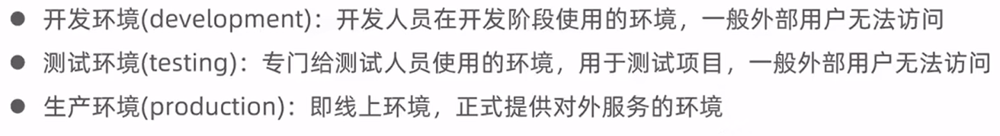
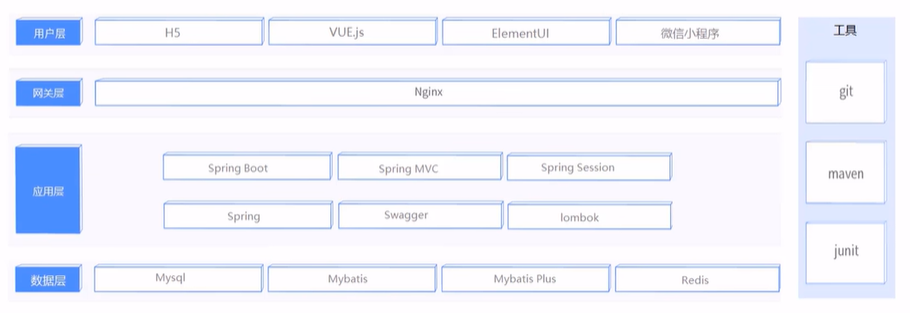
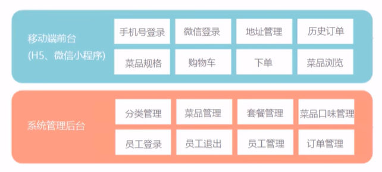
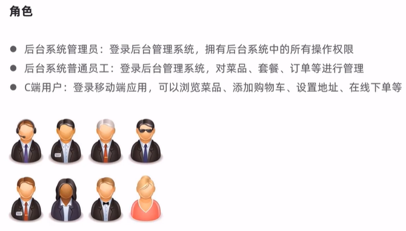
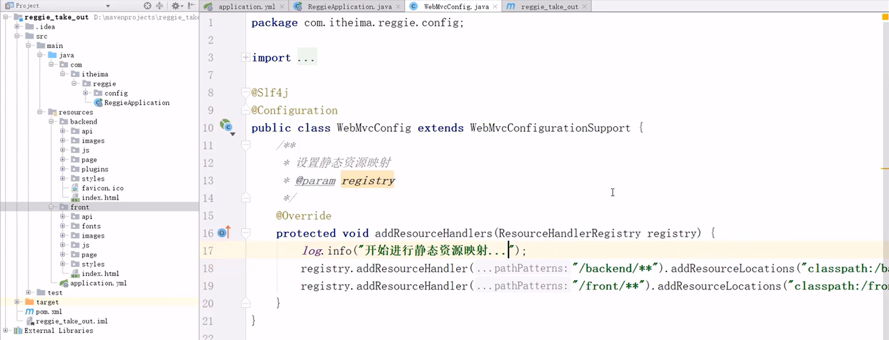
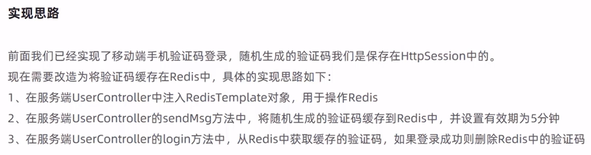
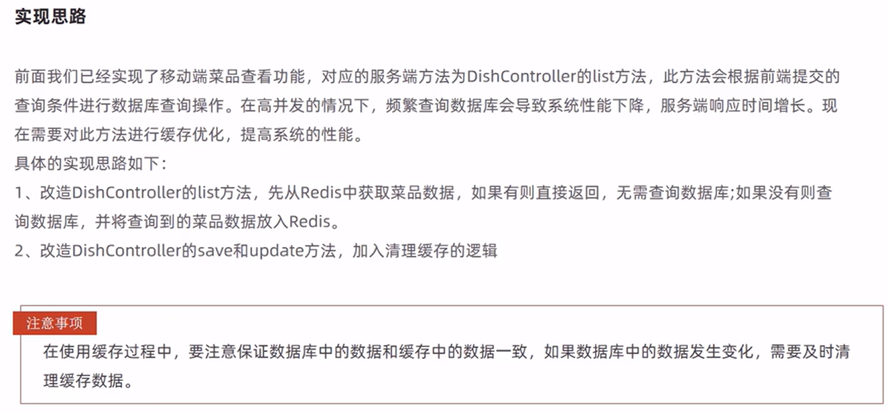
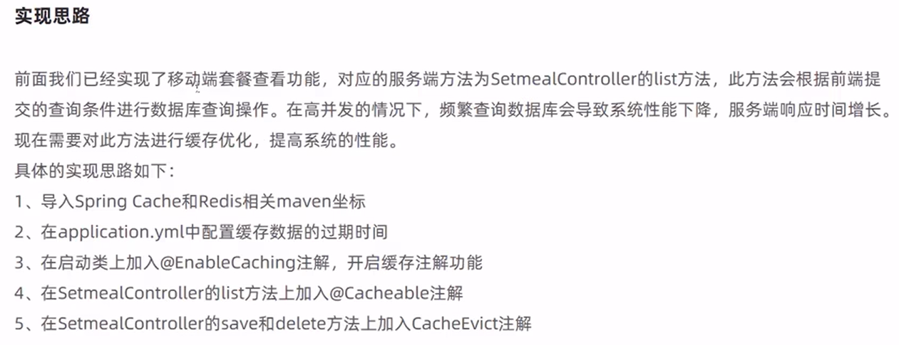

## 项目地址

[黑马程序员 - 项目视频教学]: https://www.bilibili.com/video/BV13a411q753/?share_source=copy_web&amp;vd_source=d3666c2043c363d538f217512a5c5be0
[瑞吉外卖（一）瑞吉外卖项目概述]: https://cloud.tencent.com/developer/article/2114709
[瑞吉外卖（二）员工管理业务开发]: https://cloud.tencent.com/developer/article/2117734
[瑞吉外卖（三）分类管理业务开发]: https://cloud.tencent.com/developer/article/2115745
[瑞吉外卖（四）菜品管理业务开发]: https://cloud.tencent.com/developer/article/2115744
[瑞吉外卖（五）套餐管理业务开发]: https://cloud.tencent.com/developer/article/2117314
[瑞吉外卖（七）地址簿业务开发]: https://cloud.tencent.com/developer/article/2117740
[瑞吉外卖（八）购物车业务开发]: https://cloud.tencent.com/developer/article/2117745
[瑞吉外卖（九）下单业务开发]: https://cloud.tencent.com/developer/article/2117747
[瑞吉外卖（十）项目展示]: https://cloud.tencent.com/developer/article/2117751
[瑞吉外卖（终章）项目优化]: https://cloud.tencent.com/developer/article/2117754

## P2 移动端、PC后台管理设计

## P3 软件开发整体介绍

软件开发流程：

 

角色分工：

软件环境：

## P4 瑞吉外卖项目介绍

## P5 数据库环境搭建

## P6 Maven 项目搭建

前后端不分离项目，MVC config配置静态资源映射：

## P156-P170 项目优化1

Redis + Spring Cache

### 缓存短信验证码

### 缓存菜品数据

根据分类区分缓存区的key

### 缓存套餐数据

