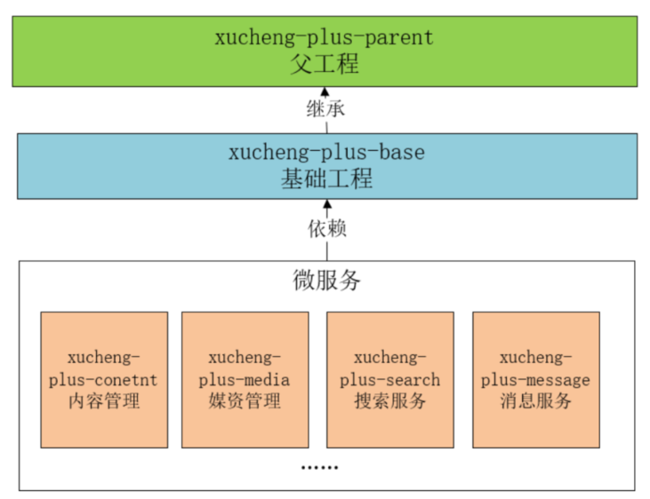
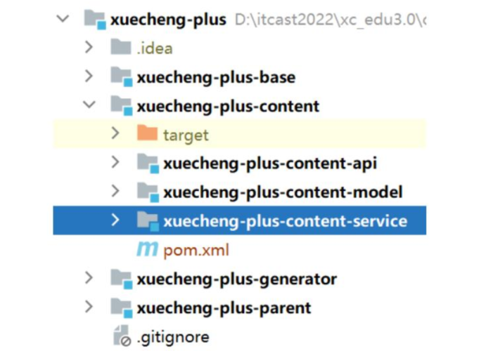
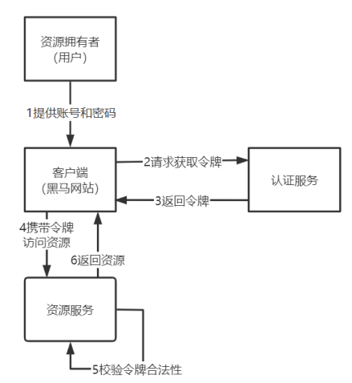

# 学成在线项目亮点

## Day0 准备

[前后端分离项目]: https://www.bilibili.com/video/BV1j8411N7Bm/?share_source=copy_web

**技术栈：**SpringBoot + MySQL + Mybatis + SpringCloud + Nacos + xxl-job-admin + elasticsearch + Kibana + Redis + RabbitMQ + MiniIO + Docker 

## Day1 项目介绍

**业务架构:**

核心模块包括：内容管理、媒资管理、课程搜索、订单支付、选课管理、认证授权等  

**整体流程：**

**技术架构:**

**工程结构：**

**Day1开发路线:**

1. 构建父工程 xuecheng-plus-parent，为子工程和微服务提供Maven版本依赖管理
2. 构建基础工程，提供一些系统架构所需要的基础类库以及一此工具类库，父工程为 xuecheng-plus-parent 

## Day2 内容管理模块  

**模块介绍：**

本项目作为一个大型的在线教育平台，其内容管理模块主要对课程及相关内容进行管理，主要功能包括：
课程的基本信息、课程图片、课程师资信息、课程的授课计划、课程视频、课程文档等内容的管理 

**Day2开发路线：** 

1. 模块需求分析（了解用户需求、确认关键问题、梳理业务流程），这部分由产品人员完成并产出需求规格说明书成果，然后由开发人员对数据进行建模建表

2. 创建微服务内容管理模块

   xuecheng-plus-content-api：接口工程，为前端提供接口，可以定义接口类、请求参数类型、响应数据类型等

   xuecheng-plus-content-service: 业务工程，为接口工程提供业务支撑，编写服务类、数据访问层代码、业务逻辑处理等

   xuecheng-plus-content-model: 数据模型工程，存储数据模型类（实体类、持久化对象）、数据传输类型（DTO）

   xuecheng-plus-content：内容管理模块工程，用于聚合 xuecheng-plus-content-api

   

   

3. 根据课程查询的业务流程去确定数据模型，然后创建数据库表和PO类，并使用 mybatis-plus 的 generator 工程自动生成 PO 类、 Mapper接口、 Mapper的xml 文件，并将 po 类拷贝到 model 工程模块，并添加MyBatisPlus 框架的依赖

4. 定义分页查询模型类（由于分页查询这一类的接口在项目较多，这里针对分页查询的参数如当前页码、每页显示记录数等等单独在 xuecheng-plus-base 基础工程中定义

5. 在api中定义查询需求接口 controller，再配置启动类、bootstrap.yml 配置文件

6. 模型类分类：
   DTO 数据传输对象，接口层向业务层之间传输数据
   PO 持久化对象，用于业务层与持久层之间传输数据
   VO 对象，用在前端与接口层之间传输数据，当前端有多个平台且接口存在差异时就需要设置 VO 对象用于前端和接口层传输数据

7. 使用 swagger 自动生成在线接口文档，并配置中文注解

8. 使用 MyBatis-Plus 开发持久层，每个 PO 类对应数据库的每张表，每张表需要创建一个 Mapper 接口和 Mapper 的 xml 映射文件。内容需要拷贝到 service 工程（由工具根据PO类自动生成），service 工程即业务层为 api 接口工程提供业务处理支撑。配置 Mybatis-Plus configuration 并定义分页拦截器

9. 配置 web 单元测试需要的环境

10. 开发业务层接口以及实现类，可以定义数据字典表去维护变动性较大的信息，统一放在 xuecheng-plus-system 项目工程中

11. 前后端联调学习

12. 解决跨域问题，由于端口、主机、协议不同，产生跨域问题（服务器之间不存在跨域问题），解决方案：

    JSONP、Access-Control-Allow-Origin 请求头、Nginx代理跨域

13. 后端配置跨域过滤器并完成测试课程查询列表是否正常显示

14. 课程分类实现：树形表查询，parentid字段为父结点 ID。编写树型DTO，并自定义mapper方法，并在xml中编写实现的sql语句

15. 新增课程实现：课程相关的信息有课程基本信息、课程营销信息、课程图片信息、课程计划、课程师资信息，并进行合法性校验

16. 当参数不合法则抛出异常，因此要在base工程中做统一异常处理

17. JSR-303, 基于 spring-boot-starter-validation 对模型对象参数进行统一校验的实现

18. 定义分组校验，满足更多需求

19. 修改课程实现：@Transactional 事务

20. 查询课程计划实现：课程计划分为大章节和小章节两级标签，因此用到树型结构

21. 新增/修改计划实现

22. 项目实战：

    1. 创建git远程仓库

    2. 业务需求分析

    3. 接口定义

    4. 接口开发：Mapper、Service、Api接口层开发

    5. 接口测试

## Day3 媒资管理模块

**模块介绍：**

每个教学机构都可以在媒资系统管理自己的教学资源。目前媒资管理的主要管理对象是视频、图片、文档等，包括：媒资文件的查询、文件上传、视频处理等。主要包含以下功能：

媒资查询：教学机构查询自己所拥有的媒资信息
文件上传：包括上传图片、上传文档、上传视频
视频处理：视频上传成功，系统自动对视频进行编码处理
文件删除：教学机构删除自己上传的媒资文件

**Day3开发路线：**

1. 开发业务需求分析

2. 避免前端对每个请求地址都配置绝对路径，添加 Spring Cloud Gateway 网关，首先要搭建 Nacos（服务发现中心、配置中心）：

   

3. 搭建nacos，配置开发/测试/生产环境

4. 在 xuecheng-plus-parent 中添加 cloud 依赖管理，并在内容管理模块的接口工程、系统管理模块的接口工程中添加依赖，并进入nacos 管理页面配置微服务的 yaml 信息

5. 搭建 Nacos 配置中心，创建私有以及公用配置（swagger2、log...）

6. 通过配置优先级，可以让本地文件优先读取：

   

7. 搭建 Spring Cloud Gateway 作为网关，创建 xuecheng-plus-gateway 工程项目

8. 采用 MinIO 构建分布式文件系统去中心化共享架构，每个结点是对等关系，可以通过 Nginx 可对 MinIO 进行负载均衡访问。它将分布在不同服务器上的多块硬盘组成一个对象存储服务。由于硬盘分布在不同的节点上，分布式 Minio 避免了单点故障。Minio 使用纠删码技术来保护数据，好处是即便丢失一半数量（N/2）的硬盘，仍然可以恢复数据。该项目在 Docker 环境下安装并使用 MinIO，首先测试上传、删除、下载、利用MD5哈希算法查询文件的一致性

9. 图片上传业务的实现流程：

   

   a. 前端进入上传图片界面上传图片，请求媒资管理服务

   b. 媒资管理服务将图片文件存储在 MinIO，并记录文件信息到数据库

   c. 前端请求内容管理服务保存课程信息和图片地址

10. 进入 media-service-dev.yaml，在 nacos 配置中 minio 的相关信息，在 media-service 工程编写 minio 的配置类 Bean

11. 定义文件上传DTO模型类和支持multipart/form-data的接口，并完成 service 业务

12. 事务优化：目前是在 uploadFile 和 addMediaFilesToDb 方法上都添加@Transactional，当调用 uploadFile 方法前会开启数据库事务，但如果上传文件过程时间较长那么数据库的事务持续时间就会变长，这样数据库链接释放就慢，最终导致数据库链接不够用。我们只将 addMediaFilesToDb 方法添加事务控制即可,uploadFile 方法上的@Transactional 注解去掉。但是这样会出现一个问题，当一个非事务方法调同类一个事务方法，事务无法控制。因为如果在 uploadFile 方法上没有@Transactional 注解，代理对象执行此方法前不进行事务控制。所以判断该方法是否可以事务控制必须保证是通过代理对象调用此方法，且此方法上添加了@Transactional 注解。只要通过代理对象去调用 addMediaFilesToDb 方法，即可解决这个问题。因此，我们只需要在当前serviceImpl中注入当前对象，通过代理对象去调用事务方法，就能在非事务方法中执行事务方法。

13. 视频上传业务需求分析

    

14. 断点续传技术实现：前端上传前先把文件分成块上传，上传中断后重新上传，各分块分别上传完成最后在MinIO服务端合并文件  

15. 视频转码需求：例如上传的是avi，不符合我们 mp4 需求，视频上传成功后需要使用 FFmpeg 对视频进行转码处理

16. 对一个视频的转码可以理解为一个任务的执行，如果 视频的数量比较多，为了高效处理任务，可以有以下方法：

    a. 多线程

    b. 分布式 + 多线程

17. 任务调度就是对任务的调度，它是指系统为了完成特定业务，基于给定时间点，给定时间间隔或者给定执行次数自动执行任务。而分布式任务调就相当于将任务调度程序分布式构建，这样就可以具有分布式系统的特点，并且提高任务的调度处理能力：  

    a. 并行任务调度  

    b. 高可用  

    c. 弹性扩容  

    d. 任务管理与监测  

    e. 避免任务重复执行  

18. XXL-JOB 是一个轻量级分布式任务调度平台主要功能有：

    调度中心: 负责管理调度信息，发出调度请求，自身不承担业务代码；主要职责为执行器管理、任务管理、监控运维、日志管理等。  

    任务执行器: 负责接收调度请求并执行任务逻辑；主要职责是注册服务、任务执行服务、执行结果上报、日志服务等。

    任务: 负责执行具体的业务处理。

    

19. 面试: 高级配置

    

20. 路由策略：分片广播（广播触发对应集群中所有机器执行一次 任务，同时系统自动传递分片参数；请求根据分片参数开发分片任务）

21. 接下来将 xxl-job 应用在视频处理任务中，调度过期策略我们选择忽略，阻塞处理策略选择丢弃后续调度或单机串行方式来避免任务重复执行。但是只做这些配置，还是不可以保证任务不会重复执行，还需要保证任务处理的幂等性。

    这里我们在数据库视频处理表中添加处理状态字段，视频处理完成更新状态为完成，执行视频处理前判断状态是否完成，如果完成则不再处理。  

    > 任务的幂等性是指：对于数据的操作不论多少次，操作的结果始终是一致的。
    >
    > 幂等性是为了解决重复提交问题，比如：恶意刷单，重复支付等。
    >
    > 解决幂等性常用的方案：
    > 1）数据库约束，比如：唯一索引，主键。
    > 2）乐观锁，常用于数据库，更新数据时根据乐观锁状态(设置版本号)去更新。
    > 3）唯一序列号，操作传递一个唯一序列号，操作时判断与该序列号相等则执行。
    >
    > [一口气说出四种幂等性解决方案]: https://juejin.cn/post/6906290538761158670

22. 视频处理的业务流程：

    

    用取模算法为分布式的每个执行器分配数据表中待处理/处理失败的视频：

    

    a. 任务调度中心广播作业分片。
    b. 执行器收到广播作业分片，从数据库读取待处理的视频格式任务，读取未处理及处理失败的任务。
    c. 执行器更新任务为处理中，根据任务内容从 MinIO 下载要处理的文件。
    d. 执行器启动多线程去处理任务。
    e. 任务处理完成，上传处理后的视频到 MinIO。
    f. 将更新任务处理结果，如果视频处理完成除了更新任务处理结果以外还要将文件的访问地址更新至任务处理表及文件表中，最后将任务完成记录写入历史表。  

23. 分布式锁：理论上每个执行器分到的任务是不重复的，但是当在执行器弹性扩容时无法绝对避免任务不重复执行，比如出现异常。在单体web应用下，为了避免多线程去争抢同一个任务可以使用 synchronized 同步锁去解决。现在要实现在分布式环境下所有虚拟机中的线程去同步执行就需要让多个虚拟机去共用一个锁，虚拟机可以分布式部署，锁也可以分布式部署，这种锁叫分布式锁。实现分布式锁的方案有很多，常用的如下：

    a. 基于数据库实现分布锁
    	利用数据库主键唯一性的特点，或利用数据库唯一索引、行级锁的特点，比如：多个线程同时向数据库插入主键相同的同一条记录，谁插入成功谁就获取锁，多个线程同时去更新相同的记录，谁更新成功谁就抢到锁。也可以用乐观锁的方式实现，在表中增加一个 version 字段，更新时判断是否等于某个版本，等于则更新否则更新失败。 

    b. 基于 redis 实现锁
    	redis 提供了分布式锁的实现方案，比如： SETNX、 set nx、 redisson 等。拿 SETNX 举例说明， SETNX 命令的工作过程是去 set 一个不存在的 key，多个线程去设置同一个 key 只会有一个线程设置成功，设置成功的的线程拿到锁。  

    c. 使用 zookeeper 实现
    	zookeeper 是一个分布式协调服务，主要解决分布式程序之间的同步的问题。zookeeper 的结构类似的文件目录，多线程向 zookeeper 创建一个子目录(节点)只会有一个创建成功，利用此特点可以实现分布式锁，谁创建该结点成功谁就获得锁。

    本次业务我们采用数据库的行锁（当前读）来实现方案。

24. 完善 xxl-job 的分布式任务业务逻辑，创建线程池并利用 countDownLatch 工具类设定视频处理任务的超时时间。在 xxl-job 的任务调度策略中配置阻塞处理策略为丢弃后续调度。配置视频处理调度时间间隔不用根据视频处理时间去确定，可以配置的小一些，如：
    5 分钟，即使到达调度时间如果视频没有处理完会丢弃调度请求。  

25. 抢占任务断点测试

26. 其他问题

    a. 任务补偿机制：如果有线程抢占了某个视频的处理任务，如果线程处理过程中挂掉了，该视频的状态将会一直是处理中，其它线程将无法处理，这个问题需要用补偿机制。单独启动一个任务找到待处理任务表中超过执行期限但仍在处理中的任务，将任务的状态改为执行失败。任务执行期限是处理一个视频的最大时间，比如定为 30 分钟，在任务启动时期用 SQL 去判断任务是否超过执行期限。

    b. 达到最大失败次数：当任务达到最大失败次数时一般就说明程序处理此视频存在问题，这种情况就需要在页面中提示人工处理。

    c. 分块文件清理问题：上传一个文件进行分块上传，上传一半不传了，之前上传到 minio 的分块文件要清理掉。我们需要维护一个数据表，记录 minio 中存储的文件信息，文件开始上传时会写入文件表，状态为上传中，上传完成会更新状态为上传完成，当一个文件状态不为上传完成说明该文件没有上传完成。设置定时任务去查询文件表中的记录，如果文件未上传完成则删除 minio 中没有上传成功的文件目录。

27. 绑定媒资业务，这一章节的最后部分，纯纯业务，没有什么技能点我懒得做了...

## Day4 课程发布模块

**模块介绍：**

课程发布模块共包括三块功能：
1、课程预览
2、课程审核
3、课程发布  

**Day4开发路线：**

1. 课程预览业务：

   

2. 在内容管理接口层搭建 Freemarker 模板引擎

3. 在课程预览界面上要加载 css、 js、图片等内容，这里部署 nginx 来访问这些静态资源，对于 SpringBoot 服务的动态资源由 Nginx 去代理请求，如下图：  

   

4. 在进行课程预览时需要展示课程的图片，在线插放课程视频，课程图片、视频这些都在 MinIO 文件系统存储，下边统一由 Nginx 代理，通过文件服务域名统一访问。  

5. 配置视频预览模板，因为视频模板要访问静态资源，所以也需要 Nginx 作反向代理：

   

6. 课程审核业务：运营平台人员审核课程通过后才能发布。这里要思考一些问题：

   课程提交审核后还允许修改课程吗？

   提交审核课程后，也修改了课程信息，可以再次提交审核吗？  

7. 课程发布业务：课程发布后会公开展示在网站上供学生搜索查看、选课和学习，为了提高网站速度，可以用以下流转架构：

   

8. 分布式事务：一次课程发布操作需要向数据库、 redis、 elasticsearch、 MinIO 写四份数据，这里存在分布式事务问题。这四个地方已经不限制在一个数据库内，是由四个分散的服务去提供，与这四个服务去通信需要网络通信，而网络存在不可到达性，这种分布式系统环境下，通过与不同的服务进行网络通信去完成事务称之为分布式事务。  

9. 以下场景会产生分布式事务：

   微服务架构、单服务多数据库、多服务单数据库

10. CAP理论（一致性Consistency、 可用性Availability、 分区容忍性Partition tolerance）：CAP 理论要强调的是在分布式系统中这三点不可能全部满足，由于是分布式系统就要满足分区容忍性，因为服务之间难免出现网络异常，不能因为局部网络异常导致整个系统不可用。满足 P 那么 C 和 A 不能同时满足，举例：

    

    CP 的场景：满足 C 舍弃 A，强调一致性（跨行转账、开户操作）  

    AP 的场景：满足 A 舍弃 C，强调可用性（24小时内订单退款、注册在10分钟内送积分、延迟的支付成功短信）  

11. BASE理论（Basically Available基本可用、 Soft state软状态和 Eventually consistent最终一致性）：在实际应用中符合 AP 的场景较多，其实虽然 AP 舍弃 C 一致性，实际上最终数据还是达到了一致，也就满足了最终一致性，所以业界定义了 BASE 理论。  

12. 分布式事务控制有哪些常用的技术方案：

    实现 CP 就是要实现强一致性：

    i. 使用 Seata 框架基于 AT 模式实现  

    ii. 使用 Seata 框架基于 TCC 模式实现  

    实现 AP 则要保证最终数据一致性：

    i. 使用消息队列通知的方式去实现，通知失败自动重试，达到最大失败次数需要人工处理  

    ii.使用任务调度的方案，启动任务调度将课程信息由数据库同步到 elasticsearch、MinIO、 redis 中  

13. 本项目课程发布的事务控制方案采用AP等任务调度方式实现，实现方案：

    

    

    使用消息表这种方式实现最终事务一致性

    

    如果一个任务有好几个小任务，比如：课程发布任务需要执行三个同步操作：存储课程到 redis、存储课程到索引库，存储课程页面到文件系统。其中任何一个小任务已经完成也不应该去重复执行，应该保证其幂等性。因此将小任务作为任务的不同的阶段，还要在消息表中设计阶段状态。  

14. 如果在每个地方都实现一套针对消息表定时扫描、处理的逻辑基本上都是重复的，软件的可复用性太低，成本太高。针对这个问题可以想到将消息处理相关的逻辑做成一个通用的SDK工具包:

    抽象类：执行任务在 sdk 中不用实现任务逻辑，只需要提供一个抽象方法由具体的执行任务方去实现
    幂等性：任务执行完成后会从消息表删除，如果消息的状态是完成或不存在消息表中则不用执行
    不重复执行：任务调度采用分片广播，根据分片参数去获取任务，另外阻塞调度策略为丢弃任务，保证任务不重复执行

15. 开始配置任务调度服务

16. 页面静态化，将 ftl 模板渲染成 html 静态页面，上传到 MinIO 服务器，再用 nginx 作反向代理

17. 使用 openFeign 进行远程调用

18. 熔断降级处理。当微服务运行不正常会导致无法正常调用微服务，此时会出现异常，如果这种异常不去处理可能导致雪崩效应

    熔断：当下游服务异常而断开与上游服务的交互，它就相当于保险丝，下游服务异常触发了熔断，从而保证上游服务不受影响

    降级：当下游服务异常触发熔断后，上游服务就不再去调用异常的微服务而是执行了降级处理逻辑，这个降级处理逻辑可以是本地一个单独的方法

19. 项目使用 Hystrix 框架实现熔断、降级处理，定义降级逻辑：fallback 和 fallbackFactory

20. 课程搜索模块：课程搜索模块包括课程索引、课程搜索，本项目的课程搜索支持全文检索技术

    项目使用 Elasticsearch 作为索引及搜索服务

    课程发布后，索引创建完成，用户才可以通过前端搜索课程信息

    搜索界面，可以通过课程分类、课程难度等级等条件进行搜索  

    

21. 索引管理：在Java项目中添加/查询/更新/删除文档

22. 搜索需求分析：多级分类

23. ES实现技术方案：布尔查询、MultiMatchQuery、过滤器实现分类/等级搜索、分页查询、高亮显示

    > 使用关键字查询需要计算相关度得分，根据课程分类、课程等级去查询不需要计算相关度得分，使用过滤器实现根据课程分类、课程等级查询的过程不会计算相关度得分，效率更高。

24. Elasticsearch课程信息索引同步方案：

    a. 针对实时性非常高的场景需要满足数据的及时同步  

    同步调用：同步调用即在向 MySQL 写数据后远程调用搜索服务的接口写入索引，此方法简单但是耦合代码太高

    异步调用：可以使用一个中间的软件 canal 解决耦合性的问题，但存在学习与维护成本  

    > canal 主要用途是基于 MySQL 数据库增量日志解析，并能提供增量数据订阅和消费，实现将 MySQL 的数据同步到消息队列、 Elasticsearch、其它数据库等，应用场景十分丰富。  
    >
    > Canal 基于 mysql 的 binlog 技术实现数据同步，什么是 binlog，它是一个文件，二进制格式，记录了对数据库更新的 SQL 语句，向数据库写数据的同时向 binlog 文件里记录对应的 sql 语句。当数据库服务器发生了故障就可以使用 binlog 文件对数据库进行恢复，工作原理如下：
    >
    > 
    >
    > 1、 canal 模拟 MySQL slave 的交互协议，伪装自己为 MySQL slave ，向 MySQLmaster 发送 dump协议
    > 2、 MySQL master 收到 dump 请求，开始推送 binary log 给 slave (即 canal )
    > 3、 canal 解析 binary log 对象(原始为 byte 流)  

    b. 当索引同步的实时性要求不高时可用的技术比较多，比如： MQ、任务调度、Logstash等

[使用RabbitMQ实现AP分布式事务]: https://cloud.tencent.com/developer/article/2022241

## Day5 认证授权模块

**模块介绍：**

本项目基于微服务架构构建，微服务包括：内容管理服务、媒资管理服务、学习中心服务、系统管理服务等。为了提高用户体验性，这个模块将会实现 SSO 单点登录功能，用户只需要认证一次便可以在多个拥有访问权限的系统中访问

**Day5开发路线：** 

1. SSO 单点登入：所有的微服务都通过一个认证授权模块获取令牌

2. 了解 SpringSecurity 的执行流程

   

3. 基于 OAuth2 协议实现基于第三方微信认证的授权模式和本地密码模式

   授权模式：

   

   密码模式：

   

4. 采用 JWT 无状态式登录。并且为了省去每个资源服务都向授权模块请求校验合法性，这里为每一个模块都配置 Spring Security，并根据相同的算法，拥有自己校验令牌合法性的能力

   

5. 使用网关认证，在请求访问资源之前所有访问微服务的请求都要经过网关，在网关进行用户身份的认证可以将很多非法的
   请求拦截到微服务以外。

   网关的职责（注意网关不负责授权）：

   a) 网站白名单维护：针对不用认证的 URL 全部放行

   b) 校验 jwt 的合法性：白名单的 URL 之外的请求都需要校验 JWT 令牌

   

   放行功能统一由 gateway 来做，授权则还是交由各自微服务决定

6. 重写 loadUserByUsername() 实现验证数据库登录

7. 拓展 spring security 用户身份信息

   方案一：扩展 UserDetails，使之包括更多的自定义属性

   方案二：扩展username 的内容 ，比如存入 json 数据内容作为 username 的内容（更简单方便）

8. 编写一个工具类，方便各个微服务中去使用，用于获取当前登录用户的对象

9. 统一认证入口：认证方式非常丰富，有账号密码认证、手机验证码认证、扫码登录等。而不同的认证方式提交的数据不一样，比如：手机加验证码方式会提交手机号和验证码，账号密码方式会提交账号、密码、验证码。因此我们可以在 loadUserByUsername() 方法上做修改，将用户原来提交的账号数据改为提交 json 数据， json 数据可以扩展不同认证方式所提交的各种参数。

10. 配合 Redis 部署图片验证码服务工程，用于登入/注册/修改密码，验证码流程分析：

    

11. 使用 OpenFeign 调用远程服务（验证码工程），实现登入功能

12. 微信扫码登入：该登录就是基于 OAuth2 协议的授权码模式

      

    第三方应用获取 access_token 令牌后即可请求微信获取用户的信息，成功获取到用户的信息表示用户在第三方应用认证成功。第三方使用网站应用授权登录前，请注意是否已获取相应网页授权作用域(scope=snsapi_login)。微信登入支持跳转到微信私域服务器，也支持网页内嵌微信登入图片，提升流畅度。注意本地需要搭配内网穿透的工具，这样才能让微信找到回调地址。

13. 基于 RBAC 实现授权，主要有以下两种类型：

    基于角色的访问控制 (Role-Based Access Control)，按角色进行授权，比如：主体的角色为总经理可以查询企业运营报表，查询员工工资信息等。这个类型有一个缺点，当需要修改角色的权限时就需要修改授权的相关代码，系统可扩展性差。

    基于资源的访问控制 (Resource-Based Access Control)，按资源（或权限）进行授权，比如：用户必须具有查询工资权限才可以查
    询员工工资信息等。优点：系统设计时定义好查询工资的权限标识，即使查询工资所需要的角色变化为总经理和部门经理也不需要修改授权代码，系统可扩展性强。

14. 资源服务授权流程：

    a) 在资源服务集成 Spring Security，在需要授权的接口处使用@PreAuthorize("hasAuthority('权限标识符')")进行控制  

    b) 在统一异常处理处解析此异常信息  

15. 实战：找回密码、注册

## Day6 选课学习模块

**模块介绍：**

本模块实现了学生选课、下单支付、学习的整体流程。网站的课程有免费和收费两种，对于免费课程学生选课后可直接加入到课程表中学习，对于收费课程
学生需要下单且支付成功方可选课、学习：

本项目与第三方支付平台对接完成支付操作：

**Day6开发路线：** 

1. 业务开发：添加选课、课程查询、学习资格查询

2. 微信支付接口调研：付款码、JSAPI 支付（适用于线下/公众号/PC网站场景）、小程序、Native支付，本项目选择 JSAPI 支付接口，他的支付场景很多，可以实现在手机端 H5页面唤起微信客户端完成支付。要以企业身份注册微信商户号，开通微信支付。

3. 支付宝支付接口调研：

   

   本项目选择手机网站支付方式，相比电脑网站支付形式更灵活

   支付宝提供支付宝沙箱环境开发支付接口，可以模拟开发

4. 支付宝创建订单服务流程：

   

5. 生成二维码以及下单执行流程：

   

   

   订单号注意唯一性、安全性、尽量短等特点，生成方案常用的如下：
   a) 时间戳+随机数
   	年月日时分秒毫秒+随机数
   b) 高并发场景 
   	年月日时分秒毫秒+随机数+redis 自增序列
   c) 订单号中加上业务标识 
   	订单号加上业务标识方便客服，比如：第 10 位是业务类型，第 11 位是用户类型等。
   d) 雪花算法
   	雪花算法是推特内部使用的分布式环境下的唯一 ID 生成算法，它基于时间戳生成，保证有序递增，加以入计算机硬件等元素，可以满足高并发环境下 ID 不重复，本项目订单号生成采用雪花算法。

6. 创建支付交易记录：

   在请求微信或支付宝下单接口时需要传入 商品订单号，在与第三方支付平台对接时发现，当用户支付失败或因为其它原因最终该订单没有支付成功，此时再次调用第三方支付平台的下单接口发现报错“订单号已存在”，此时如果我们传入一个没有使用过的订单号就可以解决问题，但是商品订单已经创建，因为没有支付成功重新创建一个新订单是不合理的。
   解决以上问题的方案是：
   1、用户每次发起都创建一个新的支付交易记录 ，此交易记录与商品订单关联。
   2、将支付交易记录的流水号传给第三方支付系统下单接口，这样就即使没有支付成功就不会出现上边的问题。
   3、需要提醒用户不要重复支付。  

   [接口幂等性设计]: https://juejin.cn/post/7049140742182141959

7. 接收支付通知

   支付完成后第三方支付系统会主动通知支付结果，要实现主动通知需要在请求支付系统下单时传入 NotifyUrl，这里有两个 url：NotifyUrl 和 ReturnUrl， ReturnUrl 是支付完成后支付系统携带支付结果重定向到 ReturnUrl 地址， NotifyUrl 是支付完成后支付系统在后台定时去通知，使用 NotifyUrl 比使用 ReturnUrl 有保证

   订单服务作为通用服务在订单支付成功后需要将支付结果异步通知给其它微服务

   

8. 获取视频 - 学习资格

9. 我的课程

## Day7 项目部署

1. DevOps

   DevOps（Development 和 Operations 的组合词）是一组过程、方法与系统的统称，用于促进开发（应用程序/软件工程）、技术运营和质量保障（QA）部门之间的沟通、协作与整合。它是一种重视“软件开发人员（Dev） ”和“IT 运维技术人员（Ops） ”之间沟通合作的文化、运动或惯例。透过自动化“软件交付”和“架构变更”的流程，来使得构建、测试、发布软件能够更加地快捷、频繁和可靠。
   它的出现是由于软件行业日益清晰地认识到：为了按时交付软件产品和服务，开发和运维工作必须紧密合作。  

2. CI/CD

   CI/CD 是近年来企业有效实施 DevOps 的具体方案。

   CI/CD 包含了一个 CI 和两个 CD， CI 全称 Continuous Integration，表示持续集成，CD 包含 Continuous Delivery 和 Continuous Deployment，分别是持续交付和持续部署，三者具有前后依赖关系。 

    CI 持续集成：
   持续集成倡导团队成员需要频繁的集成他们的工作，将开发分支合并到主分支，每次集成都通过自动化构建（包括编译、构建、自动化测试）来验证，从而尽快地发现集成中的错误，让产品可以快速迭代，同时还能保持高质量。 

   

   CD 持续交付:
   持续交付将集成后的代码部署到类生产环境(预发布)，除了交付到类生产环境之外，还会执行一些集成测试、 API 测试。持续交付强调的是“交付”，交付给测试、产品验收，不管怎么更新，软件是随时随地可以交付的。  

   

   CD 持续部署：
   在持续交付的基础上由开发人员或运维人员自助式的定期向生产环境部署稳定的构建版本，持续部署的目标是代码在任何时刻都是可部署的，并可自动进入到生产环境。  

   

3. DevOps 实战技术方案:

   

   技术方案将学成在线项目使用 Docker 进行部署。本次项目部署实战旨在理解 CI/CD 的流程，考虑 Kubernates 的复杂性课堂上我们用 Jenkins 代替 Kubernates 完成容器部署。

## Day8 项目优化

1. 性能指标

   吞吐量TPS、响应时间、每秒查询数QPS、错误率

   优化后的接口响应时间应该越来越小，吞吐量越来越大，以及 QPS 值也是越大越好，错误率要保持在一个很小的范围。

   另外除了关注这些性能指标以外还要关注系统的负载情况：
   a) CPU 使用率，不高于 85%
   b) 内存利用率，不高于 85%
   c) 网络利用率，不高于 80%
   d) 磁盘 IO

   压力性能检测工具：Jmeter

2. 缓存优化：使用 Redis 优化查询较多、修改较少的接口，但是要注意不同数据库之间的数据一致性和读写策略

   缓存穿透：对请求增加校验机制、布隆过滤器、缓存空值或特殊值

   缓存击穿：热点数据不过期、提高预热

   缓存雪崩：使用同步锁控制查询数据库的线程、对同一类型信息的 key 设置不同的过期时间、缓存预热、集群、限流、多级缓存

3. 分布式锁：本地锁只能控制所在虚拟机中的线程同步执行，现在要实现分布式环境下所有虚拟机中的线程去同步执行就需要让多个虚拟机去共用一个锁

   实现方案：基于数据库实现分布锁、基于 Redis 实现锁、使用 zookeeper 实现

4. 基于 Redis 实现分布式锁：

   a) Redis，会出现很多问题

   b) Redis + Lua

   c) Redission

   

   **加锁机制**
   线程去获取锁，获取成功: 执行 lua 脚本，保存数据到 redis 数据库。
   线程去获取锁，获取失败: 一直通过 while 循环尝试获取锁，获取成功后，执行lua 脚本，保存数据到 redis  

   **WatchDog 自动延期看门狗机制**
   第一种情况：在一个分布式环境下，假如一个线程获得锁后，突然服务器宕机了，那么这个时候在一定时间后这个锁会自动释放，你也可以设置锁的有效时间(当不设置默认 30 秒时），这样的目的主要是防止死锁的发生
   第二种情况：线程 A 业务还没有执行完，时间就过了，线程 A 还想持有锁的话，就会启动一个 watch dog 后台线程，不断的延长锁 key 的生存时间。  

   **lua 脚本-保证原子性操作**
   主要是如果你的业务逻辑复杂的话，通过封装在 lua 脚本中发送给 redis，而且redis 是单线程的，这样就保证这段复杂业务逻辑执行的原子性
   具体使用 RLock 操作分布锁， RLock 继承 JDK 的 Lock 接口，所以他有 Lock 接口的所有特性，比如 lock、 unlock、 trylock 等特性,同时它还有很多新特性：强制锁释放，带有效期的锁。  

[常见分布式锁实现方案、Redission分布式锁完美方案 以及 Lua 脚本浅谈]: https://blog.csdn.net/m0_47679010/article/details/123755504

